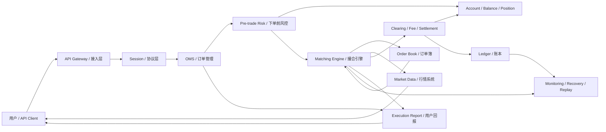

# Day 1：建立交易系统全景图

## 1. 今天的学习目标

今天的目标不是深入撮合算法，而是先建立一张完整的交易系统地图。

学完 Day 1 后，需要能回答：

- 一个交易系统里有哪些基础对象
- `product`、`order`、`trade/fill`、`account` 分别是什么
- 为什么用户看到的一笔交易，背后不是只有撮合引擎
- 为什么撮合引擎只是交易系统中的一个核心模块，而不是整个交易系统

参考资料：

- Coinbase Exchange Trading Concepts：https://docs.cdp.coinbase.com/exchange/concepts/trading
- Coinbase Exchange Account Structure：https://docs.cdp.coinbase.com/exchange/concepts/structure
- Coinbase Exchange Matching Engine：https://docs.cdp.coinbase.com/exchange/concepts/matching-engine
- Coinbase Exchange Concepts Overview：https://docs.cdp.coinbase.com/exchange/concepts/overview

## 2. Coinbase Trading Concepts 重点摘录

Coinbase 官方 Trading Concepts 里，最核心的几个概念是：

- `Product Pairs`：可交易的市场，例如 `BTC-USD`、`ETH-USD`。一个 product pair 决定了 base currency、quote currency、最小下单数量、价格精度、数量精度等交易约束。
- `Orders`：订单是交易行为的基础对象。用户并不是直接生成成交，而是先提交订单，由交易系统根据订单类型和订单簿状态决定是否成交、部分成交、挂簿或取消。
- `Limit Orders`：限价单带有价格约束。买单不会以高于限价的价格成交，卖单不会以低于限价的价格成交。限价单可能成为 maker，也可能如果价格穿透盘口而立即成为 taker。
- `Market Orders`：市价单优先立即执行，不保证成交价格。它会消耗订单簿上的可用流动性，因此总是 taker，可能因为扫过多个价格档位产生滑点。
- `Size vs Funds`：`size` 表示 base currency 数量，例如 BTC-USD 中的 BTC 数量；`funds` 表示 quote currency 金额，例如 BTC-USD 中的 USD 金额。市价单可以用 size 或 funds 表达目标，但不能同时使用两者。
- `Post-Only`：保证订单只做 maker。如果订单会立即成交，就会被拒绝或取消。
- `Time in Force`：控制订单有效期，例如 GTC、IOC、FOK。
- `Self-Trade Prevention`：自成交防护，用于避免同一用户自己的买卖订单互相成交。

这些概念说明：交易系统不是简单地“用户点买入，然后撮合成交”。每个订单都带有一组业务约束，系统必须在接入、风控、撮合、账务和回报链路中一致地解释这些约束。

## 3. 基础对象解释

### 3.1 Product

`product` 是一个可交易标的或交易对。

在现货交易里，常见形式是：

```text
BTC-USDT
ETH-USDT
BTC-USD
```

一个 product 至少包含：

- base currency：基础币，例如 BTC-USDT 中的 BTC
- quote currency：计价币，例如 BTC-USDT 中的 USDT
- price precision：价格精度
- quantity precision：数量精度
- min order size：最小下单数量
- trading status：是否允许交易

工程视角下，`product` 是交易系统的配置中心对象之一。下单校验、撮合、行情、账务、风控都会依赖它。

### 3.2 Account

`account` 是资产和权限的承载对象。

Coinbase Account Structure 中提到，profile/account 用来组织不同的交易组合、资金和 API 权限。对交易系统来说，account 通常承担这些职责：

- 记录用户身份和交易权限
- 记录可用余额、冻结余额和总余额
- 承载下单、撤单、查询、转账权限
- 作为风控和清算的账户维度

一个账户不是简单的一行余额。它通常包含多个币种的资产状态：

```text
accountId = 10001
BTC:
  available = 1.2
  frozen = 0.3
  total = 1.5

USDT:
  available = 10000
  frozen = 2000
  total = 12000
```

其中：

- `available`：可用余额，可以继续下单或提现
- `frozen/hold`：冻结余额，已经被订单、提现或风控占用
- `total`：总余额，通常等于 available + frozen

### 3.3 Order

`order` 是用户向交易系统提交的交易意图。

订单不是成交本身，而是一个待执行的指令。它通常包含：

- orderId
- clientOrderId
- accountId
- productId
- side：buy / sell
- type：limit / market
- price
- quantity 或 amount
- timeInForce
- status
- createdTime

示例：

```text
用户想用 30000 USDT 的价格买 1 BTC

order:
  product = BTC-USDT
  side = BUY
  type = LIMIT
  price = 30000
  quantity = 1 BTC
```

订单状态会变化：

```text
NEW -> PARTIALLY_FILLED -> FULL_FILLED
NEW -> CANCELLED
NEW -> REJECTED
```

生产系统里，订单是一个状态机对象，不是一次性请求。

### 3.4 Trade / Fill

`trade` 或 `fill` 是成交结果。

一张订单可以对应 0 笔、1 笔或多笔 fill。

例如用户下市价买单买 3 BTC，订单簿卖盘如下：

```text
Ask 30000, 1 BTC
Ask 30100, 1 BTC
Ask 30200, 1 BTC
```

这张订单会产生 3 笔 fill：

```text
fill 1: 1 BTC @ 30000
fill 2: 1 BTC @ 30100
fill 3: 1 BTC @ 30200
```

所以：

```text
order = 用户的交易意图
fill = 订单被撮合后的具体成交明细
```

`lastPrice` 通常来自最新一笔 fill 的成交价，而不是买一卖一中间价。

### 3.5 Position

`position` 是持仓或风险敞口。

在现货系统里，position 很多时候可以理解为某资产的净持有量，例如：

```text
BTC position = 1.5 BTC
USDT position = 12000 USDT
```

但在严格账务系统里，现货更常说 `balance`，因为用户实际持有的是资产余额。

在合约、杠杆、保证金系统里，`position` 会更重要，通常包含：

- symbol
- side：long / short
- position size
- entry price
- mark price
- unrealized PnL
- margin
- liquidation price

这些字段的含义如下：

| 字段 | 中文含义 | 说明 |
| --- | --- | --- |
| `symbol` | 交易标的 / 合约标识 | 表示这笔持仓属于哪个市场，例如 `BTC-USDT` 现货、`BTC-USDT-SWAP` 永续合约、`BTC-USD-PERP` 永续合约。生产系统里不能只用 `BTC` 表达持仓，因为不同 quote currency、合约类型、结算币和到期日会对应完全不同的风险。 |
| `side` | 持仓方向 | `long` 表示多头，价格上涨时盈利、下跌时亏损；`short` 表示空头，价格下跌时盈利、上涨时亏损。现货普通账户通常没有真正的 short，short 一般出现在杠杆、借贷、合约或永续合约系统里。 |
| `position size` | 持仓数量 | 表示当前持有的仓位规模。它的单位要看产品定义，可能是 base currency 数量，例如 `0.5 BTC`；也可能是合约张数，例如 `100 contracts`。生产系统里必须结合合约面值、乘数和结算币解释它，不能只看数字。 |
| `entry price` | 开仓均价 / 持仓均价 | 表示当前仓位的平均建仓价格，通常用于计算未实现盈亏。加仓可能改变 entry price，减仓通常只减少仓位数量，不一定改变剩余仓位均价，具体取决于交易所的持仓会计规则。 |
| `mark price` | 标记价格 | 交易所用于计算未实现盈亏、保证金风险和强平风险的参考价格。它通常不是最新成交价 `last price`，而是根据指数价格、盘口、资金费率或合理基差计算出的公平价格，用来减少恶意插针或极端成交对强平的影响。 |
| `unrealized PnL` | 未实现盈亏 / 浮动盈亏 | 表示仓位还没有平仓时，按照 mark price 估算出来的当前盈亏。多头可以简化理解为 `(mark price - entry price) * position size`，空头可以简化理解为 `(entry price - mark price) * position size`，实际系统还要考虑合约乘数、计价币、结算币和手续费。 |
| `margin` | 保证金 | 为了维持杠杆仓位而占用的抵押资产。开仓时需要初始保证金，持仓期间需要满足维持保证金要求。逐仓模式下保证金隔离在单个仓位里；全仓模式下整个账户可用权益可能共同承担风险。 |
| `liquidation price` | 预估强平价格 | 当 mark price 触及某个价格，使账户权益或仓位保证金不足以满足维持保证金要求时，系统可能触发强制平仓。强平价格不是固定常量，会受到杠杆倍数、保证金模式、仓位大小、账户余额、资金费、手续费和风险限额影响。 |

一个合约仓位可以简化表示为：

```text
symbol = BTC-USDT-SWAP
side = long
position size = 0.5 BTC
entry price = 60000 USDT
mark price = 61000 USDT
unrealized PnL = 500 USDT
margin = 3000 USDT
liquidation price = 54500 USDT
```

这个例子表示：用户在 `BTC-USDT-SWAP` 上持有 `0.5 BTC` 多头，平均开仓价是 `60000 USDT`，当前标记价格是 `61000 USDT`，所以账面上有浮盈。只要没有平仓，这个盈亏就是 `unrealized PnL`，还没有真正落到账本里的已实现收益。

Day 1 先记住：`balance` 偏资产账本，`position` 偏交易风险敞口。

### 3.6 Balance

`balance` 是账户资产余额。

一个完整余额至少要区分：

```text
available balance: 可用余额
frozen balance: 冻结余额
total balance: 总余额
```

下单时：

- 买单冻结 quote currency，例如 USDT
- 卖单冻结 base currency，例如 BTC

成交时：

- 买方扣 quote，增加 base
- 卖方扣 base，增加 quote
- 手续费根据规则从 base 或 quote 扣除

撤单时：

- 释放未成交部分对应的冻结余额

余额系统必须能解释每一分钱、每一聪 BTC 为什么变化。

## 4. 交易系统全景图



这张图里，撮合引擎只负责其中一段：

```text
订单进入撮合 -> 访问订单簿 -> 生成成交事件
```

但完整交易系统还要负责：

- 用户接入
- 请求鉴权
- 参数校验
- 账户余额冻结
- 风控校验
- 订单状态管理
- 成交回报
- 手续费计算
- 资产扣减与入账
- 账本流水
- 行情发布
- 故障恢复和审计

## 5. 一条订单的主链路

以现货限价买单为例：

```text
1. 用户提交订单
2. API Gateway 鉴权、限流、基础参数校验
3. OMS 创建订单状态
4. 风控检查余额、交易权限、价格范围、数量精度
5. 账户系统冻结 quote currency
6. 订单进入撮合引擎
7. 撮合引擎根据订单簿决定成交、部分成交或挂簿
8. 生成 fill / match event
9. 清算模块计算手续费和资产变动
10. 账本模块写入资金流水
11. 行情模块发布成交、深度、ticker 更新
12. 用户收到订单回报和成交回报
```

注意：撮合引擎通常不应该直接改用户余额。撮合引擎应该输出确定性的成交事件，账户和清算系统基于成交事件做资产变更。

## 6. 小练习：用自己的话解释四个概念

### 6.1 Order

`order` 是用户提交给交易系统的交易意图。

它描述用户想买还是卖、交易哪个 product、以什么价格或方式成交、数量是多少、订单有效期是什么。

订单可以成交，也可以部分成交，也可以挂在订单簿里等待，也可以被取消或拒绝。

### 6.2 Fill

`fill` 是订单实际成交的一笔明细。

一张订单可能有多笔 fill。尤其是市价单或大额限价单，可能会吃掉多个对手方订单，因此产生多笔不同价格的 fill。

### 6.3 Position

`position` 是某个资产或合约上的持仓/风险敞口。

现货里可以简单理解成用户持有多少 BTC、ETH、USDT。合约里 position 更复杂，会包含方向、开仓均价、保证金、未实现盈亏和强平价格。

### 6.4 Balance

`balance` 是账户里的资产余额。

它不只是一个数字，至少要区分可用余额和冻结余额。下单会冻结余额，成交会扣减和入账，撤单会释放冻结。

## 7. 复盘问题：为什么交易系统不等于撮合引擎

撮合引擎是交易系统的核心，但它不是整个交易系统。

撮合引擎主要解决：

- 买卖订单如何按价格时间优先成交
- 订单簿如何维护
- 成交价和成交数量如何确定
- 如何生成确定性的成交事件

但完整交易系统还必须解决：

- 用户是谁，是否有权限交易
- 账户里是否有足够余额
- 下单参数是否满足 product 约束
- 订单状态如何对用户展示
- 成交后资产如何扣减和入账
- 手续费如何计算
- 账本流水如何保证可审计
- 行情如何发布给市场
- 系统故障后如何恢复
- 如何处理重复请求、断线重连、消息重放

如果只有撮合引擎，就只能回答：

```text
这两张订单能不能成交，成交多少，成交价是多少。
```

但一个交易系统还必须回答：

```text
用户有没有钱？
钱冻结了吗？
成交后钱和币去哪了？
订单状态如何变化？
用户和下游系统如何知道结果？
系统宕机后如何恢复到一致状态？
监管或审计如何追踪这笔交易？
```

所以，交易系统是一个围绕订单生命周期构建的完整业务系统；撮合引擎只是其中负责价格发现和订单撮合的核心状态机。

## 8. 和当前项目的关系

当前仓库是一个简化交易系统，模块大致对应：

```text
common:
  协议 DTO、枚举、SBE schema、编解码

matching:
  撮合引擎、订单簿、撮合结果、Aeron Cluster、快照恢复

counter:
  模拟柜台/客户端，负责发送订单和订阅撮合结果
```

它已经覆盖了交易系统中的一部分核心链路：

- 下单请求
- 订单类型
- 买卖方向
- 撮合
- 成交结果
- 撤单结果
- 快照恢复

但它还不是完整交易所系统，因为还缺少或只简化实现了：

- 完整账户系统
- 余额冻结和释放
- 清算与手续费
- 账本流水
- 用户权限和 API 会话
- 完整行情系统
- 风控系统
- 对账和审计系统

后续学习时，可以把这个项目作为撮合内核和协议练习场，再逐步补齐账户、风控、账本、行情和恢复链路。

## 9. 今日检查清单

- 能解释 `product` 是交易对，不只是币种。
- 能解释 `order` 是交易意图，不是成交。
- 能解释 `fill` 是成交明细，一张订单可以有多笔 fill。
- 能区分 `balance` 和 `position`。
- 能说出市价单为什么会产生滑点。
- 能说出限价单为什么可能挂簿，也可能立即成交。
- 能解释为什么撮合引擎不应该直接等同于交易系统。

## 10. 今日结论

交易系统的主线是订单生命周期。

用户提交的是 order；撮合产生的是 fill；清算和账本更新的是 balance；行情系统发布的是市场状态；风控系统控制的是交易能否发生；撮合引擎只是决定订单之间如何成交。

从工程角度看，交易系统的难点不是单点算法，而是多个状态系统之间保持一致：订单状态、订单簿状态、账户余额、成交流水、账本流水和行情快照必须能互相解释、可回放、可审计。
