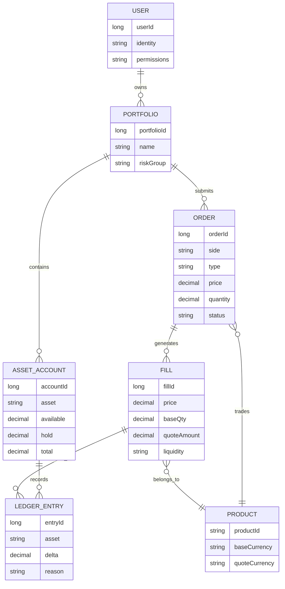

# Day 2：区分参与者与职责边界

## 1. 今天的学习目标

今天的目标是把“用户、账户、组合、订单、成交”之间的关系讲清楚。

学完 Day 2 后，需要能回答：

- 用户和账户是不是一回事
- 一个用户为什么可能有多个 portfolio/profile
- 账户系统和撮合系统分别维护什么状态
- 为什么成交发生在撮合引擎，但资产变化不能直接塞进撮合引擎

参考资料：

- Coinbase Exchange Trading Concepts：https://docs.cdp.coinbase.com/exchange/concepts/trading
- Coinbase Exchange Account Structure：https://docs.cdp.coinbase.com/exchange/concepts/structure
- Coinbase Exchange Matching Engine：https://docs.cdp.coinbase.com/exchange/concepts/matching-engine
- Coinbase Exchange REST API Overview：https://docs.cdp.coinbase.com/exchange/reference

## 2. Coinbase 账户结构重点

Coinbase Account Structure 中的核心思想是：账户结构是分层的。

可以简化理解为：

```text
Organization / Exchange Account
  -> Profile / Portfolio
      -> Asset Account
          -> Balance
```

这里有几个重要点：

- `profile` 或 `portfolio` 是交易组合维度，可以用于隔离策略、团队、资金和权限。
- `account` 更接近某个 profile 下的某个币种资产账户，例如 BTC account、USD account。
- 订单属于某个用户或交易组合，但成交会影响多个资产账户。
- 余额不是撮合引擎的内部状态，而是账户系统的核心状态。

交易系统里不要把“用户 ID”直接等同于“资金账户”。一个用户可以有多个交易组合，一个交易组合可以有多个币种账户，每个币种账户有可用、冻结、总额等状态。

## 3. 基础对象关系

### 3.1 User

`user` 是使用交易系统的人或机构主体。

它通常负责：

- 登录和认证
- API key 管理
- 权限管理
- 所属组织关系
- 审计身份

用户不是资产余额本身。余额一般属于 account 或 portfolio。

### 3.2 Portfolio / Profile

`portfolio` 或 `profile` 是交易组合。

它的作用是隔离交易活动：

```text
同一个机构用户
  -> 做市策略 portfolio
  -> 套利策略 portfolio
  -> 人工交易 portfolio
```

每个 portfolio 可以有自己的：

- 权限
- API key
- 订单
- 资金
- 风控限制
- 成交记录

这样可以避免不同策略之间混用资金、混淆风险和混乱对账。

### 3.3 Account

`account` 是某个 portfolio 下某种资产的余额账户。

例如：

```text
portfolio = market-making

BTC account:
  available = 2
  hold = 0.5
  total = 2.5

USDT account:
  available = 100000
  hold = 20000
  total = 120000
```

账户系统负责回答：

- 用户有多少钱
- 哪些钱可用
- 哪些钱已冻结
- 成交后余额如何变化
- 撤单后冻结如何释放
- 账本流水能否解释每一次余额变化

### 3.4 Order

`order` 是 portfolio/account 发出的交易意图。

订单本身通常不直接持有余额，但它会引用账户和交易对：

```text
orderId = 123
portfolioId = strategy-a
product = BTC-USDT
side = BUY
type = LIMIT
price = 30000
quantity = 1
```

下单前，风控和账户系统会根据订单冻结资产：

- 买单冻结 quote currency，例如 USDT
- 卖单冻结 base currency，例如 BTC

### 3.5 Fill / Trade

`fill` 是订单成交后的明细。

一笔 fill 会连接：

```text
taker order
maker order
product
price
base quantity
quote notional
fee
timestamp
```

成交不是账户余额变化的终点。成交事件还要进入清算和账本，最终才会变成可审计的资产变化。

## 4. 用户-账户-订单-成交关系图



这张图的重点：

- 用户不是订单簿参与者，订单才是。
- portfolio 是交易组合和权限隔离边界。
- account 是余额承载对象。
- fill 是撮合结果。
- ledger entry 是资产变化的审计记录。

## 5. 账户系统维护什么状态

账户系统维护的是资产和资金状态。

核心状态包括：

- 每个资产的可用余额
- 每个资产的冻结余额
- 每个资产的总余额
- 订单冻结记录
- 成交扣减记录
- 手续费扣减记录
- 充值、提现、划转记录
- 账本流水

账户系统关心的问题是：

```text
这笔钱能不能用？
这笔钱为什么被冻结？
成交后应该扣谁的钱，给谁入账？
撤单后应该释放多少？
系统宕机后余额能不能通过流水重建？
```

## 6. 撮合系统维护什么状态

撮合系统维护的是市场微观结构状态。

核心状态包括：

- 每个 product 的订单簿
- 每个价格档位的订单队列
- 每张订单的剩余数量
- 价格时间优先顺序
- 成交事件序列
- 撮合结果序号
- 快照和回放状态

撮合系统关心的问题是：

```text
哪张订单先成交？
成交价格是多少？
成交数量是多少？
maker 和 taker 分别是谁？
订单簿剩余状态是什么？
事件顺序是否确定？
```

## 7. 小练习：列出账户系统和撮合系统各自维护的核心状态

### 7.1 账户系统核心状态

```text
accountId
asset
availableBalance
frozenBalance
totalBalance
orderHoldId
ledgerEntryId
feeRecord
depositRecord
withdrawRecord
transferRecord
```

### 7.2 撮合系统核心状态

```text
productId
orderBook
priceLevel
restingOrderQueue
orderRemainingQty
lastTradePrice
matchEventSeq
snapshotSeq
```

## 8. 复盘问题：为什么账户体系不能直接嵌进撮合模块里

账户体系不能直接嵌进撮合模块，主要有 6 个原因。

第一，职责不同。

撮合模块负责价格时间优先和成交事件；账户系统负责余额、冻结、入账和流水。两者的状态模型不同。

第二，性能路径不同。

撮合引擎是低延迟核心路径，应尽量保持单线程、确定性、少 IO。账户系统通常需要持久化、审计、幂等和复杂校验。如果把账户写入放进撮合核心，会拖慢撮合路径。

第三，恢复方式不同。

撮合系统可以通过订单簿快照和撮合日志恢复；账户系统要通过账本流水恢复。两者混在一起会让恢复边界变得混乱。

第四，可审计要求不同。

账户余额变化必须逐笔可解释，通常需要 ledger。撮合事件只说明成交发生，不直接等于最终入账结果。

第五，扩展方向不同。

撮合系统按 product 分片更自然；账户系统按 account 或 asset 分片更自然。强行放在一起会让分片和扩展非常难做。

第六，故障影响不同。

账户系统慢一点可以排队补偿，但撮合引擎如果阻塞，会影响整个市场交易连续性。

更合理的设计是：

```text
撮合引擎输出 MatchEvent
清算系统消费 MatchEvent
账户系统根据清算结果更新余额
账本系统记录可审计流水
```

## 9. 和当前项目的关系

当前项目中：

```text
common:
  PlaceOrderRequest / MatchResult / enums / SBE schema

matching:
  MatchOrder / OrderBook / MatchEngine / MatchResultEventsHelper

counter:
  模拟客户端和结果订阅
```

目前更接近“撮合系统 + 简化柜台”，还没有完整账户系统。

已经具备：

- 订单对象
- 订单簿
- 撮合事件
- 撤单事件
- 市价单预算字段
- 快照恢复

仍需补齐：

- accountId 下的资产余额
- 下单冻结
- 成交清算
- 手续费
- ledger 流水
- 余额回放和对账

Day 2 的关键结论是：当前 `matching` 模块不应该继续膨胀成账户系统。它应该保持撮合核心职责，账户、清算和账本应作为独立模块补齐。

## 10. 今日检查清单

- 能解释 user、portfolio、account 的区别。
- 能解释一张订单为什么属于某个交易组合。
- 能解释账户系统维护余额，撮合系统维护订单簿。
- 能解释 fill 为什么还需要进入清算和账本。
- 能说出账户系统不能嵌入撮合模块的至少 3 个原因。

## 11. 今日结论

交易系统里的对象不是平铺的，而是分层的。

用户发起交易，portfolio 隔离交易策略和权限，account 承载资产，order 表达交易意图，matching engine 生成 fill，clearing 和 ledger 把 fill 转化为可审计的资产变化。

从工程上看，边界清楚比“所有逻辑放在一起方便调用”更重要。账户系统和撮合系统都很核心，但它们核心的原因不同，不能混成一个模块。
