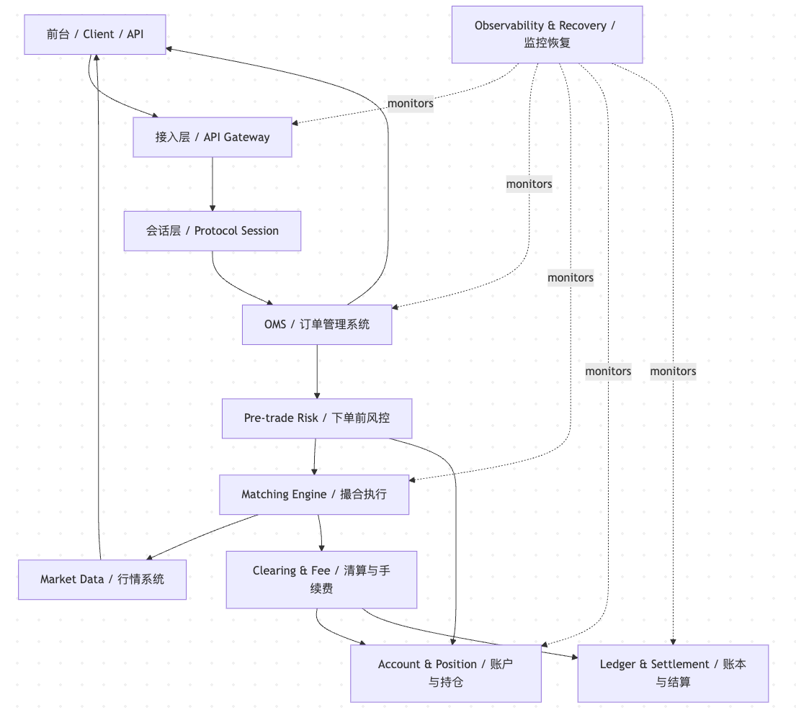
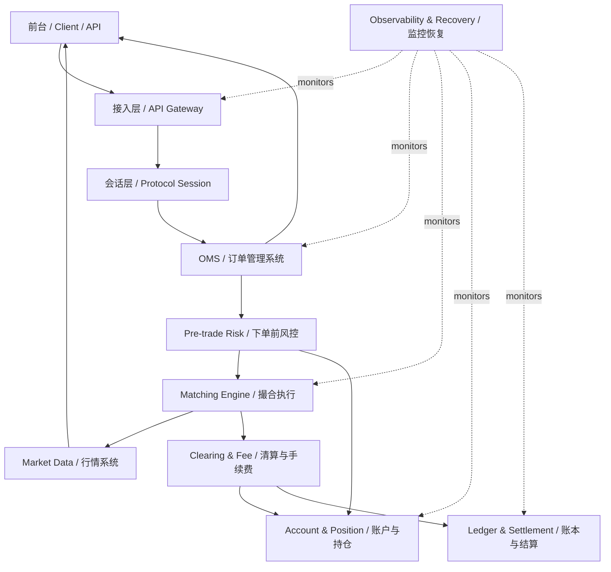

# Day 3：认识系统分层

## 1. 今天的学习目标

今天的目标是建立交易系统的分层视角。

学完 Day 3 后，需要能回答：

- 一个交易系统通常分成哪些层
- 前台、接入、OMS、风控、撮合、行情、账务、清算分别负责什么
- 哪些层偏业务，哪些层偏工程基础设施
- 为什么交易系统不能只按“接口、服务、数据库”这种普通后台系统方式理解

参考资料：

- 算法交易系统架构，此篇足矣：https://cloud.tencent.com/developer/article/1469568
- Coinbase Exchange Trading Concepts：https://docs.cdp.coinbase.com/exchange/concepts/trading
- Coinbase Exchange Matching Engine：https://docs.cdp.coinbase.com/exchange/concepts/matching-engine
- 当前项目 30 天学习计划：`business/trading-system-30-day-learning-plan.md`

## 2. 为什么要分层

交易系统的复杂度来自两个方向：

- 业务复杂度：订单类型、时间有效性、账户、风控、手续费、清算、行情、交易状态
- 工程复杂度：低延迟、高并发、严格顺序、状态恢复、审计、幂等、消息重放、容灾

如果不分层，所有逻辑会混成：

```text
接口收到订单 -> 查余额 -> 撮合 -> 改余额 -> 发消息 -> 写数据库
```

这种写法在 demo 里能跑，但无法成为生产交易系统。生产系统必须让每一层负责自己最核心的状态和约束。

## 3. 交易系统分层图



这张图表达的是中心化交易所核心交易系统的分层关系：主链路从 `前台 / Client / API` 进入，经 `接入层`、`会话层`、`OMS`、`下单前风控` 后进入 `撮合引擎`；撮合结果再流向 `行情系统`、`清算与手续费`、`账户与持仓`、`账本与结算`。右侧的 `Observability & Recovery / 监控恢复` 通过虚线监控多个关键模块，但不参与撮合主路径。



## 4. 每层核心职责

### 4.1 前台 / Client

前台是用户和交易系统的交互入口。

核心职责：

- 展示行情、订单、资产、成交
- 收集用户下单、撤单、改单请求

前台不应该负责真正的业务判断。前台可以做输入提示，但不能成为最终风控依据。

### 4.2 接入层 / API Gateway

接入层负责把外部请求安全、稳定地接进系统。

核心职责：

- 鉴权、限流、防重放、基础参数校验
- 统一 HTTP/WebSocket/FIX 等协议入口

接入层关注的是“请求能不能进入系统”，不是“订单能不能成交”。

### 4.3 会话层 / Protocol Session

会话层负责连接状态和消息顺序。

核心职责：

- 连接管理、心跳、断线重连
- 请求序号、重发、幂等入口

交易系统特别重视会话层，因为丢消息、乱序、重复消息都会直接造成订单状态不一致。

### 4.4 OMS / 订单管理系统

OMS 是订单生命周期的中心。

核心职责：

- 维护订单状态机
- 路由订单到风控、撮合或外部市场

OMS 不是简单转发器。它要知道订单当前处于什么状态、下一步允许发生什么、如何对用户回报。

### 4.5 Pre-trade Risk / 下单前风控

下单前风控负责在订单进入撮合前拦截风险。

核心职责：

- 检查余额、权限、价格范围、数量范围
- 冻结资金或持仓预算

风控必须在撮合前完成，否则撮合出成交后才发现用户没有资产，会造成严重账务问题。

### 4.6 Matching Engine / 撮合执行

撮合引擎负责订单簿和成交。

核心职责：

- 按价格时间优先撮合订单
- 生成确定性的成交事件

撮合引擎最怕不确定性。它应该尽量少依赖外部 IO 和复杂远程调用。

### 4.7 Market Data / 行情系统

行情系统负责向市场发布交易状态。

核心职责：

- 发布成交、深度、ticker、K 线
- 管理快照和增量行情

行情系统是撮合结果的消费者，不应该反向影响撮合顺序。

#### 4.7.1 Ticker 是什么

`ticker` 是某个交易对的市场摘要，不是一笔订单，也不是订单簿本身。

以 `BTC-USDT` 为例，一个 ticker 通常包含：

```text
symbol = BTC-USDT
lastPrice = 68000
bestBid = 67999
bestAsk = 68001
24hHigh = 70000
24hLow = 66000
24hVolume = 1234.56 BTC
24hQuoteVolume = 84000000 USDT
24hChange = +2.3%
timestamp = ...
```

常见字段含义：

| 字段 | 含义 | 来源 |
| --- | --- | --- |
| `lastPrice` | 最新成交价 | 最近一笔成交事件 |
| `bestBid` | 买一价 | 当前订单簿最优买价 |
| `bestAsk` | 卖一价 | 当前订单簿最优卖价 |
| `24hHigh` | 过去 24 小时最高成交价 | 成交事件统计 |
| `24hLow` | 过去 24 小时最低成交价 | 成交事件统计 |
| `24hVolume` | 过去 24 小时 base 成交量 | 成交事件聚合 |
| `24hQuoteVolume` | 过去 24 小时 quote 成交额 | 成交事件聚合 |
| `24hChange` | 过去 24 小时涨跌幅 | 当前价与窗口起始价计算 |

ticker 的作用是让用户快速了解市场当前状态。交易页面顶部看到的 BTC 当前价格、24h 涨跌幅、24h 成交量，通常就是 ticker 数据。

需要注意：`lastPrice` 通常来自最新成交价，不是简单用买一价和卖一价相加除以 2。买一卖一中间价通常叫 `mid price`，它可以用于估值或展示参考，但不是最新成交价。

#### 4.7.2 为什么行情系统需要管理快照

行情客户端通常需要在本地维护一份订单簿视图。

客户端刚连接行情服务时，并不知道当前完整盘口长什么样，所以需要一份 `snapshot`，也就是某一时刻的完整或部分订单簿状态。

例如：

```text
snapshotSeq = 1000

Ask:
68003  1.2
68002  0.8
68001  2.5

Bid:
67999  1.0
67998  3.1
67997  0.7
```

这份快照表示：在 `seq=1000` 这个时刻，`BTC-USDT` 的盘口状态如上。

如果没有快照，客户端只收到后续变化，就不知道这些变化应该叠加到哪个初始状态上。生产行情系统通常不允许客户端直接查询撮合引擎内存，而是由行情系统基于撮合事件构建快照并对外发布。

快照至少应该包含：

- `symbol`
- `snapshotSeq` 或 `lastUpdateId`
- 买盘价格档和数量
- 卖盘价格档和数量
- 生成时间

其中 `snapshotSeq` 很关键，因为它用于和后续增量行情对齐。

#### 4.7.3 增量行情是什么

`incremental update` 是快照之后发生的盘口变化，也叫增量行情。

快照之后，行情系统不会每次都重新发送完整订单簿，而是只发送发生变化的部分。

例如：

```text
seq=1001  Ask 68001 数量从 2.5 变成 1.5
seq=1002  Bid 67999 被删除
seq=1003  Ask 68004 新增 0.6
```

这些就是增量行情。

客户端维护本地订单簿的标准方式是：

```text
1. 先订阅增量行情并缓存
2. 拉取订单簿快照
3. 丢弃 seq <= snapshotSeq 的旧增量
4. 从 snapshotSeq + 1 开始按顺序应用增量
5. 持续检查序号是否连续
```

如果客户端收到：

```text
seq=1001
seq=1002
seq=1004
```

说明中间缺了 `seq=1003`，本地订单簿已经不可信，应该补齐缺失增量或重新拉快照。

行情系统管理快照和增量的核心目的，是让外部客户端能够完整、有序、可恢复地重建本地订单簿，而不是让每个客户端直接访问撮合模块内部状态。

### 4.8 Account & Position / 账户与持仓

账户与持仓系统负责资产状态。

核心职责：

- 维护余额、冻结、持仓、风险敞口
- 支持资产查询、冻结、释放、扣减、入账

现货系统更关注 balance；合约和保证金系统更关注 position。

### 4.9 Clearing & Fee / 清算与手续费

清算层负责把成交转换成资产变化。

核心职责：

- 根据成交计算买卖双方资产变动
- 计算手续费、返佣、税费或其他费用

撮合只说明“成交了多少、什么价格成交”。清算才说明“谁扣多少钱、谁得到多少资产”。

### 4.10 Ledger & Settlement / 账本与结算

账本负责可审计的资金流水。

核心职责：

- 记录每次余额变化的原因和金额
- 支持回放、对账、审计和结算

账本不是简单余额表。余额可以由账本汇总得到，账本必须能解释余额变化。

### 4.11 Observability & Recovery / 监控恢复

监控恢复层负责系统可运营。

核心职责：

- 监控延迟、队列、错误、成交速率、序号
- 支持快照、回放、故障恢复、审计追踪

交易系统不能只考虑正常路径。故障后的恢复和对账能力同样是生产能力。

## 5. 小练习：每层最核心的 2 个职责

| 层 | 核心职责 1 | 核心职责 2 |
| --- | --- | --- |
| 前台 | 展示行情和订单 | 收集用户操作 |
| 接入层 | 鉴权限流 | 请求入口统一 |
| 会话层 | 心跳和连接状态 | 序号和重发 |
| OMS | 订单状态机 | 订单路由与回报 |
| 风控 | 余额权限校验 | 冻结资金或持仓 |
| 撮合 | 维护订单簿 | 生成成交事件 |
| 行情 | 发布成交和深度 | 管理快照和增量 |
| 账户 | 维护余额持仓 | 冻结释放扣减 |
| 清算 | 计算资产变动 | 计算手续费 |
| 账本 | 记录流水 | 支持对账审计 |
| 监控恢复 | 监控运行状态 | 快照回放恢复 |

## 6. 复盘问题：哪些层偏业务，哪些层偏工程基础设施

偏业务的层：

- OMS
- 风控
- 账户与持仓
- 清算与手续费
- 账本与结算

这些层直接承载交易规则、资产规则、费用规则和订单生命周期。

偏工程基础设施的层：

- 接入层
- 会话层
- 行情分发基础设施
- 监控恢复
- 消息队列和日志回放

这些层解决的是可靠性、顺序性、可观测性和性能问题。

撮合引擎介于两者之间。

它既有强业务规则：

```text
价格时间优先
maker/taker
订单类型
自成交防护
```

也有强工程约束：

```text
低延迟
单线程确定性
快照恢复
事件序号
无锁或少锁数据结构
```

## 7. 分层设计的常见错误

### 7.1 把 OMS 当成转发器

错误理解：

```text
OMS 只负责把订单转给撮合。
```

正确理解：

```text
OMS 是订单生命周期的主状态机。
```

### 7.2 把撮合引擎当成交易系统

错误理解：

```text
撮合成交了，交易系统就完成了。
```

正确理解：

```text
撮合只是产生成交事件，后面还有清算、入账、账本、回报、行情。
```

### 7.3 把账户余额直接写在撮合核心里

错误理解：

```text
成交时顺手改余额。
```

正确理解：

```text
撮合输出确定性成交事件，清算和账户系统消费事件更新资产。
```

### 7.4 把行情当成简单查询订单簿

错误理解：

```text
用户要行情时直接查撮合订单簿。
```

正确理解：

```text
行情系统应基于撮合事件构建快照和增量，独立对外发布。
```

## 8. 和当前项目的关系

当前项目可以映射到这些层：

```text
common:
  协议 DTO、枚举、SBE schema

counter:
  简化客户端 / 柜台 / 接入模拟

matching:
  撮合引擎、订单簿、结果事件、快照恢复
```

还缺少：

- 独立 OMS
- 独立账户系统
- 独立风控系统
- 清算与手续费模块
- 账本模块
- 行情发布系统
- 完整会话层

如果后续演进这个项目，一个合理方向是：

```text
counter -> gateway/session mock
matching -> matching core
new risk module -> pre-trade risk
new account module -> balance/hold
new clearing module -> settlement from MatchResult
new market-data module -> ticker/depth/trade feed
```

## 9. 今日检查清单

- 能画出交易系统分层图。
- 能说出 OMS、风控、撮合、账户、清算、账本的职责差异。
- 能解释为什么撮合引擎不应该直接做清算。
- 能解释为什么行情系统应从成交事件构建，而不是让用户直接查撮合内存。
- 能区分业务层和工程基础设施层。

## 10. 今日结论

交易系统不是一个普通 CRUD 系统，而是一组状态机和事件流组成的业务基础设施。

分层的目的不是为了“看起来架构复杂”，而是为了让每个模块只维护自己能负责到底的状态：OMS 维护订单状态，风控维护准入判断，撮合维护订单簿，账户维护余额，清算维护成交后的资产变动，账本维护可审计流水。

清晰的分层边界，是后续做低延迟、回放恢复、对账、扩展和故障隔离的基础。
