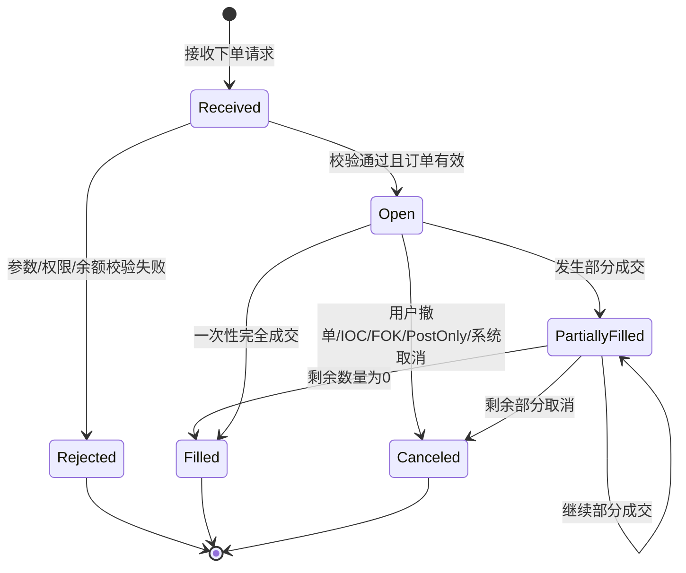

# Day 4：理解订单生命周期

## 1. 今天的学习目标

今天的目标是理解订单从进入系统到最终结束的状态变化。

学完 Day 4 后，需要能回答：

- `received`、`open`、`done` 分别是什么意思
- 为什么一张订单可能部分成交
- 撤单、完全成交、拒单分别如何结束订单
- 为什么订单状态机是交易系统最重要的状态机之一

参考资料：

- Coinbase Exchange Matching Engine：https://docs.cdp.coinbase.com/exchange/concepts/matching-engine
- Coinbase Exchange Trading Concepts：https://docs.cdp.coinbase.com/exchange/concepts/trading
- Coinbase Exchange WebSocket Channels：https://docs.cdp.coinbase.com/exchange/websocket-feed/channels

## 2. 订单生命周期的核心概念

Coinbase Matching Engine 文档强调，撮合引擎维护连续订单簿，订单按价格时间优先执行。

从生命周期角度看，一张订单通常会经历：

```text
received -> open -> partially filled -> filled / canceled / rejected
```

Coinbase 行情和订单事件中常见的概念包括：

- `received`：订单被交易系统接收。
- `open`：订单进入订单簿或处于可成交状态。
- `match`：订单发生一笔成交。
- `done`：订单结束，可能因为完全成交，也可能因为取消。
- `change`：订单剩余数量、资金等发生变化。

不同交易所字段名可能不同，但状态机思想基本一致。

## 3. 订单状态解释

### 3.1 Received

`received` 表示订单已经到达交易系统。

它不等于订单一定已经进入订单簿，也不等于订单一定会成交。

在生产系统里，received 前后通常还要经历：

- 请求鉴权
- 参数校验
- 幂等检查
- 风控检查
- 资金冻结
- 分配订单 ID

可以理解为：

```text
系统已经看见这张订单，但它还没有最终完成生命周期。
```

### 3.2 Open

`open` 表示订单仍然有效。

对限价单来说，open 通常表示它已经挂在订单簿上等待成交。

对市价单来说，它一般不会长期 open，因为市价单通常立即成交或取消。

open 订单必须维护：

- 原始数量
- 已成交数量
- 剩余数量
- 当前状态
- 所在订单簿价格档位
- 时间优先顺序

### 3.3 Partially Filled

`partially filled` 表示订单部分成交。

例如：

```text
买单：买 10 BTC
当前只成交 3 BTC
剩余 7 BTC
```

这时订单还没有结束。如果是 GTC 限价单，剩余 7 BTC 可以继续挂簿；如果是 IOC，剩余部分会被取消。

### 3.4 Filled

`filled` 表示订单完全成交。

条件是：

```text
filledQty == originalQty
```

对按金额市价单，完成条件可能是：

```text
remainingQuoteBudget == 0
```

完全成交后，订单生命周期结束，不再参与撮合。

### 3.5 Canceled

`canceled` 表示订单被取消。

取消来源可能是：

- 用户主动撤单
- IOC 剩余部分取消
- FOK 无法完全成交取消
- Post-only 发生交叉取消
- 市价单未完全成交取消
- 风控或市场状态触发系统取消

取消后必须释放未成交部分对应的冻结资产。

### 3.6 Rejected

`rejected` 表示订单未被系统接受。

常见原因：

- product 不存在或未开启交易
- 数量太小
- 价格精度错误
- 余额不足
- 权限不足
- 重复订单
- 参数非法

拒单通常不会进入撮合引擎，也不应该出现在订单簿中。

## 4. 订单生命周期状态机



## 5. 不同订单类型下的生命周期

### 5.1 GTC 限价单

```text
received -> open -> partially filled -> open -> filled
```

也可能：

```text
received -> open -> canceled
```

GTC 的特点是剩余部分可以继续留在订单簿。

### 5.2 IOC 限价单

```text
received -> match -> done
```

IOC 会立即成交可成交部分，剩余部分取消。

可能结果：

- 完全成交
- 部分成交后取消剩余
- 完全不成交并取消

### 5.3 FOK 限价单

FOK 要么全部成交，要么全部取消。

```text
received -> filled
```

或者：

```text
received -> canceled
```

FOK 通常需要预检查订单簿深度，确认能完全成交后再真正执行。

### 5.4 Post-only 限价单

Post-only 要求只做 maker。

如果会立即成交：

```text
received -> canceled/rejected
```

如果不会立即成交：

```text
received -> open
```

### 5.5 市价单

市价单通常不挂簿。

```text
received -> filled
```

或者：

```text
received -> partially filled -> canceled
```

如果没有对手盘：

```text
received -> canceled
```

## 6. 小练习：手工推演一笔限价单

当前订单簿：

```text
卖盘:
101, 2 BTC
102, 3 BTC

买盘:
99, 1 BTC
98, 5 BTC
```

### 场景 A：买限价单 100，数量 1 BTC，GTC

买价 100 低于最优卖价 101，不会成交。

生命周期：

```text
received -> open
```

结果：

```text
挂入买盘 100, 1 BTC
```

### 场景 B：买限价单 101，数量 1 BTC，GTC

买价 101 可以吃掉卖一 101。

生命周期：

```text
received -> filled
```

结果：

```text
成交 1 BTC @ 101
卖盘 101 剩余 1 BTC
```

### 场景 C：买限价单 102，数量 4 BTC，GTC

可以吃 101 的 2 BTC，再吃 102 的 2 BTC。

生命周期：

```text
received -> partially filled -> filled
```

结果：

```text
成交 2 BTC @ 101
成交 2 BTC @ 102
卖盘 102 剩余 1 BTC
```

### 场景 D：买限价单 102，数量 10 BTC，IOC

可以立即成交 5 BTC，剩余 5 BTC 取消。

生命周期：

```text
received -> partially filled -> canceled
```

结果：

```text
成交 2 BTC @ 101
成交 3 BTC @ 102
取消剩余 5 BTC
```

### 场景 E：买限价单 102，数量 10 BTC，FOK

订单簿里 102 以内只有 5 BTC，不够完全成交。

生命周期：

```text
received -> canceled
```

结果：

```text
不成交，不改变订单簿
```

## 7. 复盘问题：为什么订单状态机是整个交易系统最重要的状态机之一

订单状态机重要，因为它连接了交易系统里的几乎所有模块。

订单状态影响：

- 用户看到的订单列表
- 是否还能撤单
- 是否还能改单
- 资金是否继续冻结
- 是否需要释放冻结
- 是否需要清算入账
- 是否要推送成交回报
- 是否影响行情
- 是否需要写账本流水

如果订单状态错了，会导致：

- 用户以为订单还在，但实际已经成交
- 用户以为订单取消了，但资金没有释放
- 成交已经发生，但账务没有入账
- 重放恢复后订单簿和订单状态不一致
- 对账无法解释资产变化

所以订单状态机必须满足：

- 状态转换合法
- 事件顺序确定
- 状态可回放
- 结果可审计
- 重复消息幂等

## 8. 和当前项目的关系

当前项目中订单状态主要由：

```text
OrderStatusEnum
MatchOrder
MatchEngine
MatchResultEventsHelper
```

共同维护。

已有状态包括：

- `NEW`
- `PARTIALLY_FILLED`
- `FULL_FILLED`
- `CANCELLED`
- `REJECTED`

已有结果事件包括：

- `PlaceOrderResult`
- `MatchOrderResult`
- `CancelOrderResult`

当前项目已经体现了一个重要原则：

```text
PLACE -> MATCH -> CANCEL
```

也就是先有订单接收结果，再有成交结果，最后才可能有取消结果。这个顺序对下游对账和状态重建非常重要。

## 9. 今日检查清单

- 能解释 `received`、`open`、`done` 的含义。
- 能解释为什么一张订单可以有多笔成交。
- 能推演 GTC、IOC、FOK、Post-only、市价单的生命周期。
- 能说出取消订单后为什么要释放冻结资产。
- 能解释订单状态机为什么必须可回放、可审计。

## 10. 今日结论

订单不是一次请求，而是一个生命周期对象。

一张订单从接收、校验、打开、成交、部分成交、取消到结束，每一步都影响撮合、账户、清算、行情和用户回报。交易系统的很多复杂性，本质上都是为了保证订单状态机和资产状态机之间始终一致。
