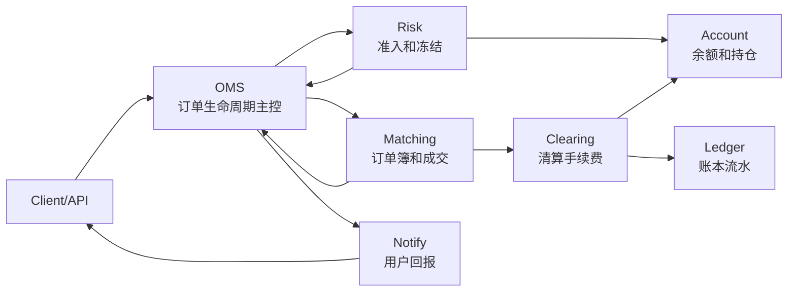

# Day 6：理解 OMS 的存在价值

## 1. 今天的学习目标

今天的目标是理解 OMS 为什么不是“转发订单的薄壳”。

学完 Day 6 后，需要能回答：

- OMS 是什么
- OMS 和撮合引擎有什么区别
- OMS 应该维护哪些订单状态
- 哪些逻辑适合放在 OMS，哪些逻辑应该下沉到风控、撮合、账户或清算模块

参考资料：

- 交易系统架构演进之路（一）：1.0版：https://cloud.tencent.com/developer/article/1759411
- Coinbase Exchange Trading Concepts：https://docs.cdp.coinbase.com/exchange/concepts/trading
- Coinbase Exchange Matching Engine：https://docs.cdp.coinbase.com/exchange/concepts/matching-engine

## 2. OMS 是什么

OMS 是 Order Management System，订单管理系统。

它的核心职责是：

```text
管理订单从创建到结束的完整生命周期。
```

OMS 不是简单地把订单从 API 转发给撮合引擎。它要维护订单状态、处理回报、协调风控和账户、保证用户看到的订单状态与系统内部事件一致。

可以把 OMS 理解成：

```text
订单生命周期的主控系统。
```

## 3. OMS 为什么不是转发器

如果 OMS 只是转发器，交易链路会变成：

```text
API -> OMS -> Matching
```

看起来简单，但马上会遇到问题：

- 订单被撮合前是否已经冻结资金
- 撮合失败后订单状态如何返回
- 部分成交后剩余数量谁维护
- 用户撤单时订单是否还可以撤
- 重复下单请求如何幂等
- 成交回报乱序时如何处理
- 断线重连后用户如何查询真实订单状态
- 系统恢复后订单状态如何重建

这些问题都不是撮合引擎单独能解决的。

## 4. OMS 职责边界表

| 能力 | 是否属于 OMS | 说明 |
| --- | --- | --- |
| 生成或接收订单 ID | 是 | OMS 需要用订单 ID 追踪生命周期 |
| clientOrderId 幂等 | 是 | 防止用户重复提交导致重复订单 |
| 订单状态机 | 是 | NEW、PARTIAL、FILLED、CANCELLED、REJECTED |
| 订单查询 | 是 | 用户看到的订单状态应来自 OMS 或订单视图 |
| 订单回报聚合 | 是 | PLACE、MATCH、CANCEL 等事件要汇总为订单状态 |
| 撤单合法性判断 | 是 | 已完成订单不能撤，未知订单不能撤 |
| 账户余额计算 | 否 | 应属于账户系统 |
| 冻结资金执行 | 否，OMS 协调 | 具体冻结由账户/风控执行 |
| 价格时间优先撮合 | 否 | 属于撮合引擎 |
| 手续费计算 | 否 | 属于清算模块 |
| 账本流水 | 否 | 属于 ledger |
| 行情深度构建 | 否 | 属于行情系统 |

## 5. OMS 应该负责的至少 8 个能力

### 5.1 订单接收和规范化

OMS 接收来自接入层的订单请求，把不同入口协议转换为内部统一订单模型。

例如：

```text
REST order
FIX NewOrderSingle
内部 PlaceOrderCommand
```

最终应转换成统一的内部订单对象。

### 5.2 clientOrderId 幂等

用户可能因为网络超时重复提交订单。

OMS 需要支持：

```text
同一个 accountId + clientOrderId
如果已经成功创建订单，则返回原订单
而不是创建新订单
```

### 5.3 订单状态机

OMS 要维护订单状态：

```text
NEW
PARTIALLY_FILLED
FULL_FILLED
CANCEL_PENDING
CANCELLED
REJECTED
```

撮合引擎可以输出事件，但 OMS 要把事件应用到订单视图中。

### 5.4 订单路由

OMS 决定订单去哪：

- 内部撮合引擎
- 外部交易所
- 做市策略
- 风控拒绝路径
- 灰度或测试环境

在多市场系统里，路由会变得非常关键。

### 5.5 撤单和改单管理

撤单不是简单删除订单。

OMS 要判断：

- 订单是否存在
- 是否已完成
- 是否正在撤单中
- 是否允许改单
- 撤单请求是否重复

### 5.6 回报聚合

撮合引擎可能产生多笔成交。

OMS 要把它们聚合成用户可理解的状态：

```text
原始数量 = 10
已成交 = 7
剩余 = 3
平均成交价 = totalQuote / filledBase
状态 = PARTIALLY_FILLED
```

### 5.7 查询视图

用户查询订单时，不应该直接查撮合引擎。

OMS 或订单视图应提供：

- 当前订单状态
- 成交明细
- 剩余数量
- 平均价格
- 创建和更新时间
- 取消原因

### 5.8 事件顺序和恢复

OMS 要能从事件重建订单状态。

例如：

```text
PlaceOrderResult
MatchOrderResult
MatchOrderResult
CancelOrderResult
```

回放后应得到同样的订单状态。

## 6. 什么逻辑放在 OMS 更合理

适合放在 OMS：

- 订单生命周期状态
- clientOrderId 幂等
- 订单查询视图
- 用户回报聚合
- 撤单/改单请求状态
- 订单路由
- 订单事件持久化
- 与风控、撮合、清算之间的编排

这些逻辑围绕订单本身，不直接属于某个底层执行模块。

## 7. 什么逻辑应该下沉到其他模块

不适合放在 OMS：

### 7.1 撮合规则

例如：

- 价格时间优先
- 订单簿结构
- maker/taker 判定
- 自成交处理

这些应属于撮合引擎。

### 7.2 账户余额

例如：

- 可用余额
- 冻结余额
- 余额扣减
- 余额释放

这些应属于账户系统。

### 7.3 手续费和清算

例如：

- 手续费费率
- maker/taker fee
- base/quote 扣费
- 返佣

这些应属于清算系统。

### 7.4 账本

例如：

- 资金流水
- 资产变更审计
- 对账
- 结算批次

这些应属于 ledger。

### 7.5 行情

例如：

- 订单簿深度
- 最新成交价
- ticker
- K 线

这些应属于行情系统。

## 8. OMS 与其他模块关系图



这张图的重点：

- OMS 是订单生命周期中心。
- 风控和账户是准入和冻结中心。
- 撮合是成交中心。
- 清算和账本是资产变更中心。
- 用户回报应以 OMS 聚合后的状态为主。

## 9. 小练习：列出至少 8 个 OMS 能力

答案：

```text
1. 接收下单请求
2. 生成或绑定 orderId
3. clientOrderId 幂等
4. 维护订单状态机
5. 下单、撤单、改单合法性判断
6. 路由订单到风控和撮合
7. 聚合成交回报
8. 提供订单查询视图
9. 持久化订单事件
10. 支持事件回放恢复
11. 管理订单超时和取消中状态
12. 推送用户执行报告
```

## 10. 复盘问题：什么逻辑放在 OMS 更合理，什么逻辑应该下沉

判断标准是：

```text
这个逻辑是不是围绕“订单生命周期”？
```

如果是，放 OMS：

- 订单状态
- 订单查询
- 撤单状态
- 回报聚合
- 幂等

如果不是，放对应专门系统：

- 价格时间优先 -> 撮合
- 可用余额 -> 账户
- 冻结和风险限额 -> 风控/账户
- 手续费 -> 清算
- 资金流水 -> 账本
- 深度和 ticker -> 行情

## 11. 和当前项目的关系

当前项目中，OMS 还没有独立出来。

现在的职责分布大致是：

```text
counter:
  模拟客户端下单

matching:
  同时承担订单接收、撮合、结果生成

common:
  协议对象
```

如果后续演进，可以新增 OMS 层：

```text
counter/API -> OMS -> Risk -> Matching
                         -> Account
Matching -> OMS -> ExecutionReport
Matching -> Clearing -> Account/Ledger
```

这样可以让 `matching` 更专注：

```text
只维护订单簿和成交事件。
```

## 12. 今日检查清单

- 能解释 OMS 不是转发器。
- 能说出 OMS 至少 8 个职责。
- 能区分 OMS 和撮合引擎。
- 能区分 OMS 和账户系统。
- 能说明订单查询为什么不应该直接查撮合引擎。
- 能说明 OMS 为什么要支持事件回放恢复。

## 13. 今日结论

OMS 的价值在于管理订单生命周期，而不是转发请求。

撮合引擎告诉系统“成交发生了”；OMS 告诉用户“你的订单现在是什么状态”；账户和清算告诉系统“资产应该如何变化”；账本告诉审计“为什么资产这样变化”。

生产交易系统里，OMS 是把订单、风控、撮合、清算、回报连接起来的主控层。
