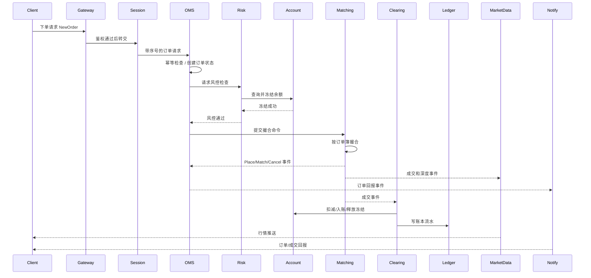
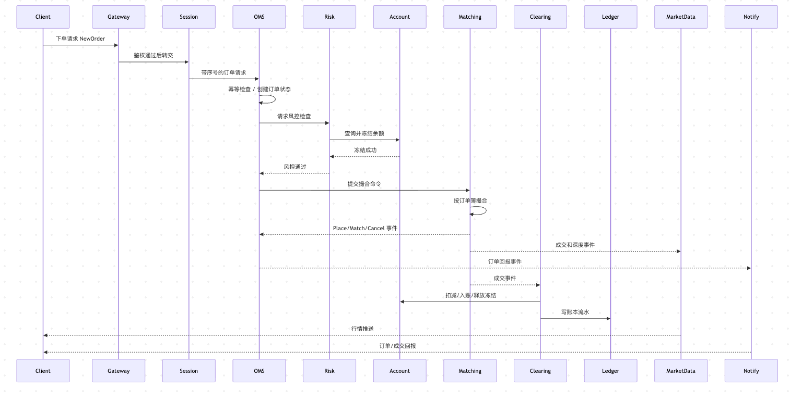

# Day 7：建立订单主链路时序图

## 1. 今天的学习目标

今天的目标是把 Day 1 到 Day 6 的知识串成一条完整订单主链路。

学完 Day 7 后，需要能回答：

- 一笔订单从客户端到成交回报经历哪些步骤
- 哪些步骤是同步请求，哪些步骤是异步事件
- 哪些步骤必须严格顺序执行
- 哪些步骤可以异步化或最终一致

参考资料：

- Coinbase Exchange Trading Concepts：https://docs.cdp.coinbase.com/exchange/concepts/trading
- Coinbase Exchange Matching Engine：https://docs.cdp.coinbase.com/exchange/concepts/matching-engine
- Coinbase Exchange WebSocket Feed：https://docs.cdp.coinbase.com/exchange/websocket-feed/overview
- Day 1-Day 6 学习笔记：`business/days/day-01-建立交易系统全景图.md` 到 `business/days/day-06-理解OMS的存在价值.md`

## 2. 订单主链路总览

一笔订单的主链路可以概括为：

```text
报单
-> 接入校验
-> OMS 建单
-> 风控检查
-> 资金冻结
-> 撮合执行
-> 成交事件
-> 清算入账
-> 账本流水
-> 行情更新
-> 用户回报
```

这条链路里有两个核心事实：

第一，撮合不是第一步。

订单进入撮合前，必须先通过鉴权、参数校验、风控和冻结。

第二，撮合不是最后一步。

撮合产生成交事件后，还需要清算、入账、账本、行情和回报。

## 3. 订单主链路时序图




## 4. 每条箭头的同步/异步属性

| 步骤 | 类型 | 说明 |
| --- | --- | --- |
| Client -> Gateway | 同步请求 | 用户发起下单 |
| Gateway -> Session | 同步请求 | 鉴权、限流、基础参数校验 |
| Session -> OMS | 同步请求或有序消息 | 需要保持请求序号 |
| OMS 内部建单 | 同步状态变更 | 必须确定订单是否创建 |
| OMS -> Risk | 同步请求 | 下单前必须知道风控结果 |
| Risk -> Account 冻结 | 同步请求 | 未冻结成功不能进撮合 |
| OMS -> Matching | 有序命令 | 必须保证同一市场命令顺序 |
| Matching -> OMS | 有序事件 | 订单状态依赖撮合结果顺序 |
| Matching -> MarketData | 异步事件 | 行情可由事件流构建 |
| Matching -> Clearing | 异步或准同步事件 | 成交后必须清算，但可通过可靠事件解耦 |
| Clearing -> Account | 同步状态变更 | 资产入账必须一致 |
| Clearing -> Ledger | 同步或可靠异步 | 账本必须最终完整且可审计 |
| Notify -> Client | 异步推送 | 用户回报可异步到达 |
| MarketData -> Client | 异步推送 | 行情天然是异步流 |

## 5. 哪些步骤必须严格顺序执行

### 5.1 同一账户的资金冻结和释放

必须严格控制顺序。

否则可能出现：

```text
两个订单同时看到同一笔可用余额
最终都冻结成功
导致超卖或透支
```

### 5.2 同一 product 的撮合命令

必须严格按顺序进入撮合。

撮合顺序影响：

- 谁先成交
- 成交价格
- maker/taker
- 订单簿最终状态

### 5.3 同一订单的状态事件

必须严格顺序：

```text
PLACE -> MATCH -> MATCH -> CANCEL
```

不能出现：

```text
MATCH 先于 PLACE
CANCEL 先于 MATCH
FILLED 后又 CANCEL
```

### 5.4 成交清算的幂等顺序

同一笔 fill 只能清算一次。

清算事件必须能通过唯一 fillId 或 matchEventId 幂等处理。

### 5.5 账本流水顺序

账本必须能解释余额变化。

即使物理写入可以批量化，也必须保留逻辑顺序和唯一事件 ID。

## 6. 哪些步骤可以异步化

### 6.1 行情发布

行情可以异步消费撮合事件构建：

- trade feed
- depth feed
- ticker
- K line

行情延迟几十毫秒通常不会影响资产正确性，但会影响用户体验和策略表现。

### 6.2 用户通知

用户回报可以异步推送。

但要注意：

- 不能丢
- 不能乱序
- 客户端断线后要能补查

### 6.3 账本落库

账本可以通过可靠队列异步写入，但必须满足：

- 事件不丢
- 幂等
- 可回放
- 最终和账户余额一致

### 6.4 监控指标

监控指标可以异步。

例如：

- 成交速率
- 下单 QPS
- 撮合延迟
- 队列长度
- 错误码计数

指标不能阻塞撮合主路径。

## 7. 小练习：给箭头标上同步/异步、请求/事件

```text
Client -> Gateway:
  同步请求

Gateway -> OMS:
  同步请求 / 有序命令

OMS -> Risk:
  同步请求

Risk -> Account:
  同步请求

OMS -> Matching:
  有序命令

Matching -> OMS:
  有序事件

Matching -> MarketData:
  异步事件

Matching -> Clearing:
  可靠事件

Clearing -> Account:
  同步状态更新

Clearing -> Ledger:
  同步或可靠异步事件

OMS -> Notify -> Client:
  异步事件推送
```

## 8. 订单链路中的关键数据

### 8.1 请求阶段

```text
requestId（需要定序器进行定序）
clientOrderId
accountId
portfolioId
productId
side
orderType
price
quantity
timeInForce
```

### 8.2 风控阶段

```text
availableBalance
frozenBalance
riskLimit
priceBand
maxOrderSize
feeReserve
holdId
```

字段含义：

| 字段 | 含义 | 典型用途 |
| --- | --- | --- |
| `availableBalance` | 可用余额。当前可以被新订单占用的资金或持仓，不包含已经被冻结、出金锁定、风控锁定的部分。 | 判断买单是否有足够 quote 资产，卖单是否有足够 base 持仓，合约订单是否有足够保证金。 |
| `frozenBalance` | 冻结余额。已经被未成交订单、提现、划转、风控动作占用的资金或持仓。 | 防止同一笔资产被多笔订单重复使用；撤单、成交、过期时需要按冻结记录释放或扣减。 |
| `riskLimit` | 风险限额。账户、产品、杠杆档位或风险等级允许的最大敞口、仓位、保证金占用或订单名义价值。 | 控制单账户最大持仓、最大下单金额、杠杆档位、保证金风险，避免超过交易所允许的风险边界。 |
| `priceBand` | 价格保护区间。订单价格相对最新价、指数价、标记价或盘口中间价允许偏离的上下界。 | 拦截胖手指订单、异常价格订单、明显偏离市场的订单，避免错误订单冲击盘口。 |
| `maxOrderSize` | 单笔订单最大数量或最大名义价值。通常由合约规则、账户等级、风控策略共同决定。 | 限制单笔订单规模，避免单笔大单造成过大撮合冲击、风控敞口或清算压力。 |
| `feeReserve` | 手续费预留。下单时额外预估并冻结的手续费金额。 | 避免成交后资金只够成交本金或保证金、不够扣手续费；实际成交后按真实 maker/taker 费率结算，多余部分释放。 |
| `holdId` | 冻结记录 ID。一次资金或持仓预冻结生成的唯一标识。 | 用于后续成交扣减、撤单释放、失败回滚和幂等处理；生产系统不应只按账户和资产粗粒度释放冻结。 |

核心原则：风控阶段不是只判断“够不够钱”，而是要形成一条可追踪、可回滚、可幂等的占用记录。订单进入撮合前，`holdId` 必须和订单状态绑定；成交、撤单、拒单、过期都应基于这条冻结记录处理资金或持仓变化。

### 8.3 撮合阶段

```text
orderId
makerOrderId
takerOrderId
price
baseQty
quoteAmount
remainingQty
matchEventSeq
```

### 8.4 清算阶段

```text
fillId
buyerAccountId
sellerAccountId
baseDelta
quoteDelta
feeAmount
feeCurrency
```

### 8.5 账本阶段

```text
ledgerEntryId
accountId
asset
delta
balanceAfter
reason
sourceEventId
```

## 9. 复盘问题：哪些步骤必须严格顺序执行，哪些可以异步化

必须严格顺序执行：

- 同一账户的冻结、扣减、释放
- 同一 product 的撮合命令
- 同一订单的状态事件
- 同一成交的清算幂等处理
- 账本逻辑顺序

可以异步化：

- 行情构建和发布
- 用户通知推送
- 监控指标上报
- 报表和统计
- K 线聚合
- 风险报表

但“可以异步”不代表“可以丢”。

生产系统里异步模块通常仍需要：

- 可靠队列
- 消费位点
- 幂等键
- 重放能力
- 死信处理
- 延迟监控

## 10. 和当前项目的关系

当前项目已有一个简化主链路：

```text
counter
  -> PlaceOrderRequest
  -> Aeron Cluster
  -> CommandDispatcher
  -> MatchEngine
  -> MatchResultEventsHelper
  -> ResultRepository
  -> ResultMdcBroadcaster
  -> counter subscriber
```

这条链路已经体现了几个生产系统关键点：

- 使用命令进入撮合状态机
- 使用结果事件输出撮合结果
- 维护 resultSerialNum
- 使用快照恢复撮合状态
- 通过广播通道推送结果

但它还缺少：

- OMS 独立状态机
- 账户冻结
- 清算入账
- 账本流水
- 行情系统
- 完整会话层

后续学习可以围绕这条链路逐步补齐：

```text
先让订单链路完整
再让资产链路完整
最后让行情和恢复链路完整
```

## 11. 今日检查清单

- 能画出订单主链路时序图。
- 能标出同步请求、异步事件、有序命令。
- 能说明订单进撮合前为什么必须冻结资金。
- 能说明撮合后为什么还需要清算和账本。
- 能说出至少 5 个必须严格顺序执行的步骤。
- 能说出至少 5 个可以异步化的步骤。

## 12. 今日结论

交易系统的主链路不是一条简单函数调用链，而是一组有序命令和可靠事件组成的状态转换链。

同步部分保证交易前置条件正确，撮合部分保证成交顺序确定，异步事件部分保证行情、清算、账本和通知可以扩展。生产交易系统的核心能力，就是在低延迟和强一致边界之间做清晰取舍。
