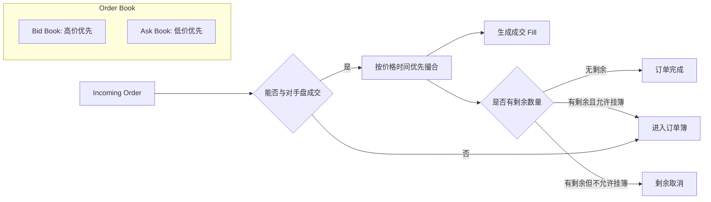

# Day 8：理解订单簿与价格时间优先

## 1. 今天的学习目标

今天的目标是理解撮合引擎最核心的数据结构：订单簿。

学完 Day 8 后，需要能回答：

- 什么是订单簿
- 买盘、卖盘、买一、卖一分别是什么
- 为什么撮合通常使用价格时间优先
- maker 和 taker 的区别是什么
- price improvement 是怎么产生的
- 为什么订单簿设计会直接影响撮合性能和公平性

参考资料：

- Coinbase Exchange Matching Engine：https://docs.cdp.coinbase.com/exchange/concepts/matching-engine
- Coinbase Exchange Trading Concepts：https://docs.cdp.coinbase.com/exchange/concepts/trading

## 2. 订单簿是什么

订单簿是某个交易对上所有未成交限价单的集合。

以 `BTC-USDT` 为例，订单簿通常分为两边：

- `bid book`：买盘，用户愿意买入 BTC 的挂单
- `ask book`：卖盘，用户愿意卖出 BTC 的挂单

简化盘口如下：

```text
Ask 卖盘
price      size
30200      1.0
30100      2.0
30000      1.5   <- best ask / 卖一

29900      1.2   <- best bid / 买一
29800      3.0
29700      2.5
Bid 买盘
```

其中：

- `best bid`：最高买价，也叫买一价
- `best ask`：最低卖价，也叫卖一价
- `spread`：卖一价和买一价之间的价差
- `mid price`：常见简化中间价，通常是 `(best bid + best ask) / 2`

撮合引擎处理订单时，本质上就是在维护这两棵有序结构。

## 3. 价格时间优先

价格时间优先可以拆成两个规则：

第一，价格优先。

- 买单价格越高，优先级越高
- 卖单价格越低，优先级越高

第二，时间优先。

在同一个价格档位内，先进入订单簿的订单先成交。

例如卖盘：

```text
price = 30000
  order A: size = 1 BTC, time = 10:00:00.001
  order B: size = 1 BTC, time = 10:00:00.002
```

如果一个买单打到 `30000`，必须先成交 order A，再成交 order B。

这条规则的意义是：

- 保护先挂单用户的队列位置
- 让撮合结果可解释、可审计
- 让行情和成交回放可以确定性复现
- 避免撮合引擎根据账户、用户等级或其他隐藏条件随意改变成交顺序

## 4. Maker 与 Taker

`maker` 是向订单簿提供流动性的一方。

`taker` 是从订单簿消耗流动性的一方。

示例：

```text
当前卖一：
Ask 30000, 1 BTC

用户提交限价买单：
BUY 1 BTC @ 29900
```

这笔买单不会立即成交，而是进入买盘订单簿，成为 maker。

再看另一个例子：

```text
当前卖一：
Ask 30000, 1 BTC

用户提交限价买单：
BUY 1 BTC @ 30000
```

这笔买单会立即吃掉卖一，提交买单的用户是 taker，原来挂在卖盘上的订单是 maker。

市价单一般总是 taker，因为它不会挂簿，而是立即消耗对手盘流动性。

## 5. Price Improvement

`price improvement` 可以理解为成交价格优于用户订单的限制价格。

例如当前卖盘：

```text
Ask 30000, 1 BTC
Ask 30100, 1 BTC
```

用户提交：

```text
BUY 1 BTC @ 30500
```

这张限价买单虽然最高愿意付 `30500`，但订单簿上最优卖价是 `30000`，所以实际成交价是 `30000`。

对买方来说：

```text
limit price = 30500
trade price = 30000
price improvement = 500
```

生产系统里需要注意：

- 成交价通常取 resting order 的价格，也就是订单簿上原有 maker 订单的价格
- 限价单的价格只是最差可接受价格，不代表一定按该价格成交
- 市价单没有价格上限或下限，需要依靠风控预算、滑点保护或市价保护机制控制风险

对买入限价单来说，如果账户系统在下单时按用户限价预冻结 quote，实际成交又按更优的 maker 价格成交，那么多冻结的 quote 需要在清算时释放回用户可用余额。

以上面的例子：

```text
BUY 1 BTC @ 30500
实际成交 1 BTC @ 30000

下单预冻结 quote = 30500 USDT
实际成交花费 quote = 30000 USDT
应释放多余冻结 = 500 USDT
```

清算后的资产变化可以简化理解为：

```text
USDT frozen   -30500
USDT available +500
BTC available  +1
```

如果还涉及手续费，手续费应由清算层按成交金额、maker/taker 身份、费率和手续费币种计算。释放金额也要扣除实际手续费占用后再确定，不能由撮合引擎直接修改账户余额。

## 6. 订单簿核心概念图



## 7. 手工推演 5 档订单簿

初始订单簿：

```text
Ask:
30200  2 BTC
30100  1 BTC
30000  1 BTC

Bid:
29900  1 BTC
29800  2 BTC
29700  3 BTC
```

用户提交：

```text
BUY 2.5 BTC @ 30100
```

撮合过程：

```text
第 1 笔：
  与 Ask 30000 成交 1 BTC
  remaining = 1.5 BTC

第 2 笔：
  与 Ask 30100 成交 1 BTC
  remaining = 0.5 BTC

检查下一档：
  Ask 30200 高于买单限价 30100
  不能继续成交

剩余：
  0.5 BTC 以 BUY 30100 挂入买盘
```

撮合后订单簿：

```text
Ask:
30200  2 BTC

Bid:
30100  0.5 BTC
29900  1 BTC
29800  2 BTC
29700  3 BTC
```

这张订单同时扮演了 taker 和 maker：

- 前 `2 BTC` 主动吃掉卖盘，是 taker
- 剩余 `0.5 BTC` 挂到买盘，是 maker

## 8. 工程实现上的订单簿结构

一个常见实现会拆成两层：

```text
OrderBook
  bidPriceLevels: price -> PriceLevel
  askPriceLevels: price -> PriceLevel

PriceLevel
  price
  totalRemainingQty
  orders: FIFO queue

Order
  orderId
  accountId
  side
  price
  remainingQty
  timestamp / sequence
```

买盘需要快速找到最高价，卖盘需要快速找到最低价。

常见结构：

- 红黑树 / 跳表 / TreeMap：容易实现，适合一般性能要求
- 自定义价格数组 / 稀疏数组：适合价格范围有限、追求极低延迟的场景
- price level + FIFO linked list：维护同价位的时间优先
- orderId index：用于快速撤单、改单、查询订单位置

生产撮合引擎通常至少需要这些索引：

| 索引 | 作用 |
| --- | --- |
| `best bid/ask` | 快速找到最优价格 |
| `price -> level` | 快速定位价格档位 |
| `orderId -> order` | 快速撤单和查询 |
| `accountId -> orders` | 辅助风控、撤单和自成交防护 |

## 9. 订单簿为什么核心

订单簿决定了：

- 成交价格
- 成交数量
- maker/taker 身份
- 订单是否挂簿
- 市场深度
- 行情快照和增量
- 策略看到的流动性
- 撮合结果的公平性和确定性

所以订单簿不是一个普通集合，而是交易系统里最重要的状态对象之一。

撮合引擎的很多设计都围绕它展开：

- 单线程顺序撮合，避免锁竞争和乱序
- 快照 + 日志回放，恢复订单簿状态
- 按 symbol 分片，隔离不同交易对
- 价格精度整数化，避免浮点误差
- 所有状态变更通过事件输出，便于行情和清算消费

## 10. 小练习

维护下面的订单簿：

```text
Ask:
105  3
104  2
103  1

Bid:
102  2
101  3
100  4
```

依次处理：

```text
1. BUY 2 @ 104
2. SELL 5 @ 101
3. BUY 1 MARKET
4. CANCEL bid order at 101, qty 1
```

要求输出：

- 每一步产生了几笔 fill
- 每笔 fill 的价格和数量
- 处理后的 best bid / best ask
- 哪些订单成为 maker，哪些订单成为 taker

## 11. 复盘问题

为什么订单簿是交易系统最核心的数据结构之一？

可以从这些角度回答：

- 它保存了市场上尚未成交的交易意图
- 它决定新订单的成交对象和成交顺序
- 它是深度行情的直接来源
- 它的顺序性影响公平性
- 它的状态恢复能力影响系统故障恢复
- 它的性能上限影响整个交易所的吞吐和延迟

一句话总结：撮合引擎的核心不是“循环比较价格”，而是稳定、确定、低延迟地维护订单簿状态。
