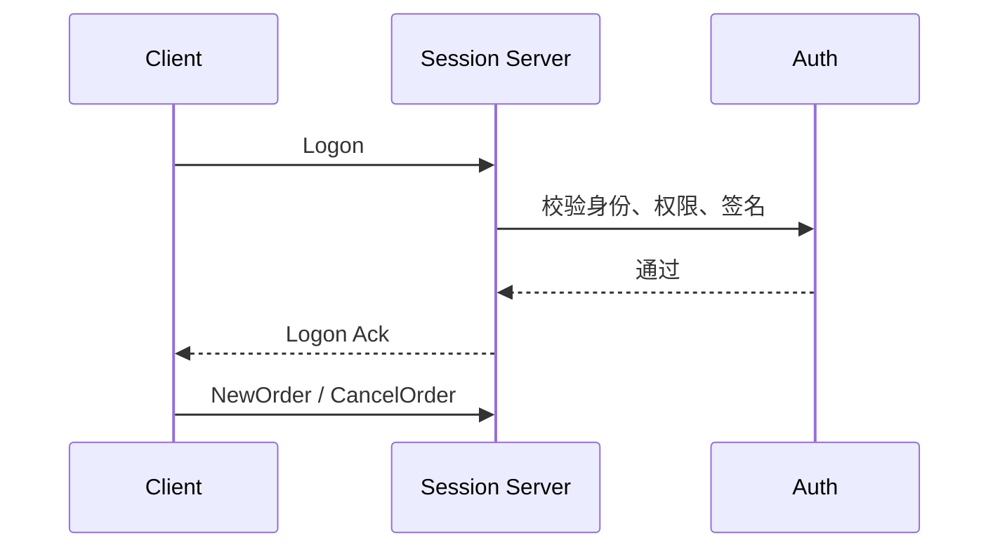

# Day 11：理解会话层

## 1. 今天的学习目标

今天的目标是理解为什么订单协议之外还必须有会话层。

学完 Day 11 后，需要能回答：

- 会话层解决什么问题
- 登录、心跳、序号、重发、断线恢复分别有什么作用
- 为什么 FIX API 一类协议非常重视 sequence number
- 会话层和业务层订单状态有什么边界
- 为什么交易系统不能只靠 TCP 保证可靠性

参考资料：

- Coinbase Exchange FIX API：https://docs.cdp.coinbase.com/exchange/fix-api
- Coinbase Exchange Trading Concepts：https://docs.cdp.coinbase.com/exchange/concepts/trading

## 2. 会话层是什么

会话层位于网络连接和业务订单协议之间。

简化结构：

```text
TCP / TLS
  -> Session Layer
  -> Order Entry Protocol
  -> OMS
  -> Risk
  -> Matching
```

会话层不直接决定订单是否成交，它解决的是：

- 谁连接进来了
- 连接是否有效
- 消息有没有丢
- 消息有没有乱序
- 断线后从哪里恢复
- 重复消息如何处理
- 服务端和客户端是否还活着

如果没有会话层，交易所很难判断：

```text
客户端没发订单？
订单发了但网络丢了？
交易所收到了但回报丢了？
客户端重复发了一遍？
```

## 3. 登录

登录用于建立一个有效交易会话。

登录阶段通常校验：

- API key / 证书 / 签名
- 账户权限
- IP 白名单
- 协议版本
- 会话标识
- 初始序号
- 是否允许交易或只读

登录成功后，服务端才会处理后续业务消息。

简化流程：



## 4. 心跳

`heartbeat` 用于确认连接双方仍然存活。

如果一段时间没有业务消息，双方会发送心跳：

```text
Client -> Server: Heartbeat
Server -> Client: Heartbeat
```

心跳解决的问题：

- 检测连接是否断开
- 检测对端是否卡死
- 维持 NAT / 防火墙连接状态
- 辅助触发重连和会话恢复

心跳不是业务消息，不应该改变订单状态。

## 5. 序号

`sequence number` 是会话层最核心的字段之一。

它用于判断消息顺序：

```text
expectedSeq = 100

收到 seq=100 -> 正常处理，expectedSeq=101
收到 seq=102 -> 发现缺 seq=101，需要重发或恢复
收到 seq=99  -> 可能是重复消息，需要丢弃或幂等处理
```

序号解决的问题：

- 检测丢包
- 检测乱序
- 支持断线恢复
- 支持消息重放
- 支持客户端和服务端对账

交易系统不能只依赖 TCP 的有序性，因为：

- TCP 只保证单条连接内字节流有序
- 断线重连后需要知道上次处理到哪里
- 应用层可能超时重发
- 业务回报和网络 ACK 不是一回事
- 多连接、多网关、多实例下需要应用序号协调状态

## 6. 重发

`resend` 用于在发现序号缺口时请求补发消息。

示例：

```text
Client expected seq = 101
Client received seq = 105

Client -> Server:
  ResendRequest from 101 to 104

Server -> Client:
  resend seq 101
  resend seq 102
  resend seq 103
  resend seq 104
```

重发要注意：

- 重发消息不能重复改变业务状态
- 客户端要根据 orderId、clientOrderId、executionId 做幂等
- 某些管理消息可以使用 gap fill 表示跳过
- 服务端需要保留足够长的会话消息日志

## 7. 断线恢复

断线恢复的目标不是“重新连上就行”，而是恢复到一致的业务状态。

客户端断线后可能错过：

- 订单接受回报
- 拒单回报
- 部分成交回报
- 完全成交回报
- 撤单成功回报
- 撤单失败回报

恢复流程通常是：

```text
1. 客户端重连并登录
2. 双方交换当前 sequence number
3. 发现缺口则发起 resend
4. 客户端补齐 execution report
5. 客户端再通过 REST / 查询接口校验 open orders、fills、balances
```

对交易系统来说，断线恢复必须同时依赖：

- 会话消息重放
- 订单状态查询
- 成交查询
- 账户余额查询
- 幂等处理

## 8. 会话层状态图

```mermaid
stateDiagram-v2
    [*] --> Disconnected
    Disconnected --> Connecting: 建立 TCP/TLS
    Connecting --> LogonSent: 发送 Logon
    LogonSent --> Active: Logon Ack
    LogonSent --> Disconnected: Logon Reject / Timeout
    Active --> Active: NewOrder / Cancel / ExecutionReport
    Active --> HeartbeatWait: 超过心跳间隔未收到消息
    HeartbeatWait --> Active: 收到 Heartbeat/TestResponse
    HeartbeatWait --> Reconnecting: 心跳超时
    Active --> Reconnecting: 网络断开
    Reconnecting --> LogonSent: 重新连接并登录
    Active --> Logout: 主动登出
    Logout --> Disconnected
```



## 9. 会话层和业务层边界

会话层负责消息可靠性，不负责交易业务判断。

| 问题 | 所属层 |
| --- | --- |
| API key 是否有效 | 会话层 / 鉴权层 |
| 消息序号是否连续 | 会话层 |
| 是否需要重发消息 | 会话层 |
| 订单价格是否合法 | 业务校验 / 风控 |
| 账户余额是否足够 | 风控 / 账户 |
| 订单能否成交 | 撮合 |
| 成交后如何入账 | 清算 / 账本 |

边界不清会导致两个问题：

- 会话层变得复杂，影响接入性能
- 业务层无法独立回放和审计订单状态

## 10. 三个关键词

### 10.1 Heartbeat

`heartbeat` 解决连接存活检测问题。

它回答的是：

```text
对端还在吗？
网络连接是否还可用？
```

### 10.2 Sequence Number

`sequence number` 解决消息顺序和缺失检测问题。

它回答的是：

```text
这条消息是不是我应该处理的下一条？
中间有没有漏消息？
```

### 10.3 Resend

`resend` 解决缺失消息补齐问题。

它回答的是：

```text
我缺了哪些消息？
服务端能否重新发给我？
```

## 11. 工程实践建议

生产系统里，会话层至少需要考虑：

- 入站消息序号检查
- 出站消息序号分配
- 消息持久化或可重放日志
- 登录态和权限缓存
- 心跳超时检测
- 重连限流
- 重复登录处理
- 同一 API key 多连接策略
- 断线是否自动撤单
- 会话恢复后的订单状态对账

其中，是否支持 `cancel on disconnect` 是一个重要业务决策：

- 支持后，可以降低断线后挂单失控风险
- 但误触发会导致用户订单被非预期撤销
- 需要非常清晰的协议和配置控制

## 12. 小练习

解释下面三个字段分别解决什么问题：

```text
heartbeatInterval = 30s
inboundSeq = 1024
resendFromSeq = 1001
```

再推演：

```text
客户端期望收到 seq=200
实际收到 seq=203
```

应该做什么？

参考答案方向：

- 暂停处理 seq=203 后续业务语义
- 请求补发 seq=200 到 seq=202
- 补齐后按顺序处理
- 如果无法补齐，则通过查询接口重建业务状态

## 13. 复盘问题

为什么订单协议之外还必须有一层会话协议？

可以这样回答：

订单协议表达的是业务意图，例如下单、撤单和成交回报；会话协议保障的是这些业务消息能被有序、可靠、可恢复地传输。没有会话层，系统无法在断线、重连、超时、重复发送、消息缺失时判断真实状态，也无法通过序号和重发机制恢复客户端与交易所之间的一致视图。
