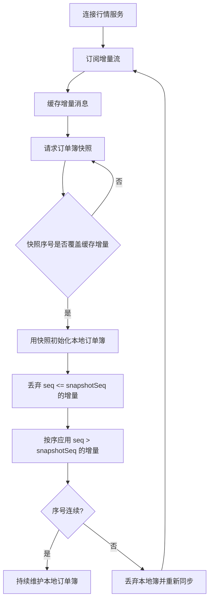

# Day 14：理解快照 + 增量

## 1. 今天的学习目标

今天的目标是理解行情系统中最重要的恢复模型：快照 + 增量。

学完 Day 14 后，需要能回答：

- 什么是 snapshot
- 什么是 incremental update
- 为什么只靠快照或只靠增量都不够
- 客户端如何用快照和增量重建本地订单簿
- 遇到乱序、缺包、断线时如何恢复
- 为什么行情系统最怕的是不完整而不是慢一点

参考资料：

- Coinbase Exchange FIX Market Data：https://docs.cdp.coinbase.com/exchange/fix-api/market-data
- Coinbase Exchange WebSocket Feed：https://docs.cdp.coinbase.com/exchange/websocket-feed/overview
- Nasdaq TotalView-ITCH 5.0 Specification：https://nasdaqtrader.com/content/technicalsupport/specifications/dataproducts/NQTVITCHSpecification.pdf

## 2. Snapshot 是什么

`snapshot` 是某个时刻订单簿的完整状态或部分完整状态。

例如 5 档快照：

```text
snapshotSeq = 1000

Ask:
30030  4 BTC
30020  3 BTC
30010  2 BTC

Bid:
30000  1 BTC
29990  5 BTC
29980  2 BTC
```

快照回答的是：

```text
在 seq=1000 这个时刻，订单簿长什么样？
```

快照适合初始化本地状态，但不适合高频传输全部变化。

## 3. Incremental Update 是什么

`incremental update` 是快照之后的增量变化。

例如：

```text
seq=1001 Update Ask 30010 -> 1.5 BTC
seq=1002 Delete Bid 29980
seq=1003 Add    Ask 30040 -> 2 BTC
```

增量回答的是：

```text
从上一个状态到现在发生了什么变化？
```

增量适合实时更新，但要求客户端不能漏消息。

## 4. 为什么需要快照 + 增量

只靠快照的问题：

- 数据量大
- 实时性差
- 高频推送完整订单簿成本高
- 客户端无法知道两次快照之间发生过什么

只靠增量的问题：

- 新客户端没有初始状态
- 客户端断线后不知道当前完整状态
- 丢失任意一条增量都可能导致状态错误
- 长时间回放成本高

所以生产行情系统通常结合使用：

```text
先拿 snapshot 建立初始订单簿
再按 sequence number 应用 incremental update
```

## 5. 快照与增量恢复流程图



## 6. 标准重建步骤

客户端重建本地订单簿可以采用下面流程：

```text
1. 连接行情增量通道
2. 开始缓存收到的增量消息，不立即应用
3. 请求 REST 或专用通道获取订单簿 snapshot
4. 读取 snapshot 对应的 sequence number
5. 丢弃所有 seq <= snapshotSeq 的增量
6. 找到第一条 seq = snapshotSeq + 1 的增量
7. 从该增量开始按顺序应用
8. 每应用一条都检查 sequence number 是否连续
9. 如果发现缺口，重新同步
```

关键点是：先订阅增量，再拿快照。

如果先拿快照再订阅增量，中间可能漏掉变化。

## 7. 序号检查

本地维护变量：

```text
lastAppliedSeq = snapshotSeq
```

每来一条增量：

```text
if msg.seq == lastAppliedSeq + 1:
    apply(msg)
    lastAppliedSeq = msg.seq
elif msg.seq <= lastAppliedSeq:
    ignore duplicate or old message
else:
    gap detected
    resync()
```

序号检查是行情完整性的底线。

没有序号，客户端无法知道自己看到的盘口是否完整。

## 8. 乱序处理

网络层可能导致客户端收到顺序与发布顺序不同。

示例：

```text
收到 seq=1003
收到 seq=1001
收到 seq=1002
```

处理方式：

- 短时间缓存未来序号
- 等待缺失序号到达
- 如果超时仍缺失，触发重新同步

伪代码：

```text
expectedSeq = 1001

onMessage(msg):
  if msg.seq == expectedSeq:
      apply(msg)
      expectedSeq++
      drainBufferedMessages()
  elif msg.seq > expectedSeq:
      buffer[msg.seq] = msg
      waitOrResync()
  else:
      ignore(msg)
```

不要在缺少 `1001` 和 `1002` 时直接应用 `1003`。

## 9. 缺包恢复

发现序号缺口：

```text
lastAppliedSeq = 1000
received seq = 1005
```

说明至少缺了：

```text
1001, 1002, 1003, 1004
```

恢复策略取决于交易所提供什么能力：

| 能力 | 恢复方式 |
| --- | --- |
| 支持增量重放 | 请求缺失序号区间 |
| 支持快照 | 丢弃本地簿，重新拉快照 |
| 支持快照 + 增量缓存 | 重新执行标准重建流程 |
| 不支持恢复 | 只能断开重连并重新初始化 |

对高可靠行情系统来说，客户端必须把缺口当成严重问题，而不是继续使用错误订单簿。

## 10. Snapshot 的一致性边界

快照必须带有能和增量对齐的边界。

常见字段：

```text
snapshotSeq
lastUpdateId
symbol
timestamp
```

如果快照没有序号，客户端就无法知道：

```text
哪些增量已经包含在快照里？
哪些增量应该继续应用？
```

这会导致重复应用或漏应用。

生产设计里，快照和增量必须使用同一套逻辑序号或可转换的边界标识。

## 11. 为什么行情系统最怕不完整

行情慢一点，客户端最多看到的是延迟市场。

行情不完整，客户端看到的是错误市场。

错误盘口会导致：

- 错误下单
- 错误撤单
- 错误估值
- 错误风控
- 错误回测
- 策略亏损或行为异常

例如真实盘口：

```text
Ask 30000 已经被吃掉
当前 best ask = 30100
```

但客户端因为丢增量仍以为：

```text
best ask = 30000
```

策略可能会基于不存在的流动性下单。

所以行情系统里，完整性通常比几毫秒延迟更重要。

## 12. 小练习

客户端拿到快照：

```text
snapshotSeq = 10

Ask:
101  5

Bid:
100  3
```

缓存增量：

```text
seq=9   Update Bid 100 -> 2
seq=10  Add Ask 102 -> 1
seq=11  Update Ask 101 -> 4
seq=12  Add Bid 99 -> 6
seq=14  Delete Ask 102
```

要求：

- 哪些增量要丢弃
- 应该从哪条增量开始应用
- 什么时候发现缺口
- 发现缺口后应该怎么处理

参考方向：

- 丢弃 `seq <= 10`
- 从 `seq=11` 开始
- 应用 `11`、`12`
- 收到 `14` 时发现缺 `13`
- 触发增量补齐或重新同步

## 13. 复盘问题

为什么行情系统最怕的是不完整而不是慢一点？

可以这样回答：

行情延迟意味着客户端看到的是稍早的真实市场状态，而行情不完整意味着客户端维护的是错误市场状态。对于依赖本地订单簿的策略来说，错误状态比延迟更危险，因为它会影响价格判断、流动性判断、成交概率估算和风控决策。因此行情系统必须通过序号、快照、增量、缺口检测和恢复机制优先保证完整性。
