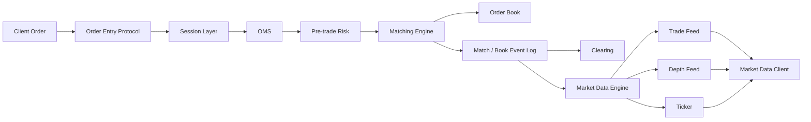

# Day 15：形成撮合与行情模块总结

## 1. 今天的学习目标

今天的目标是把 Day 8 到 Day 14 的内容串成完整闭环。

学完 Day 15 后，需要能回答：

- 订单消息如何进入撮合
- 撮合如何维护订单簿
- 成交事件如何变成行情消息
- 订单接入协议和行情协议如何分工
- 快照、增量、序号在行情恢复中分别起什么作用
- 撮合引擎和行情引擎之间共享哪些核心概念

参考资料：

- Coinbase Exchange Matching Engine：https://docs.cdp.coinbase.com/exchange/concepts/matching-engine
- Coinbase Exchange Trading Concepts：https://docs.cdp.coinbase.com/exchange/concepts/trading
- Coinbase Exchange FIX Market Data：https://docs.cdp.coinbase.com/exchange/fix-api/market-data
- Nasdaq OUCH：https://www.nasdaqtrader.com/Trader.aspx?id=OUCH
- Nasdaq TotalView-ITCH 5.0 Specification：https://nasdaqtrader.com/content/technicalsupport/specifications/dataproducts/NQTVITCHSpecification.pdf
- CME Market by Order (MBO) FAQ：https://www.cmegroup.com/articles/faqs/market-by-order-mbo.html

## 2. Phase 2 总结

Phase 2 的主线是：协议把订单和行情变成可传输、可排序、可恢复的消息；撮合引擎把订单消息变成订单簿状态和成交事件；行情系统再把撮合产生的状态变化变成外部可订阅的市场数据。

订单进入交易所后，不会直接“买卖成功”。它首先要通过订单接入协议进入网关和会话层。订单协议负责清楚表达交易意图，例如交易哪个 symbol、买还是卖、限价还是市价、数量是多少、是否允许挂簿、time in force 是什么、自成交防护模式是什么。会话层则负责登录、心跳、序号、重发和断线恢复，保证这些交易指令在应用层是有序、可恢复、可审计的。

订单进入撮合前，系统已经应该把关键业务语义解析清楚。撮合引擎的核心工作是维护订单簿。订单簿由买盘和卖盘组成，买盘高价优先，卖盘低价优先，同一价格档内时间优先。新订单到达时，撮合引擎先检查是否能与对手盘成交；如果价格穿透，就按价格时间优先逐笔撮合，生成 fill；如果不能成交或只成交了一部分，剩余数量在规则允许时进入订单簿。

maker 和 taker 是撮合结果中的重要身份。挂在订单簿上提供流动性的订单是 maker，主动打掉对手盘流动性的订单是 taker。限价单既可能是 maker，也可能是 taker；市价单通常是 taker。成交价通常来自订单簿上已有的 resting order，因此限价买单可能以低于自己限价的价格成交，这就是 price improvement。

自成交防护是撮合规则中容易被低估的一部分。当 incoming order 和 resting order 属于同一账户、同一用户或同一 self-trade group 时，即使价格可成交，也不能直接生成 fill。系统需要根据 `dc`、`co`、`cn`、`cb` 等策略取消、递减或保留订单。关键点是：自成交防护不是成交，不能产生手续费、成交量和 ticker 成交价，但它会改变订单状态和订单簿状态，所以必须输出明确事件供 OMS、账户和审计系统处理。

撮合引擎产生的成交和订单簿变化，会进入行情系统。行情协议与订单接入协议不同：订单接入是私有请求，行情分发是公共或半公共广播；订单接入改变交易所状态，行情协议传播交易所状态。OUCH 这类协议偏订单接入，ITCH 这类协议偏行情分发。生产系统通常把两者拆开，避免撮合热路径承担大量行情格式化和网络广播工作。

行情可以分为 L1、L2、MBP 和 MBO。L1 只提供最优买卖价和最新成交；L2/MBP 按价格档聚合数量；MBO 提供订单级别变化。MBO 信息量最大，可以向下聚合成 L2，但 L2 通常无法反推出订单级队列。执行策略更偏爱 MBO 或逐笔级别行情，因为它能帮助估算排队位置、真实流动性、撤单行为和短期市场压力。

行情系统最重要的工程模型是快照 + 增量。快照提供某个序号点上的订单簿完整状态，增量提供该序号之后的连续变化。客户端通常先订阅增量并缓存，再拉取快照，然后丢弃快照序号之前的增量，从 `snapshotSeq + 1` 开始按顺序应用。每条增量都必须检查 sequence number；一旦发现缺口，不能继续相信本地订单簿，必须补齐缺失增量或重新同步。

这一阶段最重要的结论是：撮合和行情不是两个孤立模块，而是围绕同一组状态和事件工作的上下游。撮合关注订单簿的真实状态变更和成交确定性，行情关注把这些状态变更完整、有序地发布出去。订单簿、成交、序号、快照、增量、价格档、订单 ID、成交 ID 是两者共享的核心概念。一个成熟交易系统必须让撮合结果可以被清算消费、被 OMS 回报、被行情重建、被日志回放、被审计解释。

## 3. 订单消息如何变成行情消息

完整链路如下：

```text
NewOrder
  -> Gateway 鉴权和基础校验
  -> Session 分配或检查序号
  -> OMS 建立订单状态
  -> Risk 前置风控和资产冻结
  -> Matching 按订单簿撮合
  -> Match Event / Book Event
  -> Market Data Builder
  -> Trade Feed / Depth Feed / Ticker
  -> Client
```

关键点：

- 订单消息是交易意图
- 撮合事件是交易所内部确定状态
- 行情消息是面向外部发布的市场状态

这三者不能混为一谈。

## 4. 撮合与行情闭环图




## 5. 撮合引擎和行情引擎共享的核心概念

| 概念 | 撮合中的含义 | 行情中的含义 |
| --- | --- | --- |
| `symbol` | 订单簿分片和撮合市场 | 行情订阅主题 |
| `orderId` | 订单状态和撤单定位 | MBO 重建订单簿 |
| `price` | 撮合比较和价格档 | 深度档位和成交价格 |
| `quantity` | 可成交数量和剩余数量 | 档位数量、成交数量 |
| `side` | 买盘或卖盘 | bid / ask |
| `sequence` | 撮合命令和事件顺序，例如 `resultSerialNum`、`matchSeq` | 行情增量顺序通常应使用单交易对连续的 `symbolSeq` / `bookSeq` |
| `tradeId` | 成交唯一标识 | trade feed、ticker、K 线来源 |
| `snapshot` | 订单簿状态快照 | 客户端初始化本地簿 |
| `incremental` | 状态变更事件 | 客户端实时更新本地簿 |

这里要特别区分 `resultSerialNum` 和行情增量序号。

`resultSerialNum` 适合表示撮合结果事件在内部全局结果流中的顺序，适合用于：

```text
审计
回放
下游消费幂等
内部问题排查
```

但它不适合直接作为单个交易对的行情增量连续序号。原因是行情客户端通常按 `symbol` 订阅，例如只订阅 `BTC-USDT`。如果全局结果流是：

```text
resultSerialNum = 1001 BTC-USDT update
resultSerialNum = 1002 ETH-USDT update
resultSerialNum = 1003 SOL-USDT update
resultSerialNum = 1004 BTC-USDT update
```

只订阅 `BTC-USDT` 的客户端会看到：

```text
1001, 1004
```

这并不表示 BTC 行情缺了 `1002` 和 `1003`，因为它们属于其他交易对。

因此生产上更推荐：

```text
DepthUpdate:
  symbol = BTC-USDT
  bookSeq = 20001
  prevBookSeq = 20000
  sourceResultSerialNum = 1004
```

其中：

- `bookSeq` / `symbolSeq`：给外部行情客户端检查单个交易对增量是否连续。
- `sourceResultSerialNum`：给内部系统追踪这条行情来自哪条撮合结果事件。

## 6. 最小生产实践原则

### 6.1 撮合侧

撮合模块至少要保证：

- 同一 symbol 内命令严格有序
- 订单簿状态只由撮合线程或确定性事件修改
- 价格和数量使用整数或高精度定点数
- 价格时间优先规则稳定
- 自成交防护在生成 fill 前执行
- 每笔 fill 有全局或 symbol 内唯一 ID
- 每个订单状态变化都有事件
- 事件可以回放恢复订单簿

### 6.2 行情侧

行情模块至少要保证：

- 从撮合事件按顺序构建行情
- trade、depth、ticker 的来源一致
- 每条增量带 sequence number
- 快照带 snapshot sequence
- 客户端能检测缺口
- 缺口后有重放或重新同步机制
- 行情发布不反向阻塞撮合热路径

### 6.3 协议侧

协议设计至少要保证：

- 字段含义稳定
- 枚举值不可随意复用
- 数量单位明确区分 base 和 quote
- 会话层有登录、心跳、序号和重发
- 新旧版本兼容策略清晰
- 订单回报和行情事件都有可审计 ID

## 7. 小练习

用自己的语言讲清楚“订单消息如何变成行情消息”。

建议按下面结构输出：

```text
1. 客户端如何表达交易意图
2. 会话层如何保证消息顺序和恢复
3. OMS 和风控在撮合前做什么
4. 撮合如何更新订单簿并生成 fill
5. 成交事件如何进入行情系统
6. 行情系统如何生成 trade、depth、ticker
7. 客户端如何用 snapshot + incremental 维护本地订单簿
```

### 7.1 参考生产实践流程

生产系统里，“订单消息变成行情消息”可以按下面流程设计：

```text
1. Client 发送 NewOrder
   - 携带 clientOrderId、symbol、side、orderType、price、qty、timeInForce
   - clientOrderId 用于客户端重试幂等

2. Gateway / Session 接收请求
   - 鉴权、限流、基础参数校验
   - 检查会话序号、心跳、重放窗口
   - 转换为内部 PlaceOrderCommand

3. OMS 创建订单请求记录
   - 生成 orderId
   - 校验 accountId + clientOrderId 幂等
   - 建立订单初始状态 RECEIVED / PENDING_RISK
   - 记录订单请求事实，准备进入风控
   - 此时订单还没有进入撮合，也不是可成交挂单

4. OMS 调用 Risk / Account 做前置风控
   - 校验 symbol 状态、tickSize、lotSize、minNotional
   - 校验余额、持仓、权限、限频、价格保护
   - Account 冻结 quote 或 base
   - Risk / Account 返回 PASS + holdId，或 REJECT + reason
   - Risk 不直接成为订单路由中心

5. OMS 根据风控结果推进订单
   - 如果 REJECT:
       status = REJECTED
       生成拒单回报
       流程结束
   - 如果 PASS:
       status = ACCEPTED / SENT_TO_MATCHING
       OMS 发送 PlaceOrderCommand 给 Matching
       订单进入撮合前的状态变化要可恢复、可审计

6. Matching 按 symbol 定序处理
   - 同一 symbol 的命令严格有序
   - 订单进入对应 OrderBook
   - 按价格时间优先撮合
   - 生成 matchId、tradePrice、tradeBaseQty、tradeQuoteAmount
   - 更新 maker / taker remainingQty 和订单簿
   - 生成 resultSerialNum 和 symbolSeq / bookSeq

7. Matching 输出撮合事件
   - OrderAccepted / OrderMatched / OrderCanceled
   - BookUpdated
   - 事件写入 Match Event Log
   - 事件通过可靠总线或发布器分发给下游

8. OMS 消费撮合事件
   - 根据 orderId 和事件顺序更新订单状态
   - PARTIALLY_FILLED / FILLED / CANCELED
   - 更新累计成交数量、均价、剩余数量
   - 生成用户订单回报和订单查询视图

9. Clearing 消费成交事件
   - 按 matchId 幂等处理
   - 计算买卖双方资产变化
   - 计算手续费
   - 计算冻结扣减和多余冻结释放
   - 输出账本写入请求

10. MarketData 消费撮合事件和订单簿事件
   - 根据 MatchEvent 生成 Trade Feed
   - 根据 BookUpdated 生成 Depth Incremental
   - 根据最新成交和 24h 窗口生成 Ticker
   - 根据成交聚合生成 K Line
   - 对每个 symbol 维护独立 bookSeq

11. MarketData 发布行情
    - Trade:
        tradeId / matchId, price, qty, side, timestamp
    - Depth:
        symbol, prevBookSeq, bookSeq, bids/asks delta
    - Ticker:
        lastPrice, bestBid, bestAsk, 24hVolume, 24hChange
    - Snapshot:
        symbol, snapshotSeq, bids, asks

12. Client 重建本地订单簿
    - 先订阅增量并缓存
    - 拉取 snapshot
    - 丢弃 seq <= snapshotSeq 的增量
    - 从 snapshotSeq + 1 开始应用增量
    - 检查 prevBookSeq / bookSeq 是否连续
    - 如果缺口，重新同步或请求补增量
```

这个流程里的关键原则是：

- 撮合是订单簿事实源。
- 行情系统消费撮合事件，不反向影响撮合。
- `resultSerialNum` 用于内部事件回放和审计。
- `symbolSeq` / `bookSeq` 用于单交易对行情连续性。
- OMS 是订单生命周期主控，Risk / Account 返回准入和冻结结果，不直接替代 OMS 推送订单给撮合。
- OMS、Clearing、MarketData 都消费同一份撮合事实，但各自维护自己的读模型。

## 8. 复盘问题

撮合引擎和行情引擎之间共享了哪些核心概念？

可以这样回答：

撮合引擎和行情引擎共享订单簿、价格档、买卖方向、订单 ID、成交 ID、成交价格、成交数量、事件序号、快照和增量等概念。区别在于撮合引擎维护真实交易状态并决定成交，行情引擎消费这些状态变化并向外部发布可订阅、可恢复的市场视图。两者之间最好通过有序事件日志连接，而不是让行情直接读取或修改撮合内部状态。
