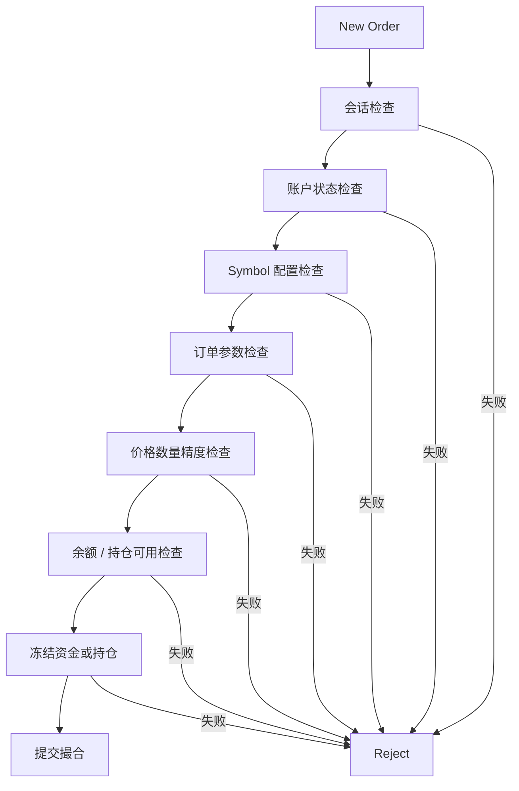

# Day 16：进入前置风控

## 1. 今天的学习目标

今天的目标是理解订单进入撮合前，系统必须完成哪些风险检查。

学完 Day 16 后，需要能回答：

- 什么是前置风控
- 为什么订单不能直接进入撮合
- 余额检查、价格检查、数量检查、精度检查分别解决什么问题
- 现货、杠杆、合约在前置风控上的差异是什么
- 为什么风控不能只依赖交易后处理

参考资料：

- Coinbase Exchange Trading Concepts：https://docs.cdp.coinbase.com/exchange/concepts/trading
- Coinbase Exchange FIX API：https://docs.cdp.coinbase.com/exchange/fix-api
- Day 5：订单类型与时间有效性：`business/days/day-05-理解订单类型与时间有效性.md`

## 2. 什么是前置风控

前置风控是订单进入撮合引擎之前的风险检查。

简化链路：

```text
Client
  -> Gateway
  -> Session
  -> OMS
  -> Pre-trade Risk
  -> Account Hold
  -> Matching
```

前置风控的核心目标是：在订单影响订单簿之前，确认它是合法、可执行、资金或持仓可覆盖的。

如果没有前置风控，系统可能出现：

- 余额不足也能下单
- 超出价格范围的订单进入订单簿
- 数量精度错误导致清算失败
- 同一笔资金被多个订单重复使用
- 已被冻结或已卖出的资产再次被卖出
- 订单进入撮合后才发现无法结算

交易系统里，撮合成功但资产无法交割，是非常严重的问题。

## 3. 前置风控检查项清单

| 分类 | 检查项 | 说明 |
| --- | --- | --- |
| 会话类 | 登录状态 | 用户是否已通过认证 |
| 会话类 | 请求序号 | 消息是否重复、乱序或缺失 |
| 会话类 | 权限范围 | API key 是否允许交易、撤单、查询 |
| 会话类 | 限频 | 下单、撤单、改单频率是否超限 |
| 账户类 | 账户状态 | 是否被冻结、禁用、只允许撤单 |
| 账户类 | 可用余额 | 买单是否有足够 quote，卖单是否有足够 base |
| 账户类 | 冻结资金 | 下单后需要冻结的资产是否可用 |
| 账户类 | 可用持仓 | 卖出或平仓时是否有可用数量 |
| 标的类 | symbol 状态 | 是否开放交易、是否暂停、是否只撤单 |
| 标的类 | price tick | 价格是否符合最小变动单位 |
| 标的类 | lot size | 数量是否符合最小交易单位 |
| 标的类 | min notional | 名义金额是否达到最小下单金额 |
| 订单类 | order type | 市价、限价、IOC、FOK、post-only 是否支持 |
| 订单类 | side | 买卖方向是否合法 |
| 订单类 | price band | 是否超过价格保护区间 |
| 订单类 | market protection | 市价单是否有预算、滑点或保护上限 |

## 4. 账户类检查

账户类检查解决的是：这个账户能不能承担这笔订单的资产占用。

### 4.1 买入限价单

现货买入限价单通常需要冻结 quote currency。

示例：

```text
symbol = BTC-USDT
side = BUY
type = LIMIT
price = 30000
baseQty = 1
```

理论冻结金额：

```text
lockedQuote = price * baseQty
            = 30000 USDT
```

如果还要预冻结手续费，可能是：

```text
lockedQuote = price * baseQty + maxFee
```

生产系统中，冻结金额必须按交易对精度和费用规则计算，不能由前端估算后直接相信。

### 4.2 卖出限价单

现货卖出限价单通常需要冻结 base currency。

示例：

```text
symbol = BTC-USDT
side = SELL
type = LIMIT
baseQty = 1
```

冻结：

```text
lockedBase = 1 BTC
```

如果用户可用 BTC 只有 `0.8`，订单必须拒绝或缩量，不应该进入撮合。

### 4.3 市价买单

市价买单有两种常见目标：

```text
BUY by quote amount: 用 1000 USDT 买 BTC
BUY by base quantity: 买 0.1 BTC
```

按 quote 金额买时，风控冻结 quote 预算：

```text
targetQuoteAmount = 1000 USDT
lockedQuoteAmount = 1000 USDT + maxFee
```

按 base 数量买时，风控需要根据盘口或保护价估算最大 quote 占用：

```text
targetBaseQty = 0.1 BTC
estimatedQuote = targetBaseQty * protectionPrice
lockedQuoteAmount = estimatedQuote + maxFee
```

这就是市价单不能简单只传数量给撮合的原因。进入撮合前，必须有预算上限或保护规则。

### 4.4 市价卖单

市价卖单通常冻结 base：

```text
SELL by base quantity:
  lockedBaseAmount = targetBaseQty
```

如果支持 `SELL by quote amount`，也就是用户希望卖出直到获得目标 quote 金额，风控需要估算最多可能消耗多少 base，并把这个 base 预算传入撮合或执行层。

## 5. 标的类检查

标的类检查解决的是：这个 symbol 当前是否允许以这种参数交易。

常见配置：

```text
symbol = BTC-USDT
base = BTC
quote = USDT
priceTick = 0.1
lotSize = 0.00001
minBaseQty = 0.0001
minQuoteAmount = 5 USDT
status = TRADING
```

示例：

```text
price = 30000.123
priceTick = 0.1
```

该价格不合法，因为它不是 `0.1` 的整数倍。

再看数量：

```text
baseQty = 0.000001
lotSize = 0.00001
```

该数量也不合法，因为小于最小数量单位。

这类检查必须在订单进入撮合前完成。撮合引擎可以假设输入已经符合产品规则，从而保持热路径简单。

## 6. 订单类检查

订单类检查解决的是：这张订单的执行规则是否清晰且可执行。

常见检查：

- 限价单必须有价格
- 市价单不能带普通限价价格
- `GTC` 订单允许挂簿
- `IOC` 订单不允许剩余挂簿
- `FOK` 必须全部立即成交，否则取消
- `POST_ONLY` 如果会立即成交，应拒绝或取消
- 市价单必须有目标数量或目标金额，不能两者同时为空
- 按 base 数量和按 quote 金额的目标单位必须明确

订单类型不是展示字段，而是会直接影响撮合行为。

## 7. 价格保护与 Fat Finger

`fat finger` 指用户或程序误输入极端价格或数量。

例如：

```text
原本想买 1 BTC @ 30000
误输入 BUY 100 BTC @ 300000
```

前置风控可以设置价格保护：

```text
referencePrice = 30000
maxBuyPrice = referencePrice * 1.05
minSellPrice = referencePrice * 0.95
```

也可以设置订单名义金额上限：

```text
maxOrderNotional = 100000 USDT
```

这类规则保护用户，也保护市场。

## 8. 前置风控流程图



## 9. 为什么不能只依赖交易后处理

交易后处理只能在成交已经发生后修正问题。

但有些问题一旦进入撮合，就很难安全修正：

- 余额不足订单已经成交
- 错误价格影响市场价格
- 错误成交已经被行情发布
- 下游策略已经基于成交价继续交易
- 账户账务无法完成交割
- 需要冲正，影响审计和用户信任

交易系统的基本原则是：

```text
撮合前阻止明显非法风险
撮合后只处理真实成交产生的资产变化
```

前置风控不是为了替代清算，而是为了保证进入撮合的订单具备最低可执行性。

## 10. 小练习

把下面校验项分成账户类、标的类、订单类、会话类：

```text
API key 是否过期
symbol 是否暂停交易
price 是否符合 tickSize
baseQty 是否符合 lotSize
买单 quote 余额是否足够
卖单 base 可用数量是否足够
市价单是否带预算上限
请求序号是否重复
账户是否只允许撤单
订单名义金额是否小于最小金额
```

## 11. 复盘问题

为什么风控不能只依赖交易后处理？

可以这样回答：

交易后处理发生在成交之后，只能对已经发生的事实做清算、入账、冲正或补偿。如果非法订单先进入撮合，可能已经改变订单簿、产生成交、影响行情和其他用户决策。前置风控的作用是在订单影响市场之前完成账户、标的、订单和会话层面的基本检查，保证撮合输入是可执行、可结算、可审计的。
