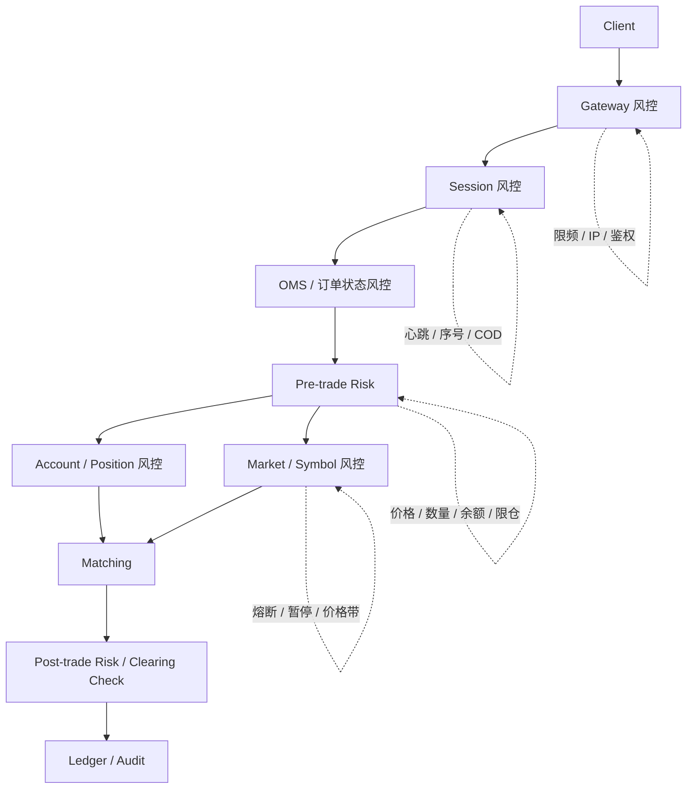

# Day 17：理解风险控制的层次

## 1. 今天的学习目标

今天的目标是理解风险控制不是单个模块能一次做完的事情，而是分布在交易链路的多个层次。

学完 Day 17 后，需要能回答：

- 会话级、订单级、账户级、市场级风控分别是什么
- `fat finger`、`cancel-on-disconnect`、限频、限仓各属于哪一层
- 为什么风控规则会分布在 Gateway、Session、OMS、Risk、Account、Matching 等模块
- 为什么很多风控不是在一个模块里做完的

参考资料：

- Coinbase Exchange FIX API：https://docs.cdp.coinbase.com/exchange/fix-api
- Nasdaq OUCH：https://www.nasdaqtrader.com/Trader.aspx?id=OUCH
- Day 11：会话层：`business/days/day-11-理解会话层.md`
- Day 16：前置风控：`business/days/day-16-进入前置风控.md`

## 2. 风控为什么要分层

不同风险发生的位置不同，能被拦截的时机也不同。

例如：

- API key 无效，应该在接入层拦截
- 消息序号乱了，应该在会话层拦截
- 订单价格偏离太大，应该在订单风控拦截
- 账户余额不足，应该在账户风控拦截
- 某个市场熔断，应该在市场级风控拦截
- 某笔成交异常，可能需要交易后风控和审计处理

如果所有风控都堆到一个模块里，会导致：

- 模块过重
- 依赖过多
- 热路径变慢
- 规则边界不清
- 故障定位困难
- 撮合前后的责任混乱

生产系统里，风控通常是一组分层规则，而不是一个万能服务。

## 3. 风控分层图



## 4. 会话级风控

会话级风控关注连接和消息可靠性。

典型规则：

| 风控项 | 说明 |
| --- | --- |
| 登录认证 | API key、签名、证书是否合法 |
| 会话权限 | 是否允许交易、只读、只撤单 |
| 心跳超时 | 连接是否仍然有效 |
| 序号检查 | 请求是否重复、缺失、乱序 |
| 重放防护 | 防止旧请求被重复提交 |
| cancel-on-disconnect | 断线后是否自动撤销挂单 |

`cancel-on-disconnect` 属于会话级和 OMS 共同参与的规则。

它的触发点在会话层：

```text
检测到用户连接断开
```

但真正执行撤单通常需要 OMS 或撮合层处理：

```text
找到该会话或账户关联的 open orders
发起批量撤单
释放冻结资产
生成撤单回报
```

## 5. 接入级风控

接入级风控更靠近 Gateway。

典型规则：

- IP 白名单
- API key 权限
- 请求签名
- 时间戳窗口
- HTTP/WebSocket/FIX 连接数限制
- 每秒请求数限制
- 下单接口和查询接口分开限流

限频通常属于接入级和会话级风控。

示例：

```text
每个 API key 每秒最多 100 个 NewOrder
每个 IP 每秒最多 500 个请求
每个账户每秒最多 50 个撤单
```

限频不是为了撮合正确性，而是为了保护系统稳定性和公平使用资源。

## 6. 订单级风控

订单级风控关注单笔订单参数是否合理。

典型规则：

| 风控项 | 说明 |
| --- | --- |
| price tick | 价格是否符合最小变动单位 |
| lot size | 数量是否符合最小交易单位 |
| min notional | 名义金额是否达到最小下单金额 |
| max order size | 单笔订单数量上限 |
| max order notional | 单笔订单金额上限 |
| fat finger | 极端价格或数量保护 |
| order type support | 当前市场是否支持该订单类型 |
| TIF support | 当前市场是否支持该 time in force |

`fat finger` 属于订单级风控。

示例：

```text
referencePrice = 30000
maxBuyPrice = 33000
minSellPrice = 27000

BUY @ 50000 -> reject
SELL @ 10000 -> reject
```

它防止用户或程序误输入明显异常的价格。

## 7. 账户级风控

账户级风控关注账户资产和风险敞口。

典型规则：

- 可用余额是否足够
- 冻结金额是否正确
- 可用持仓是否足够
- 账户是否被冻结
- 杠杆倍数是否超限
- 保证金是否足够
- 最大持仓是否超限
- 最大未成交订单金额是否超限

限仓属于账户级、产品级和市场级共同约束。

例如：

```text
Account A 在 BTC-USDT-SWAP 最大允许持仓 = 10 BTC
当前已有持仓 = 9 BTC
新订单如果全部成交会增加 2 BTC
则应拒绝或缩量
```

限仓不能只看当前成交结果，还要考虑 open orders 的潜在成交风险。

## 8. 市场级风控

市场级风控关注整个交易对或市场是否安全运行。

典型规则：

- symbol 是否开放交易
- 是否暂停交易
- 是否只允许撤单
- 是否触发熔断
- 是否触发价格带保护
- 是否进入集合竞价或特殊交易阶段
- 市价单是否暂时禁用
- 某类订单类型是否临时关闭

市场级风控通常由运营、风控、交易规则和系统状态共同决定。

示例：

```text
BTC-USDT status = CANCEL_ONLY
```

此时：

- 新下单拒绝
- 改单拒绝或受限
- 撤单允许
- 查询允许

## 9. 撮合内风控

撮合引擎不应该承担复杂账户风控，但它仍然需要执行少量撮合相关规则。

例如：

- 价格时间优先
- post-only 是否会成交
- IOC 剩余取消
- FOK 是否可全部成交
- 自成交防护
- 市价单保护价或预算消耗上限
- 订单剩余量是否小于最小可成交数量

这类规则之所以放在撮合内，是因为它们依赖订单簿当前状态。

例如 FOK：

```text
只有扫描当前订单簿，才能知道是否能全部成交
```

前置风控无法离线准确判断。

## 10. 交易后风控

交易后风控关注成交后的异常发现和修复。

典型场景：

- 成交价格异常监控
- 清算结果校验
- 账户余额为负检测
- 手续费计算异常检测
- 订单账、成交账、资金账不平
- 异常成交冲正流程

交易后风控不能替代前置风控，但它是最后一道检查和审计能力。

## 11. 常见规则归类

| 规则 | 所属层次 | 说明 |
| --- | --- | --- |
| `fat finger` | 订单级风控 | 防止极端价格或数量 |
| `cancel-on-disconnect` | 会话级 + OMS | 断线后自动撤单 |
| 限频 | 接入级 / 会话级 | 保护系统资源和公平性 |
| 限仓 | 账户级 / 产品级 | 控制风险敞口 |
| 余额检查 | 账户级 | 防止透支 |
| 价格 tick 检查 | 订单级 / 标的级 | 保证价格合法 |
| symbol 暂停交易 | 市场级 | 控制市场交易状态 |
| STP 自成交防护 | 撮合级 / 账户组规则 | 防止自己与自己成交 |
| 负余额扫描 | 交易后风控 | 发现清算或账务异常 |

## 12. 为什么很多风控不是在一个模块里做完

原因是不同规则需要不同上下文。

| 规则 | 最需要的上下文 |
| --- | --- |
| 鉴权 | API key、签名、连接信息 |
| 序号 | 会话状态 |
| 价格精度 | symbol 配置 |
| 可用余额 | 账户资产状态 |
| FOK 可成交性 | 实时订单簿 |
| 手续费正确性 | 成交、费率、账户类型 |
| 对账 | 订单、成交、账本全量数据 |

把所有规则放在一个服务里，反而会让这个服务依赖所有系统，最终成为高延迟、高耦合、难恢复的核心瓶颈。

## 13. 小练习

把下面规则归类：

```text
fat finger
cancel-on-disconnect
API key 每秒最多 100 单
账户最大持仓 10 BTC
symbol 暂停交易
FOK 不足量取消
自成交防护
负余额扫描
```

要求分成：

- 接入级
- 会话级
- 订单级
- 账户级
- 市场级
- 撮合级
- 交易后

## 14. 复盘问题

为什么很多风控不是在一个模块里做完的？

可以这样回答：

风控规则依赖不同的上下文和触发时机。鉴权和限频靠近接入层，心跳和序号属于会话层，价格数量校验属于订单和标的层，余额持仓属于账户层，FOK 和自成交防护依赖实时订单簿，清算异常和账不平只能在交易后发现。把它们强行放进一个模块，会造成高耦合和高延迟；合理做法是按交易链路分层拦截，并用事件和审计把结果串起来。
