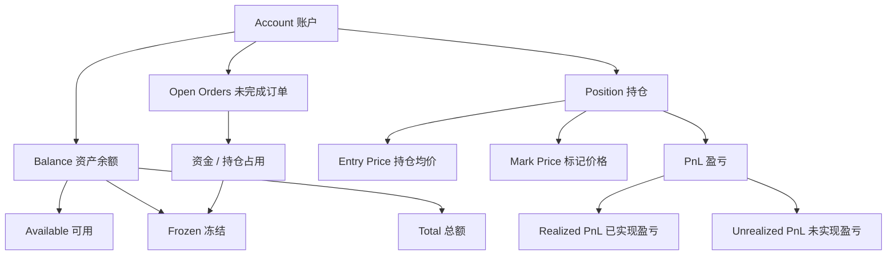

# Day 18：理解账户、持仓与可用资金

## 1. 今天的学习目标

今天的目标是理解账户系统里的余额、冻结、持仓和盈亏。

学完 Day 18 后，需要能回答：

- balance、available、frozen、total 分别是什么
- position 和 balance 有什么区别
- 可用资金为什么不能由前端计算
- 买入成交后，余额、冻结和持仓如何变化
- 已实现盈亏和未实现盈亏分别是什么

参考资料：

- Coinbase Exchange Trading Concepts：https://docs.cdp.coinbase.com/exchange/concepts/trading
- Coinbase Exchange Account Structure：https://docs.cdp.coinbase.com/exchange/concepts/structure
- Day 1：账户、余额和持仓：`business/days/day-01-建立交易系统全景图.md`
- Day 16：前置风控：`business/days/day-16-进入前置风控.md`

## 2. Balance 是什么

`balance` 是账户在某个资产上的余额状态。

现货账户里常见形式：

```text
accountId = 10001

USDT:
  available = 10000
  frozen = 2000
  total = 12000

BTC:
  available = 1.5
  frozen = 0.2
  total = 1.7
```

字段含义：

| 字段 | 含义 |
| --- | --- |
| `available` | 可用余额，可以继续下单、提现或转出 |
| `frozen` / `hold` | 冻结余额，被挂单、提现、风控或其他流程占用 |
| `total` | 总余额，通常等于 available + frozen |

在生产系统里，`available` 不是简单展示字段，而是前置风控和资金冻结的核心输入。

## 3. Position 是什么

`position` 是持仓或风险敞口。

现货普通账户里，很多时候用 balance 就能表达资产持有：

```text
BTC balance = 1.5 BTC
```

但在合约、杠杆、保证金系统里，position 更重要。

一个合约仓位可能包含：

```text
symbol = BTC-USDT-SWAP
side = LONG
positionSize = 0.5 BTC
entryPrice = 60000
markPrice = 61000
unrealizedPnl = 500 USDT
margin = 3000 USDT
liquidationPrice = 54500
```

区别可以这样理解：

```text
balance 关注资产账本：我有多少资产
position 关注交易风险：我暴露了多少市场方向风险
```

## 4. 账户、持仓、资金关系图



## 5. 可用资金为什么重要

下单时不能只看总余额。

示例：

```text
USDT total = 10000
USDT frozen = 8000
USDT available = 2000
```

用户再下一张买单需要冻结：

```text
requiredQuote = 5000 USDT
```

虽然总余额有 `10000`，但可用只有 `2000`，这张订单不能通过风控。

如果错误地按 total 校验，就会导致同一笔资金被多张订单重复使用。

## 6. 买入限价单的资金变化

初始状态：

```text
USDT:
  available = 10000
  frozen = 0
  total = 10000

BTC:
  available = 0
  frozen = 0
  total = 0
```

用户下单：

```text
BUY 1 BTC @ 30000
```

如果账户只有 `10000 USDT`，订单应被拒绝。

换一个例子：

```text
USDT available = 50000
```

下单后冻结：

```text
lockedQuote = 30000 USDT
```

账户变为：

```text
USDT:
  available = 20000
  frozen = 30000
  total = 50000
```

订单进入撮合。

如果成交：

```text
fill = 0.4 BTC @ 30000
fee = 12 USDT
```

清算后：

```text
USDT frozen 减少 = 0.4 * 30000 + 12 = 12012
BTC available 增加 = 0.4
```

订单剩余：

```text
remaining = 0.6 BTC
remaining lockedQuote = 18000 USDT
```

账户可以变为：

```text
USDT:
  available = 20000
  frozen = 17988 或 18000，取决于手续费预冻结和释放策略
  total = available + frozen

BTC:
  available = 0.4
  frozen = 0
  total = 0.4
```

手续费处理方式要由清算层和账户层统一决定，不能由撮合随意扣。

## 7. 卖出限价单的资金变化

初始状态：

```text
BTC:
  available = 1
  frozen = 0
  total = 1
```

用户下单：

```text
SELL 1 BTC @ 30000
```

下单冻结：

```text
BTC:
  available = 0
  frozen = 1
  total = 1
```

如果成交：

```text
fill = 0.4 BTC @ 30000
fee = 12 USDT
```

清算后：

```text
BTC frozen 减少 0.4
USDT available 增加 12000 - 12 = 11988
```

订单剩余 `0.6 BTC` 继续冻结。

## 8. 已实现盈亏和未实现盈亏

### 8.1 已实现盈亏

`realized PnL` 是已经通过平仓或结算落到账户中的盈亏。

例如：

```text
买入 1 BTC @ 30000
卖出 1 BTC @ 31000
```

忽略手续费：

```text
realized PnL = 1000 USDT
```

这笔收益已经通过成交完成，进入资产账本。

### 8.2 未实现盈亏

`unrealized PnL` 是仓位还没平掉时，根据当前标记价格估算的浮动盈亏。

例如永续合约多头：

```text
position = LONG 1 BTC
entryPrice = 30000
markPrice = 31000
```

忽略合约乘数：

```text
unrealized PnL = (31000 - 30000) * 1 = 1000 USDT
```

这笔盈亏还没有真正落账，价格变化后会继续变动。

## 9. 订单系统不能外包资金正确性给 UI

UI 可以显示可用余额，但不能成为最终风控依据。

原因：

- 前端数据可能延迟
- 用户可以绕过 UI 直接调用 API
- 多设备同时下单
- 多个订单并发占用同一余额
- 余额可能被提现、划转、强平、风控冻结改变
- 恶意用户可以伪造请求参数

生产系统必须在服务端账户系统中维护可用、冻结和总额，并在下单时原子地冻结资产。

## 10. 账户系统的核心不变量

现货账户至少要维护这些不变量：

```text
total = available + frozen
available >= 0
frozen >= 0
同一笔冻结必须能追溯到订单、提现或风控事件
同一笔成交只能清算一次
```

合约账户还需要维护：

```text
equity = walletBalance + unrealizedPnl
marginRatio 符合风险规则
positionSize 和成交、资金费、平仓记录一致
```

不变量比字段本身更重要。字段可以变化，但不变量不能被破坏。

## 11. 小练习

初始状态：

```text
USDT available = 50000
USDT frozen = 0
BTC available = 0
BTC frozen = 0
```

用户下单：

```text
BUY 1 BTC @ 30000
```

随后成交：

```text
fill = 0.4 BTC @ 30000
fee = 12 USDT
```

要求推演：

- 下单后 USDT available / frozen
- 成交后 USDT available / frozen
- 成交后 BTC available
- 剩余订单还需要冻结多少 USDT

## 12. 复盘问题

为什么订单系统不能把“资金正确性”外包给 UI？

可以这样回答：

UI 只是展示层，数据可能延迟，也可以被绕过。真实交易系统必须在服务端账户系统中维护 available、frozen、total 等资金状态，并在下单、成交、撤单、清算时以可审计事件原子更新。否则多设备、多订单和 API 直连场景下会出现重复占用、超卖、负余额和账务不一致。
