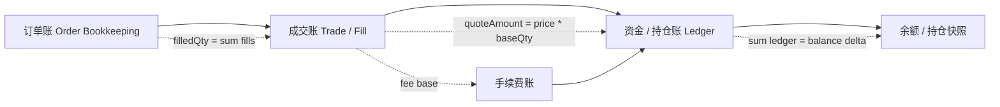

# Day 19：理解三本账

## 1. 今天的学习目标

今天的目标是理解交易系统里的订单账、成交账、资金/持仓账如何互相校验。

学完 Day 19 后，需要能回答：

- 什么是订单账
- 什么是成交账
- 什么是资金/持仓账
- 三本账之间如何勾稽
- 为什么很多线上事故最后都会落到对账问题

参考资料：

- 交易系统架构演进之路（二）：2.0 版：https://cloud.tencent.com/developer/article/1148285
- Day 4：订单生命周期：`business/days/day-04-理解订单生命周期.md`
- Day 18：账户、持仓与可用资金：`business/days/day-18-理解账户持仓与可用资金.md`

## 2. 为什么需要三本账

交易系统不是只有一张余额表。

一笔交易至少会影响：

- 订单状态
- 成交明细
- 资产余额
- 冻结金额
- 手续费
- 持仓
- 行情成交量
- 用户回报

如果只记录最终余额，系统无法解释：

```text
余额为什么变了？
是哪笔订单导致的？
成交价格和数量是多少？
手续费怎么扣的？
撤单释放了多少冻结？
是否重复清算？
```

所以生产系统通常需要多套账簿或账务视图互相校验。

## 3. 三本账是什么

### 3.1 订单账

订单账记录订单生命周期。

核心字段：

```text
orderId
clientOrderId
accountId
symbol
side
orderType
price
delegateQty
filledQty
remainingQty
status
createdTime
updatedTime
```

订单账回答：

```text
这张订单现在是什么状态？
它原始委托多少？
已经成交多少？
剩余多少？
是否撤单、拒单或完成？
```

### 3.2 成交账

成交账记录每一笔 fill。

核心字段：

```text
tradeId / matchId / fillId
symbol
price
baseQty
quoteAmount
makerOrderId
takerOrderId
makerAccountId
takerAccountId
tradeTime
matchSeq
```

成交账回答：

```text
市场上真实发生了哪些成交？
哪两张订单成交？
成交价格和数量是多少？
谁是 maker，谁是 taker？
```

一张订单可以对应多笔成交。

### 3.3 资金/持仓账

资金/持仓账记录资产变化。

核心字段：

```text
ledgerId
accountId
asset
changeType
amount
beforeAvailable
afterAvailable
beforeFrozen
afterFrozen
relatedOrderId
relatedTradeId
createdTime
```

资金账回答：

```text
账户资产为什么变化？
变化前是多少？
变化后是多少？
和哪笔订单或成交相关？
```

持仓账回答：

```text
仓位为什么变化？
开仓、平仓、加仓、减仓如何发生？
已实现盈亏和未实现盈亏如何计算？
```

## 4. 三本账勾稽关系图



核心勾稽关系：

```text
订单已成交数量 = 该订单所有 fill 数量之和
订单剩余数量 = 委托数量 - 已成交数量 - 已取消数量
成交 quote 金额 = 成交价格 * 成交 base 数量
账户余额变化 = 相关资金流水之和
手续费流水 = 成交费率规则计算结果
```

## 5. 订单账和成交账如何校验

对于一张订单：

```text
order.delegateQty = 10
order.filledQty = 7
order.remainingQty = 3
```

成交账应该满足：

```text
sum(fill.baseQty where orderId = X) = 7
```

如果成交账合计为 `6.5`，说明：

- 订单状态更新错了
- 成交记录丢了
- 成交记录重复扣减了
- 对账取数范围不一致

订单账不能只相信自身字段，必须能被成交账解释。

## 6. 成交账和资金账如何校验

一笔成交：

```text
BUY 0.5 BTC @ 30000
quoteAmount = 15000 USDT
fee = 15 USDT
```

买方资金账应该有类似变化：

```text
USDT: frozen -15015
BTC: available +0.5
```

卖方资金账：

```text
BTC: frozen -0.5
USDT: available +14985
```

如果成交账存在，但资金账没有对应流水，说明成交未清算。

如果资金账存在，但成交账没有对应 fill，说明可能有错误入账或非成交类资金流水没有正确分类。

## 7. 资金账和余额快照如何校验

余额表通常是当前状态：

```text
available
frozen
total
```

资金账是历史流水。

理论上：

```text
当前余额 = 初始余额 + sum(资金流水)
```

如果余额表和流水汇总不一致，必须查明：

- 是否漏写流水
- 是否重复写流水
- 是否余额直接被修改
- 是否异步落库延迟
- 是否修复流水未同步
- 是否查询时间边界不一致

生产系统里，余额表可以是读模型，但账本流水必须是可审计事实。

## 8. 至少 5 类需要对账的对象

常见对账对象：

| 对账对象 | 校验目标 |
| --- | --- |
| 订单账 vs 成交账 | 订单 filledQty 与 fill 合计一致 |
| 成交账 vs 清算流水 | 每笔 fill 都被清算且只清算一次 |
| 清算流水 vs 资金账 | 清算结果完整落账 |
| 资金账 vs 余额表 | 当前余额能由流水解释 |
| 手续费账 vs 成交账 | 每笔成交手续费正确 |
| 冻结余额 vs 未完成订单 | open orders 占用与 frozen 一致 |
| 持仓账 vs 成交账 | 仓位变化能由成交解释 |
| 行情成交量 vs 成交账 | 市场成交量统计不多不少 |

## 9. 对账常见异常

### 9.1 成交重复清算

同一个 `fillId` 被清算两次。

后果：

- 买方重复扣款
- 卖方重复到账
- 手续费重复收取
- 余额和成交不匹配

解决关键：

```text
fillId 幂等
ledgerId 唯一
清算消费 offset 可恢复
```

### 9.2 成交漏清算

撮合产生 fill，但清算没有处理。

后果：

- 订单显示成交
- 资产没有变化
- 用户投诉“成交了但没到账”

需要通过成交账和清算流水对账发现。

### 9.3 撤单释放错误

订单撤销后，冻结资金释放过多或过少。

后果：

- frozen 长期残留
- available 被错误增加
- 用户无法继续下单或出现透支风险

需要用未完成订单占用和账户 frozen 对账。

### 9.4 手续费不一致

成交账和手续费账不匹配。

原因可能是：

- maker/taker 识别错
- 费率版本错
- VIP 等级取错
- 手续费币种错
- 返佣规则漏算

## 10. 为什么线上事故最后会落到对账问题

因为交易系统中很多故障不是立刻表现为程序崩溃，而是表现为状态不一致。

例如：

- 回报丢了
- 成交重复消费
- 账本写入超时
- 清算异步延迟
- 用户撤单和成交并发
- 快照恢复后状态不一致

这些问题最终都会变成：

```text
订单状态对不上
成交明细对不上
资金流水对不上
余额对不上
用户看到的状态和系统事实对不上
```

对账能力不是运营补救工具，而是交易系统的核心安全能力。

## 11. 小练习

列出至少 5 类需要对账的对象。

建议从下面方向思考：

```text
订单 vs 成交
成交 vs 清算
清算 vs 账本
账本 vs 余额
冻结 vs open orders
手续费 vs 成交
持仓 vs 成交
行情成交量 vs 成交账
```

## 12. 复盘问题

为什么很多线上事故最后都会落到对账问题？

可以这样回答：

交易系统由订单、成交、清算、账本、账户、行情等多个状态视图组成。故障不一定表现为服务不可用，更多时候表现为某个状态视图更新成功、另一个状态视图失败或延迟，最终形成账不平。对账通过订单账、成交账、资金/持仓账之间的勾稽关系发现和定位这些不一致，因此很多线上事故最终都要靠对账来确认影响范围和修复路径。
