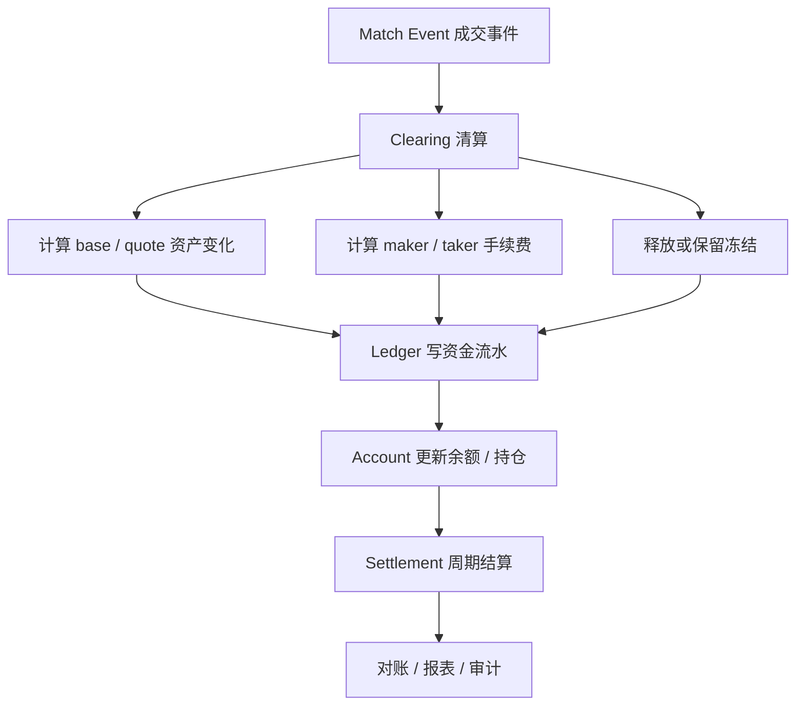

# Day 20：理解清算与结算

## 1. 今天的学习目标

今天的目标是理解成交、清算、结算之间的区别。

学完 Day 20 后，需要能回答：

- 成交和清算为什么不是同一件事
- 清算层根据成交做什么
- 结算价、逐日盯市、盈亏结转有什么系统含义
- 为什么交易系统必须区分“撮合成功”和“账务完成”
- 现货、杠杆、合约在清算结算上的差异是什么

参考资料：

- CME Mark-to-Market：https://www.cmegroup.com/education/courses/introduction-to-futures/mark-to-market.html
- Day 18：账户、持仓与可用资金：`business/days/day-18-理解账户持仓与可用资金.md`
- Day 19：三本账：`business/days/day-19-理解三本账.md`

## 2. 成交、清算、结算的区别

### 2.1 成交

成交是撮合引擎产生的交易事实。

示例：

```text
tradeId = T1001
symbol = BTC-USDT
price = 30000
baseQty = 0.5 BTC
quoteAmount = 15000 USDT
makerOrderId = M1
takerOrderId = T1
```

成交回答的是：

```text
谁和谁在什么价格成交了多少？
```

### 2.2 清算

清算是把成交转换成账户资产变化。

对上面成交，清算需要计算：

- 买方扣多少 USDT
- 买方得多少 BTC
- 卖方扣多少 BTC
- 卖方得多少 USDT
- 手续费是多少
- 手续费币种是什么
- 冻结资金释放多少
- 订单剩余冻结保留多少

清算回答的是：

```text
这笔成交对双方账户造成什么资产变化？
```

### 2.3 结算

结算是按照某个周期或规则，把交易、持仓、盈亏、保证金、费用等最终归集到账务状态。

结算回答的是：

```text
经过本周期所有交易和估值后，账户最终应该是什么状态？
```

现货系统里，很多成交可以近实时清算到账。

合约系统里，结算通常更复杂，会涉及：

- 结算价
- 标记价格
- 未实现盈亏
- 已实现盈亏
- 资金费
- 保证金
- 逐日盯市
- 风险限额

## 3. 成交后到账务结算流程图



## 4. 现货清算示例

成交：

```text
BUYER 买入 0.5 BTC
SELLER 卖出 0.5 BTC
price = 30000 USDT
quoteAmount = 15000 USDT
buyerFee = 15 USDT
sellerFee = 15 USDT
```

买方清算：

```text
USDT frozen -15015
BTC available +0.5
```

卖方清算：

```text
BTC frozen -0.5
USDT available +14985
```

手续费账户：

```text
USDT fee income +30
```

这个过程需要写账本流水，不能只改余额表。

## 5. 冻结释放

清算不仅要扣减成交金额，还要处理冻结资产。

限价买单：

```text
BUY 1 BTC @ 30000
lockedQuote = 30000
```

实际成交：

```text
fill = 1 BTC @ 29900
```

如果按 maker 价格成交，实际花费：

```text
actualQuote = 29900
```

多冻结的部分：

```text
releaseQuote = 100
```

清算层必须释放多余冻结，否则用户资金会长期被占用。

## 6. 手续费计算

手续费通常依赖：

- maker / taker 身份
- 用户 VIP 等级
- symbol 费率配置
- 手续费币种
- 是否有折扣
- 是否有返佣
- 成交时间对应的费率版本

示例：

```text
takerFeeRate = 0.001
quoteAmount = 15000
fee = 15 USDT
```

生产系统里，手续费必须可追溯：

```text
feeRateVersion
feeCurrency
feeAmount
relatedTradeId
relatedAccountId
```

否则后续对账和纠纷处理会很困难。

## 7. 逐日盯市

`mark-to-market` 可以理解为按结算价或标记价格重新评估持仓盈亏。

在期货或合约系统里，持仓盈亏可能每天结转。

示例：

```text
Day 1:
  entryPrice = 30000
  settlementPrice = 30500
  long position = 1 BTC

Daily PnL = 500 USDT
```

这 `500 USDT` 可能从未实现盈亏转为已实现盈亏，进入账户权益。

Day 2 的参考成本可能变成：

```text
previousSettlementPrice = 30500
```

逐日盯市的系统含义是：

- 每个结算周期需要一个权威结算价
- 持仓需要按结算价计算盈亏
- 盈亏需要结转到账户权益
- 保证金要求需要重新计算
- 结算结果需要可对账、可重放、可审计

## 8. 结算价

结算价不是随便取一个最新成交价。

它通常是交易所按规则计算的参考价格，可能基于：

- 某个时间窗口的成交
- 指数价格
- 标记价格
- 盘口中间价
- 排除异常价格后的加权平均

系统里结算价必须作为独立数据管理：

```text
symbol
settlementTime
settlementPrice
priceSource
calculationRuleVersion
confirmedBy
```

结算价一旦确认，会影响所有持仓账户。

## 9. 保证金补足

合约系统里，结算后可能发现账户保证金不足。

简化流程：

```text
1. 根据结算价计算账户权益
2. 计算维持保证金要求
3. 判断 equity 是否低于要求
4. 如果不足，触发追加保证金、限制交易或强平流程
```

这说明结算不是简单生成报表，而是会影响风险控制和后续交易权限。

## 10. 为什么要区分撮合成功和账务完成

撮合成功表示：

```text
订单已经成交
成交价格和数量确定
```

账务完成表示：

```text
清算已经完成
账本流水已经写入
账户余额和持仓已经更新
```

两者之间可能出现故障：

```text
撮合成功 -> 清算服务故障
撮合成功 -> 账本写入超时
撮合成功 -> 账户更新失败
撮合成功 -> 用户回报成功但余额未更新
```

如果系统不区分这两个阶段，就无法准确恢复。

生产设计里，成交事件必须可靠持久化，下游清算和账本必须能够按成交事件幂等重放。

## 11. 小练习

解释“成交”和“结算”为什么不是同一件事。

可以用下面例子推演：

```text
成交：
  BUY 1 BTC @ 30000

清算：
  买方 USDT -30000 - fee
  买方 BTC +1
  卖方 BTC -1
  卖方 USDT +30000 - fee

结算：
  日终按结算价重估持仓
  结转盈亏
  更新保证金要求
  生成对账结果
```

## 12. 复盘问题

为什么交易系统必须把“撮合成功”与“账务完成”区分开？

可以这样回答：

撮合成功只是说明订单在订单簿上完成了价格和数量匹配，产生了确定成交事件；账务完成则说明该成交已经完成清算、手续费计算、冻结释放、账本流水写入和账户余额或持仓更新。两者之间存在异步处理和故障边界，必须通过成交事件、幂等清算和账本对账保证最终一致，不能把撮合成功等同于资金已经到账。
