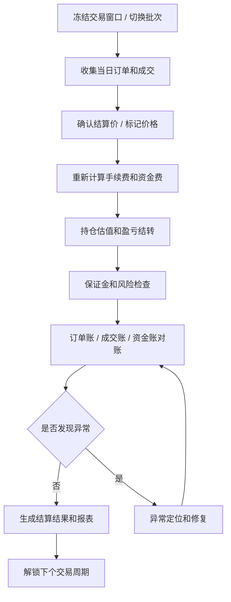

# Day 21：理解日终批处理与对账

## 1. 今天的学习目标

今天的目标是理解交易系统在非交易时段或结算窗口要做哪些高风险工作。

学完 Day 21 后，需要能回答：

- 什么是日终批处理
- 日终处理为什么不只是生成报表
- 估值、结算、对账、异常修复分别做什么
- 日终流程里最关键的批任务有哪些
- 为什么很多高风险工作发生在非交易时段

参考资料：

- CME Money Calculations for Futures and Options：https://www.cmegroup.com/education/articles-and-reports/money-calculations-for-futures-and-options
- CME Mark-to-Market：https://www.cmegroup.com/education/courses/introduction-to-futures/mark-to-market.html
- Day 19：三本账：`business/days/day-19-理解三本账.md`
- Day 20：清算与结算：`business/days/day-20-理解清算与结算.md`

## 2. 日终批处理是什么

日终批处理是交易系统在一个交易日或结算周期结束后，对交易、持仓、资金、费用、风险和报表进行统一处理。

它不一定真的发生在自然日晚上，也可能发生在：

- 每日结算时间
- 每个资金费率周期
- 每个合约交割周期
- 每个账务批次窗口
- 每个监管报送周期

日终处理的目标是：

```text
把当期交易事实转换成可确认、可对账、可审计的账户和结算结果
```

## 3. 日终批处理流程图



## 4. 日终最关键的 6 个批任务

| 批任务 | 目标 |
| --- | --- |
| 交易数据冻结和批次切换 | 确定本周期处理边界 |
| 成交和订单汇总 | 汇总当期成交、撤单、订单状态 |
| 结算价确认 | 为持仓估值和盈亏结转提供权威价格 |
| 手续费和资金费计算 | 计算交易费用、返佣、资金费 |
| 持仓估值和盈亏结转 | 更新已实现/未实现盈亏和账户权益 |
| 对账和异常修复 | 确认订单、成交、账本、余额一致 |

生产系统里还会有更多任务，例如监管报送、税务报表、风险限额重算、报表归档、冷数据归档。

## 5. 批次边界

日终处理首先要确定边界。

例如：

```text
tradingDate = 2026-05-30
batchStartSeq = 100000
batchEndSeq = 199999
settlementTime = 23:59:59
```

没有清晰边界，就会出现：

- 一笔成交被两个批次重复处理
- 一笔成交没有进入任何批次
- 订单状态跨批次不一致
- 报表和账本时间范围不一致

批次边界最好基于事件序号或成交时间加确认窗口，而不是只靠数据库当前时间。

## 6. 估值

估值是用某个参考价格计算资产或持仓的价值。

现货估值示例：

```text
BTC balance = 1
valuationPrice = 30000 USDT
assetValue = 30000 USDT
```

合约估值示例：

```text
position = LONG 1 BTC
entryPrice = 30000
settlementPrice = 30500
unrealizedPnl = 500 USDT
```

估值依赖价格来源，价格来源必须可追溯：

```text
priceSource
priceTime
calculationRuleVersion
```

## 7. 结算

结算是根据成交、持仓、费用、估值结果更新账户权益。

合约日终结算可能包括：

- 持仓按结算价重估
- 未实现盈亏转已实现盈亏
- 资金费结转
- 手续费归集
- 保证金重新计算
- 风险等级重新评估

现货系统虽然没有复杂的逐日盯市，但也会有：

- 交易手续费汇总
- 账户余额对账
- 充值提现对账
- 平台收入对账
- 异常冻结清理

## 8. 对账

日终对账要确认不同系统视图一致。

关键对账：

```text
订单账 vs 成交账
成交账 vs 清算流水
清算流水 vs 资金账
资金账 vs 余额表
手续费账 vs 平台收入
持仓账 vs 成交和平仓记录
```

对账不只是跑 SQL 比数量。它要能定位差异来源：

- 哪个账户
- 哪个资产
- 哪个订单
- 哪笔成交
- 哪条流水
- 哪个批次
- 哪个消费 offset

## 9. 异常修复

发现异常后，不能直接手改余额。

生产修复通常需要：

```text
1. 定位异常事件
2. 判断是漏处理、重复处理还是计算错误
3. 生成修复单
4. 走审批或双人复核
5. 通过补偿流水修复
6. 重新跑对账
7. 保留审计记录
```

常见修复方式：

- 补清算
- 冲正重复流水
- 补手续费流水
- 释放异常冻结
- 调整持仓账
- 重建余额快照

修复动作本身也必须有账本记录。

## 10. 为什么高风险工作发生在非交易时段

非交易时段通常要做这些工作：

- 结算价确认
- 盈亏结转
- 保证金重算
- 费率切换
- 合约交割
- 风险限额调整
- 系统快照
- 数据归档
- 对账和修复

这些任务会影响账户权益、可用资金和下一交易日的交易权限。

风险点包括：

- 批次边界错
- 结算价错
- 费用规则错
- 对账差异未处理
- 修复流水重复
- 结算任务部分成功
- 下个交易周期提前开放

所以日终不是低风险后台任务，而是交易系统的核心生产流程。

## 11. 日终系统设计建议

### 11.1 批任务要可重入

批任务可能失败重跑，因此要保证：

```text
同一个 batchId 重跑不会重复入账
```

### 11.2 结果要可审计

每个结算结果都要能追溯：

```text
输入数据
计算规则
价格来源
任务版本
执行人或审批人
输出流水
```

### 11.3 开市前必须有闸门

下个交易周期开放前，要检查：

- 日终任务全部完成
- 对账差异为 0 或已确认豁免
- 结算结果已确认
- 账户余额和持仓快照已生成
- 风控参数已生效

## 12. 小练习

列出日终流程里最关键的 6 个批任务。

参考答案：

```text
1. 批次切换和交易数据冻结
2. 成交与订单汇总
3. 结算价或估值价格确认
4. 手续费 / 资金费计算
5. 持仓估值和盈亏结转
6. 三本账对账和异常修复
```

## 13. 复盘问题

为什么交易系统很多高风险工作发生在非交易时段？

可以这样回答：

非交易时段通常承担结算价确认、盈亏结转、保证金重算、对账、异常修复、系统快照和数据归档等任务。这些任务虽然不直接撮合订单，但会决定账户权益、可用资金、持仓风险和下一交易周期的交易权限。一旦批次边界、价格、费用或修复流水出错，影响范围可能覆盖所有账户，所以日终批处理是高风险生产流程。
