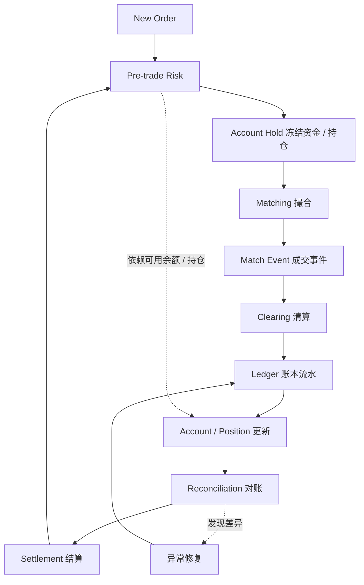

# Day 22：形成风控与账务模块总结

## 1. 今天的学习目标

今天的目标是把 Day 16 到 Day 21 的前置风控、账户、持仓、清算、结算和对账串起来。

学完 Day 22 后，需要能回答：

- 风控为什么一定依赖账务视角
- 下单前、成交后、日终三个阶段分别关注什么
- 账户、清算、账本、结算如何配合
- 如果线上出现“能下单但账不平”，应该优先怀疑哪里
- 一个交易系统为什么不能只实现撮合

参考资料：

- Day 16：进入前置风控：`business/days/day-16-进入前置风控.md`
- Day 17：理解风险控制的层次：`business/days/day-17-理解风险控制的层次.md`
- Day 18：理解账户、持仓与可用资金：`business/days/day-18-理解账户持仓与可用资金.md`
- Day 19：理解三本账：`business/days/day-19-理解三本账.md`
- Day 20：理解清算与结算：`business/days/day-20-理解清算与结算.md`
- Day 21：理解日终批处理与对账：`business/days/day-21-理解日终批处理与对账.md`

## 2. Phase 3 总结

Phase 3 的主线是：交易系统不能只保证订单能成交，还必须保证订单在成交前有足够风险约束，成交后能正确清算入账，周期结束后能结算、对账和修复。

前置风控发生在订单进入撮合之前。它要检查会话、账户、标的和订单参数，例如 API key 是否有效、请求序号是否连续、symbol 是否开放交易、价格和数量是否符合精度、账户余额或持仓是否足够、市价单是否有预算上限。前置风控的目标不是替代清算，而是保证进入撮合的订单至少是合法、可执行、可结算的。

风控不是单个模块能做完的事情。接入层负责鉴权和限频，会话层负责心跳、序号、重发和断线处理，OMS 负责订单状态约束，账户层负责余额、冻结、持仓和限仓，市场层负责 symbol 状态、价格带和熔断，撮合层负责 FOK、IOC、post-only、自成交防护等依赖订单簿的规则。不同风控规则需要不同上下文，因此必须分层处理。

账户系统维护的是资产状态。现货系统里最核心的是 available、frozen、total；合约和保证金系统里还要维护 position、entry price、mark price、unrealized PnL、margin 和 liquidation price。下单时不能只看总余额，必须看可用余额，并且要原子冻结。否则多订单、多设备、API 并发下会出现重复占用、超卖或负余额。

成交之后，撮合引擎只说明“谁和谁以什么价格成交了多少”。清算层才负责把成交转换为资产变化：买方扣 quote、得 base，卖方扣 base、得 quote，同时计算手续费、释放多余冻结、更新订单剩余占用。清算结果必须写入账本流水，再更新账户余额和持仓。撮合成功和账务完成是两个阶段，中间必须通过可靠事件、幂等消费和对账保证最终一致。

三本账是交易系统可审计性的基础。订单账记录订单生命周期，成交账记录每一笔 fill，资金/持仓账记录资产变化。三者之间必须能互相解释：订单已成交数量应该等于 fill 合计，成交金额应该能解释清算流水，资金流水汇总应该能解释余额变化，冻结余额应该能被未完成订单占用解释。很多线上事故最终表现为账不平，因此对账不是运营附属功能，而是核心安全能力。

结算和日终处理把一个交易周期内的交易、费用、持仓、估值和风险结果固化下来。现货系统关注成交清算、手续费、充值提现和余额对账；合约系统还要关注结算价、逐日盯市、盈亏结转、保证金补足、资金费和强平风险。日终批处理通常发生在非交易时段，但它会影响账户权益、可用资金和下一交易日权限，因此风险很高。

Phase 3 的核心结论是：风控一定依赖账务视角。没有账户余额，无法做买单资金校验；没有冻结，无法防止重复占用；没有持仓，无法做卖出或平仓校验；没有清算结果，无法判断成交是否真正到账；没有账本，无法解释余额变化；没有对账，无法确认系统状态是否一致。一个交易系统如果只有撮合，没有账户、清算、账本和对账，只能算撮合 demo，不能算生产交易系统。

## 3. 风控与账务闭环图



这个闭环说明：

- 风控依赖账户状态
- 账户状态来自清算和账本
- 清算依赖撮合成交事件
- 对账确认订单、成交、账本、余额一致
- 结算结果又会影响下一周期风控

## 4. 下单前、成交后、日终分别关注什么

| 阶段 | 关注点 | 主要模块 |
| --- | --- | --- |
| 下单前 | 订单是否合法、资金/持仓是否够、是否允许交易 | Gateway、Session、OMS、Risk、Account |
| 撮合中 | 是否按价格时间优先成交、是否触发撮合规则 | Matching |
| 成交后 | 资产如何变化、手续费如何扣、冻结如何释放 | Clearing、Ledger、Account |
| 日终 | 估值、结算、对账、异常修复、报表 | Settlement、Reconciliation、Ledger |

任何一个阶段缺失，系统都可能出现状态不一致。

## 5. 如果出现“能下单但账不平”，优先怀疑哪里

这种问题要按链路排查，不要只看余额表。

优先检查：

1. 前置风控是否正确冻结
2. 订单状态和冻结占用是否一致
3. 撮合是否重复产生或漏产生 fill
4. 成交事件是否可靠投递给清算
5. 清算是否幂等处理 fill
6. 手续费计算是否正确
7. 账本流水是否完整写入
8. 账户余额是否由账本正确更新
9. 撤单是否正确释放剩余冻结
10. 对账任务是否使用了相同时间边界

简化排查链路：

```text
orderId
  -> fills
  -> clearing records
  -> ledger entries
  -> balance changes
  -> reconciliation result
```

不要直接手改余额。先找到哪一层的事实和下一层状态不一致。

## 6. 生产实践原则

### 6.1 前置风控

- 不信任前端余额
- 不信任客户端传入的冻结金额
- 以服务端账户状态为准
- 冻结和下单状态要具备一致性边界
- 市价单必须有预算或保护

### 6.2 清算

- 每笔 fill 只能清算一次
- 手续费计算必须带规则版本
- 冻结释放必须可解释
- 清算结果必须写账本
- 清算失败必须能重放恢复

### 6.3 账本

- 账本流水不可随意物理删除
- 余额变化必须能由流水解释
- 修复也要走补偿流水
- 账本要支持按账户、资产、订单、成交追溯

### 6.4 对账

- 对账要有批次边界
- 差异要能定位到具体订单、成交、流水
- 对账结果要阻断高风险操作，例如开市或结算确认
- 对账不是报表，是生产安全闸门

## 7. 小练习

讲清楚“为什么风控一定会依赖账务视角”。

建议按下面结构输出：

```text
1. 风控要判断账户是否有足够可用余额
2. 可用余额来自账户账务状态
3. 下单后需要冻结，冻结也是账务状态
4. 成交后清算改变余额和持仓
5. 账本流水解释余额变化
6. 对账确认状态没有偏差
7. 所以下一笔订单的风控必须依赖这些账务结果
```

## 8. 复盘问题

如果线上出现“能下单但账不平”，应该优先怀疑哪里？

可以这样回答：

应该沿着订单到资产的事实链路排查：先看前置风控是否正确冻结，再看订单账和成交账是否一致，然后检查成交事件是否被清算完整且幂等处理，接着核对手续费、冻结释放、账本流水和账户余额更新，最后检查对账批次边界是否一致。不要直接从余额表入手修复，因为余额只是结果，真正的原因通常在订单、成交、清算或账本某一层的状态转换中。
