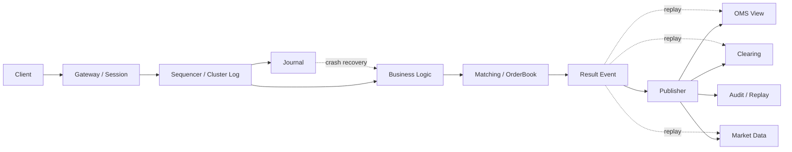
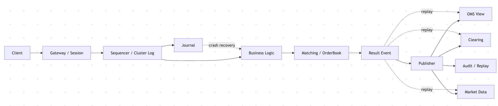

# Day 23：理解低延迟主链路

## 1. 今天的学习目标

今天的目标是理解低延迟交易系统的主链路为什么通常围绕 `gateway -> business logic -> journal -> publisher` 设计。

学完 Day 23 后，需要能回答：

- 低延迟主链路包含哪些关键阶段
- journalling 为什么可能位于性能关键路径上
- 为什么交易系统既追求低延迟，又不能放弃恢复能力
- gateway、business logic、journal、publisher 分别负责什么
- 当前项目里的 Aeron Cluster、SBE、快照和结果广播分别对应什么工程问题

参考资料：

- LMAX Technology Blog: Improving journalling latency：https://technology.lmax.com/posts/improving-journalling-latency/
- Aeron Cluster 文档：https://aeron.io/docs/aeron-cluster/overview/
- 当前项目：`matching`、`counter`、`common/src/main/resources/sbe`

## 2. 低延迟主链路是什么

低延迟主链路是交易请求从进入系统到产生确定结果的最短关键路径。

一个典型链路：

```text
Gateway
  -> Sequencer / Journal
  -> Business Logic
  -> Result Event
  -> Publisher
```

在交易所核心交易系统中可以映射为：

```text
Order Entry
  -> 定序 / 日志
  -> OMS / Risk / Matching
  -> MatchResult
  -> OMS / Clearing / MarketData
```

低延迟不是只看撮合函数有多快，而是看端到端：

```text
请求进入 -> 排队 -> 定序 -> 处理 -> 持久化 -> 发布回报
```

任何一步抖动都会影响最终用户感知。

## 3. 四个核心阶段

### 3.1 Gateway

Gateway 负责接收外部请求。

核心职责：

- 鉴权
- 限流
- 协议解析
- 基础字段校验
- 会话管理
- 将外部请求转换为内部命令

低延迟系统里，Gateway 要避免在热路径里做复杂远程调用。

### 3.2 Business Logic

Business Logic 是业务状态机。

在交易系统里包括：

- OMS 订单状态机
- 前置风控
- 账户冻结
- 撮合引擎
- 订单簿状态更新

撮合引擎通常希望输入已经完成大部分校验，使它只专注：

```text
订单簿 + 撮合规则 + 成交事件
```

### 3.3 Journal

Journal 是可恢复日志。

它记录系统处理过的命令或事件，使系统崩溃后可以通过回放恢复。

常见形式：

- append-only 文件日志
- Kafka / Pulsar 日志
- Aeron Archive
- Raft log
- 数据库顺序日志

Journal 解决的问题：

```text
系统如果挂了，如何知道已经处理到哪里？
哪些订单已经进入状态机？
哪些成交已经产生？
下游是否可以重放？
```

### 3.4 Publisher

Publisher 负责把结果事件发给下游：

- 用户订单回报
- 清算
- 行情
- 风控监控
- 审计存储

Publisher 不应该阻塞撮合核心。

如果下游慢，系统应该有队列、背压、丢弃策略或隔离机制，而不是让撮合线程等待每个消费者。

## 4. 低延迟交易链路图




## 5. 为什么 journalling 可能位于性能关键路径

交易系统不能只处理内存状态。

如果内存里已经撮合成交，但日志没有记录，系统崩溃后会出现：

```text
用户看到成交
系统恢复后成交消失
```

这不可接受。

因此很多系统会要求：

```text
命令或事件在被认为成功之前，必须进入可靠日志
```

这就让 journalling 进入性能关键路径。

关键权衡：

| 方案 | 优点 | 风险 |
| --- | --- | --- |
| 先处理内存再异步落盘 | 延迟低 | 崩溃后可能丢事实 |
| 先写 journal 再处理 | 恢复强 | 写入延迟影响下单 |
| 处理和 journal 并行 | 折中 | 需要严密一致性设计 |
| Raft / Cluster Log | 有复制和顺序 | 复制延迟和 quorum 成本 |

低延迟系统不是不要日志，而是要把日志写得足够快、足够顺序、足够可恢复。

## 6. 当前项目的对应关系

当前项目已经有低延迟交易系统的一些基础设施：

| 项目模块 | 对应能力 |
| --- | --- |
| `counter` | 模拟订单入口 / 客户端 |
| `common` | 协议 DTO、SBE schema、编解码 |
| `matching` | 撮合状态机 |
| Aeron Cluster | 命令复制、状态机执行顺序 |
| `serialNum` | 请求连续性校验 |
| `MatchResult` | 撮合结果事件 |
| Snapshot | 状态恢复 |
| Result MDC Broadcast | 结果广播 |

当前仍缺少的生产模块：

- 独立 OMS
- 账户冻结
- 清算账本
- 完整行情系统
- 结果事件可靠下游消费
- 更细粒度延迟指标

## 7. 低延迟主链路设计原则

### 7.1 热路径短

撮合热路径里尽量避免：

- 数据库查询
- 外部 HTTP 调用
- 大量日志打印
- JSON 序列化
- BigDecimal 高频运算
- 动态对象分配
- 锁竞争

### 7.2 状态机确定

同一批输入回放后，应得到同样输出。

要求：

- 输入顺序确定
- 时间来源确定
- 随机数受控
- 配置版本可追溯
- 事件输出可重放

### 7.3 事件优先

系统状态应尽可能由事件解释：

```text
OrderAccepted
OrderMatched
OrderCanceled
BalanceChanged
LedgerEntryCreated
```

有事件，才有恢复、对账和审计。

## 8. 小练习

解释为什么 journalling 可能位于性能关键路径上。

可以按下面结构回答：

```text
1. 交易系统需要崩溃恢复
2. 恢复依赖命令或事件日志
3. 如果成交已经对外发布但日志没写入，恢复后状态会不一致
4. 所以日志写入可能必须在确认成功之前完成
5. 因此 journalling 的延迟会影响交易主链路延迟
```

## 9. 复盘问题

为什么交易系统宁可复杂，也要把恢复能力做进主链路？

可以这样回答：

交易系统处理的是订单、成交和资产事实。系统崩溃后，必须知道哪些订单已经接收、哪些成交已经发生、哪些事件已经发布。如果恢复能力不在主链路中设计，而是事后补救，系统就无法保证成交事实和账务状态一致。因此交易系统宁可引入 journal、sequence、snapshot、replay 等复杂机制，也要保证核心状态可恢复、可审计、可重放。
