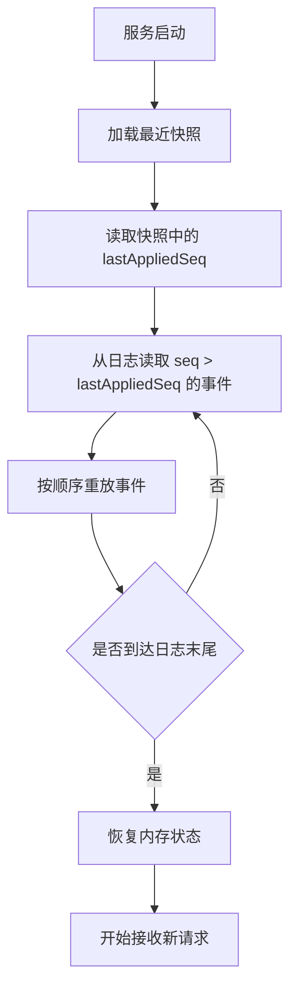

# Day 25：理解一致性与恢复

## 1. 今天的学习目标

今天的目标是理解交易系统为什么围绕事件日志、顺序处理、回放恢复和幂等消费设计。

学完 Day 25 后，需要能回答：

- 什么是事件日志
- 为什么顺序处理对撮合、账户和账本很关键
- 快照和日志回放如何恢复系统状态
- 幂等消费解决什么问题
- 为什么恢复机制通常决定系统架构，而不只是运维细节

参考资料：

- exchange-core README：https://github.com/exchange-core/exchange-core
- Coinbase FIX Market Data：https://docs.cdp.coinbase.com/exchange/fix-api/market-data
- Day 14：快照与增量：`business/days/day-14-理解快照与增量.md`
- Day 23：低延迟主链路：`business/days/day-23-理解低延迟主链路.md`

## 2. 一致性在交易系统里是什么意思

一致性不是所有模块必须同一毫秒更新完成。

更准确地说，是这些事实最终能够互相解释：

```text
订单状态能被订单事件解释
成交账能被撮合事件解释
账户余额能被账本流水解释
行情深度能被订单簿事件解释
清算结果能被成交事件解释
```

交易系统允许很多地方异步，但不能允许事实丢失、重复或乱序无法恢复。

## 3. 事件日志

事件日志是按顺序记录系统事实的 append-only 日志。

常见事件：

```text
OrderAccepted
OrderMatched
OrderCanceled
BalanceChanged
LedgerEntryCreated
BookUpdated
```

事件日志至少要包含：

- 唯一事件 ID
- 顺序号
- 事件类型
- 业务主键
- 发生时间
- 事件内容
- schema version

事件日志的价值：

- 回放恢复
- 下游补偿
- 对账审计
- 故障定位
- 重新构建读模型

## 4. 顺序处理

撮合必须按确定顺序处理同一交易对的命令。

账户必须按确定顺序处理同一账户的资金变化。

OMS 必须按确定顺序处理同一订单的状态事件。

如果顺序错了，会出现：

```text
成交先于订单创建
撤单先于成交被应用
余额释放早于冻结
行情先发布删除再发布新增
```

生产系统不一定要求全系统单一全局顺序，但必须保证关键域内有序：

| 域 | 顺序要求 |
| --- | --- |
| symbol | 撮合命令和订单簿事件有序 |
| orderId | 订单状态事件有序 |
| accountId | 资金变更有序 |
| ledger | 账本流水有序 |
| market data channel | 快照和增量有序 |

## 5. 日志回放与恢复流程图



## 6. 快照 + 日志

只靠日志恢复可能太慢。

只靠快照又无法恢复快照后的变化。

所以常见方案是：

```text
定期 snapshot
持续 append event log
恢复时先加载 snapshot
再回放 snapshot 之后的 log
```

关键字段：

```text
snapshotSeq
lastAppliedSeq
checksum
schemaVersion
createdTime
```

当前项目里已经有 snapshot 相关实现，这是交易系统走向生产化的重要基础。

## 7. 幂等消费

幂等消费解决重复消息问题。

例如清算模块收到同一笔成交两次：

```text
matchId = 1001
```

如果没有幂等，会重复扣款、重复入账。

正确做法：

```text
processedMatchId 存在 -> 跳过
processedMatchId 不存在 -> 清算并记录
```

常见幂等键：

| 模块 | 幂等键 |
| --- | --- |
| OMS | `orderId + sourceEventSeq` |
| Clearing | `matchId + accountId + entryType` |
| MarketData | `symbol + symbolSeq` |
| Ledger | `sourceType + sourceId + accountId + asset + entryType` |
| Notify | `orderId + orderVersion` |

## 8. 最简落盘 + 回放方案

一个最简原型可以这样设计：

```text
1. 每条请求进入撮合前写 command log
2. 撮合产生 MatchResult 后写 result log
3. 每隔 N 条事件生成 snapshot
4. 启动时加载最新 snapshot
5. 从 result log 回放剩余事件
6. 下游按 resultSerialNum 继续消费
```

需要注意：

- 日志写入必须有顺序号
- 回放逻辑必须和线上逻辑一致
- 消费端必须幂等
- 快照必须有校验
- schema 变更必须兼容旧日志

## 9. 恢复机制为什么决定架构

如果你要求系统能回放恢复，就必须提前设计：

- 哪些事件是事实源
- 谁生成序号
- 哪些状态可以由事件重建
- 哪些状态必须快照
- 下游如何幂等消费
- schema 如何演进
- 事件丢失时如何发现
- 重放时是否会重复通知用户

这些不是运维脚本能补出来的，而是架构基础。

## 10. 小练习

设计一个最简“落盘 + 回放”恢复方案。

建议包含：

```text
command log
result log
snapshot
lastAppliedSeq
replay
idempotency
checksum
```

## 11. 复盘问题

为什么恢复机制通常决定系统架构，而不只是运维细节？

可以这样回答：

恢复机制要求系统明确事实源、顺序号、快照边界、事件 schema、幂等键和回放流程。这些决定了模块之间如何通信、状态如何保存、下游如何消费、故障后如何恢复。如果一开始没有把恢复能力设计进主链路，事后很难补齐一致性和审计能力。因此恢复机制是交易系统架构的一部分，不是单纯运维细节。
