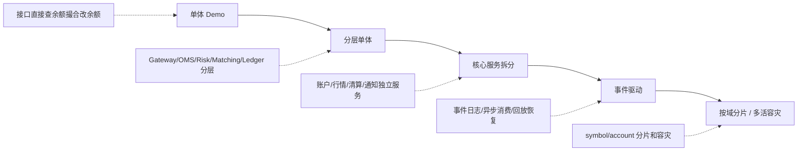

# Day 26：理解系统演进

## 1. 今天的学习目标

今天的目标是理解交易系统从单体到分层、服务化、事件驱动演进时的收益和代价。

学完 Day 26 后，需要能回答：

- 单体、分层、服务化、事件驱动分别解决什么问题
- 哪些模块适合拆分服务
- 哪些模块不宜过度拆分
- 为什么撮合核心不一定适合做成典型微服务
- 系统演进应该优先围绕哪些边界进行

参考资料：

- 交易系统架构演进之路（三）：微服务化：https://cloud.tencent.com/developer/article/1150917
- Day 3：系统分层：`business/days/day-03-认识系统分层.md`
- Day 6：OMS：`business/days/day-06-理解OMS的存在价值.md`

## 2. 架构演进不是追新技术

交易系统演进的目标不是“微服务化”，而是：

```text
让核心状态更清晰
让故障边界更可控
让系统能扩展
让恢复和对账更可靠
```

如果拆分后顺序性、幂等性、恢复能力变差，就不是好的演进。

## 3. 交易系统架构演进图



## 4. 单体阶段

单体阶段适合学习和原型验证。

特点：

- 所有模块在一个进程
- 调试简单
- 部署简单
- 事务边界容易控制

问题：

- 职责容易混在一起
- 撮合、账户、行情互相影响
- 无法独立扩容
- 故障影响面大
- 代码边界不清

单体不是错误，混乱的单体才是问题。

## 5. 分层阶段

分层单体是在一个进程或少量进程内建立清晰边界：

```text
Gateway
OMS
Risk
Matching
Clearing
Ledger
MarketData
```

好处：

- 职责清晰
- 方便测试
- 方便后续拆分
- 状态归属明确

这是大多数交易系统原型最应该先达到的阶段。

## 6. 服务化阶段

服务化是把部分模块拆成独立服务。

适合拆分的模块：

| 模块 | 原因 |
| --- | --- |
| Gateway | 面向外部流量，容易横向扩展 |
| MarketData | 读多写少，订阅者多，适合独立扩展 |
| Notify | 用户推送可异步 |
| Query / Report | 查询和报表不应压垮核心链路 |
| Ledger | 账本需要独立审计和持久化 |
| Settlement | 日终批处理适合独立调度 |
| Risk Config | 配置管理可独立 |

不宜过度拆分的模块：

| 模块 | 原因 |
| --- | --- |
| Matching Core | 强顺序、低延迟、状态机密集 |
| 同一 symbol 的订单簿 | 必须严格有序 |
| 同一账户资金变更 | 必须避免并发冲突 |
| OMS 订单状态机核心 | 对事件顺序敏感 |

## 7. 事件驱动阶段

事件驱动通过可靠事件连接模块。

典型结构：

```text
Matching
  -> MatchEvent Log
      -> OMS
      -> Clearing
      -> MarketData
      -> Audit
```

好处：

- 下游解耦
- 支持回放
- 支持异步扩展
- 支持审计
- 支持故障恢复

代价：

- 幂等复杂
- 事件 schema 演进复杂
- 最终一致性理解成本高
- 排查链路更长
- 对序号和监控要求更高

## 8. 为什么撮合核心不适合典型微服务

典型微服务强调：

- 服务自治
- 网络调用
- 独立数据库
- 横向扩展

但撮合核心强调：

- 同一 symbol 严格顺序
- 极低延迟
- 内存订单簿
- 状态机确定性
- 尽量少 IO 和远程调用

如果把撮合里的每个动作都拆成远程服务：

```text
查订单簿 -> 查对手单 -> 计算成交 -> 更新订单簿 -> 发事件
```

延迟和一致性都会变差。

更合理的做法是：

```text
撮合核心内部保持紧凑状态机
撮合外部通过事件与其他模块解耦
按 symbol 或 shard 扩展撮合实例
```

## 9. 拆分的判断标准

判断一个模块是否适合拆分，问五个问题：

```text
1. 它是否在撮合热路径上？
2. 它是否需要强顺序？
3. 它是否需要独立扩容？
4. 它是否可以通过事件最终一致？
5. 它出故障时是否应该影响撮合？
```

如果答案是：

```text
不在热路径
可以异步
需要独立扩容
故障不应阻塞撮合
```

就适合拆分。

## 10. 小练习

列出哪些模块适合拆分服务，哪些模块不宜过度拆分。

参考：

```text
适合拆分:
  Gateway, MarketData, Notify, Query, Report, Settlement

谨慎拆分:
  Matching Core, Account Hold, OMS State Machine, Ledger Write Path
```

## 11. 复盘问题

为什么撮合核心不一定适合做成典型微服务？

可以这样回答：

撮合核心维护内存订单簿，要求同一 symbol 的命令严格有序、低延迟、确定性处理。典型微服务会引入网络调用、独立状态和分布式一致性成本，容易破坏撮合热路径的性能和可恢复性。更合理的设计是让撮合核心保持紧凑状态机，通过有序事件与 OMS、清算、行情等模块解耦，并按 symbol 或 shard 水平扩展。
