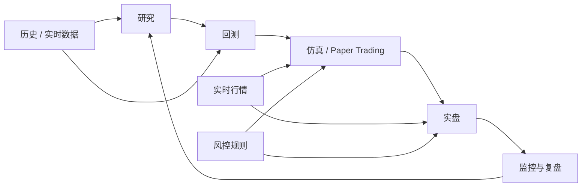

# Day 27：理解仿真、回测与实盘

## 1. 今天的学习目标

今天的目标是理解研究、回测、仿真、实盘之间共享什么，差异又在哪里。

学完 Day 27 后，需要能回答：

- 研究、回测、仿真、实盘分别是什么
- 回测为什么经常比实盘乐观
- 哪些系统能力可以复用，哪些不能复用
- 为什么策略表现好不代表交易系统已经准备好
- 从研究到实盘应该如何形成闭环

参考资料：

- VeighNa 官网：https://www.vnpy.com/
- VeighNa 社区：https://www.vnpy.com/portal/
- Day 13：逐笔与盘口：`business/days/day-13-理解逐笔与盘口.md`
- Day 14：快照与增量：`business/days/day-14-理解快照与增量.md`

## 2. 四个阶段

### 2.1 研究

研究阶段关注策略想法是否有逻辑。

输入：

- 历史行情
- 因子数据
- 成交数据
- 财务或链上数据

输出：

- 策略假设
- 信号规则
- 参数范围

### 2.2 回测

回测是在历史数据上模拟策略执行。

它回答：

```text
如果过去按这个规则交易，结果会怎样？
```

回测关注：

- 收益
- 回撤
- 成交假设
- 手续费
- 滑点
- 仓位
- 风险指标

### 2.3 仿真

仿真更接近实盘，但不真实成交。

它使用实时行情，走真实或接近真实的系统链路：

```text
MarketData -> Strategy -> Risk -> Order Simulator -> Position/PnL
```

仿真可以发现：

- 行情延迟
- 下单频率
- 策略状态 bug
- 风控误杀
- 订单生命周期处理问题

### 2.4 实盘

实盘是真实资金、真实订单、真实成交。

它需要处理：

- 网络断线
- 订单拒绝
- 部分成交
- 撤单失败
- 账户余额变化
- 交易所异常
- 风控限制
- 真实滑点

实盘系统关注的不只是收益，还包括可用性和可控性。

## 3. 研究到实盘闭环图



## 4. 回测比实盘乐观的常见原因

至少 8 个原因：

| 原因 | 说明 |
| --- | --- |
| 忽略滑点 | 回测按理想价格成交 |
| 忽略盘口深度 | 假设任意数量都能成交 |
| 忽略排队 | 挂单是否排到被简化 |
| 忽略延迟 | 信号产生到下单之间没有时间成本 |
| 忽略撤单失败 | 回测里撤单总能成功 |
| 忽略部分成交 | 回测假设全部成交 |
| 忽略交易所限频 | 实盘可能被限流 |
| 忽略手续费变化 | VIP 等级、maker/taker 费率可能变化 |
| 数据幸存者偏差 | 只看仍存在或表现好的标的 |
| 参数过拟合 | 参数对历史有效，对未来无效 |
| 忽略行情缺失 | 实盘会遇到断线和缺包 |
| 忽略资金约束 | 回测资金占用过于理想 |

## 5. 哪些能力可以复用

研究、回测、仿真、实盘应该尽量复用：

- 交易信号逻辑
- 风控规则
- 订单状态机
- 成本模型
- 持仓计算
- PnL 计算
- 数据字段定义
- 配置管理

避免出现：

```text
回测一套逻辑
实盘另一套逻辑
```

否则回测结果无法解释实盘结果。

## 6. 哪些不能简单复用

不能简单复用：

- 成交撮合假设
- 延迟模型
- 盘口排队模型
- 交易所错误处理
- 网络连接管理
- 真实账户资金冻结
- 实盘风控熔断
- 手工干预流程

实盘环境有很多回测里不存在的问题。

## 7. 策略好不代表系统准备好

策略回测好，只说明：

```text
在某些历史假设下，交易规则可能有收益
```

不说明：

- 能稳定接收行情
- 能正确重建订单簿
- 能处理部分成交
- 能处理撤单失败
- 能处理断线重连
- 能避免重复下单
- 能正确计算持仓和 PnL
- 能在异常时停机保护

交易系统准备好，是工程可靠性问题。

## 8. 小练习

列出回测比实盘更乐观的至少 8 个原因。

参考：

```text
滑点、深度、排队、延迟、部分成交、撤单失败、手续费、限频、数据偏差、过拟合
```

## 9. 复盘问题

为什么策略做得好不代表交易系统已经准备好了？

可以这样回答：

策略表现好只说明交易规则在某些历史数据和假设下有效。实盘系统还必须处理实时行情、订单状态、部分成交、撤单失败、断线重连、限频、风控、账户资金、日志、监控和异常停机等工程问题。如果这些能力没有准备好，策略再好也可能因为系统错误造成亏损或不可控风险。
