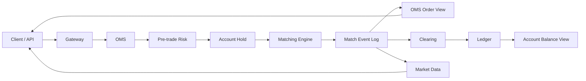

# Day 29：设计最小可用交易系统

## 1. 今天的学习目标

今天的目标是设计一个最小可用交易系统 MVP。

学完 Day 29 后，需要能回答：

- 第一版交易系统必须保留哪些模块
- 哪些模块可以先简化，但不能完全忽略
- 每个模块删掉会带来什么风险
- 同步和异步边界应该放在哪里
- MVP 如何从当前项目继续演进

参考资料：

- 回顾 Day 1-Day 28
- 当前项目：`common`、`counter`、`matching`

## 2. MVP 的原则

MVP 不是只做撮合。

最小可用交易系统至少要覆盖：

```text
下单
风控
冻结
撮合
成交
清算
账本
订单回报
行情
恢复
```

可以简化规则，但不能缺失关键事实链路。

## 3. 最小可用交易系统设计图



## 4. MVP 必须模块

| 模块 | 是否必须 | 保留理由 |
| --- | --- | --- |
| Gateway | 必须 | 统一接入、鉴权、限流 |
| OMS | 必须 | 管理订单生命周期和查询视图 |
| Pre-trade Risk | 必须 | 防止非法订单进入撮合 |
| Account Hold | 必须 | 冻结资金/持仓，防止超卖 |
| Matching | 必须 | 维护订单簿并产生成交 |
| Match Event Log | 必须 | 下游回放、清算、行情、审计 |
| Clearing | 必须 | 把成交转换为资产变化 |
| Ledger | 必须 | 记录可审计资金流水 |
| Market Data | 必须但可简化 | 发布 trade、depth、ticker |
| Observability | 必须但可简化 | 监控延迟、错误、队列、差异 |

## 5. 可以先简化的能力

第一版可以简化：

- 只支持少数 symbol
- 只支持现货
- 只支持 limit 和 market
- 暂不做杠杆和合约
- 费率先固定
- 行情先支持 trade + L2 depth
- 日终先做基础对账
- 风控先做余额、精度、最小金额
- 监控先覆盖核心指标

但不建议省略：

- 订单状态机
- 账户冻结
- 成交事件日志
- 清算
- 账本流水
- 幂等
- 快照/回放基础能力

## 6. 如果不做某个模块的风险

| 不做模块 | 风险 |
| --- | --- |
| 不做 OMS | 用户订单状态不可解释 |
| 不做风控 | 非法订单进入撮合 |
| 不做冻结 | 超卖、重复占用、负余额 |
| 不做清算 | 成交后不知道资产怎么变 |
| 不做账本 | 余额变化无法审计 |
| 不做事件日志 | 故障后无法恢复 |
| 不做行情 | 用户和策略无法感知市场 |
| 不做监控 | 线上问题发现太晚 |

## 7. 同步与异步边界

建议同步：

```text
Gateway -> OMS 基础接收
OMS -> Risk
Risk -> Account Hold
OMS/Risk -> Matching command
```

建议异步但可靠：

```text
Matching -> OMS Order View
Matching -> Clearing
Matching -> MarketData
Clearing -> Ledger
Ledger -> Account Balance View
Notify -> Client
```

关键不是同步或异步，而是：

```text
事件不能丢
消费必须幂等
顺序必须可验证
失败必须可重放
```

## 8. 当前项目演进建议

当前项目已有：

- SBE 协议
- Aeron Cluster
- 撮合引擎
- 订单簿
- STP
- 市价单逻辑
- MatchResult
- 快照恢复
- 结果广播

下一步建议：

```text
1. 独立 OMS 模块
2. 增加 Account Hold 模块
3. 增加 Clearing 模块
4. 增加 Ledger 模块
5. MatchResult 增加 matchId / symbolSeq
6. MarketData 消费 MatchResult 构建 trade/depth/ticker
7. 增加事件幂等和对账任务
```

## 9. 小练习

说明每个模块保留或删掉的理由。

建议格式：

```text
模块:
  是否保留:
  保留原因:
  如果不做的风险:
  MVP 中如何简化:
```

## 10. 复盘问题

第一版系统如果不做某个模块，会带来什么风险？

可以这样回答：

交易系统的每个核心模块都承载一个不可替代的事实：OMS 管订单状态，账户冻结管可用资产，撮合管成交事实，清算管资产变化，账本管审计解释，行情管市场状态，事件日志管恢复。如果第一版省略其中任何关键事实链路，系统可能能跑通 demo，但无法处理真实交易中的异常、对账和恢复。
