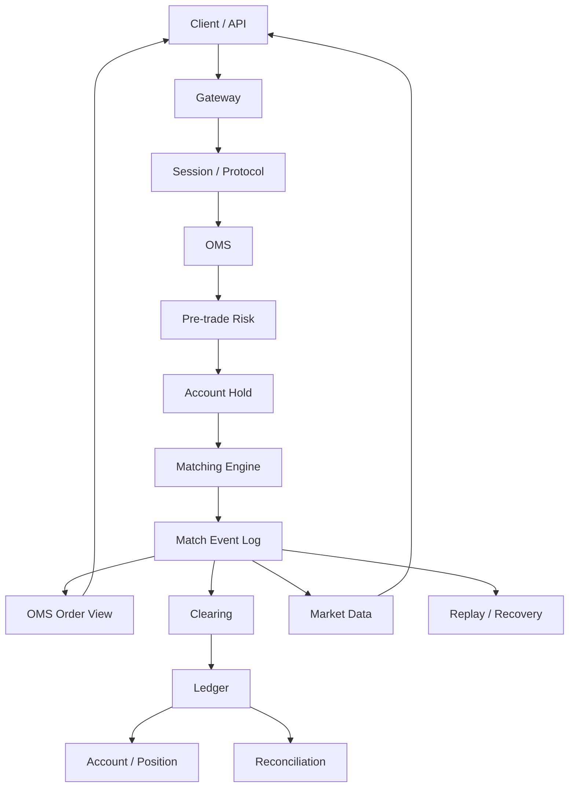

# Day 30：总复盘

## 1. 今天的学习目标

今天的目标是把 30 天的业务链路、协议链路、账务链路和恢复链路统一起来，形成自己的交易系统总设计说明。

学完 Day 30 后，需要能回答：

- 一笔订单从下单到成交、清算、入账、行情发布的完整链路是什么
- OMS、风控、撮合、清算、账本、行情之间的边界是什么
- 序号、快照、增量、日志回放为什么重要
- 如果明天要实现原型，第一周应该先做什么
- 一个交易系统为什么不是一个撮合引擎

参考资料：

- Coinbase Trading Concepts：https://docs.cdp.coinbase.com/exchange/concepts/trading
- Coinbase Matching Engine：https://docs.cdp.coinbase.com/exchange/concepts/matching-engine
- Nasdaq OUCH：https://www.nasdaqtrader.com/Trader.aspx?id=OUCH
- Nasdaq TotalView-ITCH：https://nasdaqtrader.com/content/technicalsupport/specifications/dataproducts/NQTVITCHSpecification.pdf
- CME Mark-to-Market：https://www.cmegroup.com/education/courses/introduction-to-futures/mark-to-market.html
- LMAX Technology Blog：https://technology.lmax.com/

## 2. 交易系统总设计说明

一个生产交易系统不是单个撮合引擎，而是一组围绕订单、成交、资产和市场数据协同工作的状态机。

前台或 API 负责接收用户操作，Gateway 负责鉴权、限流和协议入口，会话层负责心跳、序号、重发和断线恢复。OMS 是订单生命周期主控，它接收下单、撤单、改单请求，生成或绑定 `orderId`，处理 `clientOrderId` 幂等，维护订单状态机，并把撮合事件聚合成用户可查询的订单视图。

订单进入撮合前必须经过前置风控。风控检查 symbol 状态、订单类型、价格精度、数量精度、最小金额、账户权限、可用余额和持仓。账户模块负责冻结资金或持仓，防止同一资产被多个订单重复占用。只有通过风控并完成冻结的订单，才应该进入撮合。

撮合引擎维护订单簿，按价格时间优先处理订单，生成成交事件和订单簿变化事件。撮合引擎只负责成交事实，不负责直接修改余额。成交事件应包含 `matchId`、`symbolSeq`、价格、数量、maker/taker、订单剩余量和状态变化等信息。`resultSerialNum` 用于全局事件顺序和回放，`symbolSeq` 用于单交易对行情连续性，`matchId` 用于清算幂等。

成交后，清算模块根据成交事件、冻结记录和费率规则计算资产变化，包括买方扣 quote、得 base，卖方扣 base、得 quote，手续费、返佣和多余冻结释放。账本模块写入资金流水，账户视图根据账本或账户变更事件更新余额和持仓。账本必须能解释每一次余额变化，不能只保留当前余额。

行情系统消费撮合事件，生成 trade feed、depth feed、ticker、K 线和必要的快照与增量。行情系统不应该直接影响撮合顺序，也不应该让外部客户端直接查询撮合内存。客户端通过 snapshot + incremental update 重建本地订单簿，并用 `symbolSeq` 检查缺口。

恢复和可观测性贯穿全链路。系统需要事件日志、快照、回放、幂等消费、对账、指标和报警。撮合可以是低延迟状态机，但它输出的事实必须可持久化、可回放、可审计。清算、账本、行情和 OMS 都要能从事件恢复自己的状态。

## 3. 总链路图



## 4. 核心边界

| 模块 | 核心事实 |
| --- | --- |
| Gateway | 请求是否允许进入系统 |
| Session | 消息是否有序、可恢复 |
| OMS | 订单当前是什么状态 |
| Risk | 订单是否允许进入撮合 |
| Account | 资产是否可用、冻结、扣减 |
| Matching | 是否成交、成交多少、订单簿如何变化 |
| Clearing | 成交如何变成资产变化 |
| Ledger | 余额为什么变化 |
| MarketData | 市场状态如何对外发布 |
| Recovery | 系统如何从故障恢复 |

## 5. 第一周实现原型建议

如果明天就开工实现原型，第一周建议不要先做复杂 UI，也不要先做所有订单类型。

优先做：

```text
1. 统一订单模型和 ID 设计
2. OMS 最小订单状态机
3. Account available/frozen 模型
4. 下单前余额冻结
5. 单 symbol 限价撮合
6. MatchEvent 事件输出
7. Clearing 简化清算
8. Ledger 简化流水
9. 订单查询和成交查询
10. 最小回放测试
```

第一周目标不是“功能很多”，而是把事实链路打通：

```text
下单 -> 冻结 -> 撮合 -> 成交 -> 清算 -> 账本 -> 查询
```

## 6. 10 分钟讲清系统方案

可以按这个顺序讲：

```text
1. 系统分层
2. 订单生命周期
3. 订单簿和撮合
4. 风控和冻结
5. 成交后清算
6. 账本和对账
7. 行情快照和增量
8. 序号、日志、回放
9. 低延迟和恢复的权衡
10. MVP 第一版如何实现
```

## 7. 复盘问题

如果明天就要开工实现原型，第一周你会先做什么？

可以这样回答：

第一周应该先建立最小事实链路，而不是堆功能。优先实现订单模型、OMS 状态机、账户冻结、单 symbol 撮合、成交事件、简化清算、账本流水和查询视图。只要这条链路能稳定跑通，就能继续扩展市价单、行情、快照、对账和恢复。如果一开始只做撮合，后面会很难补订单状态、资金冻结和账务一致性。
