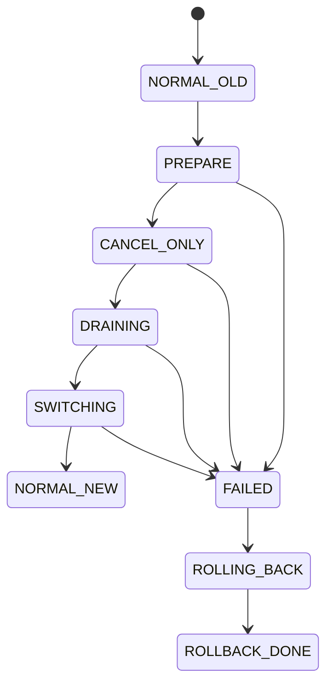
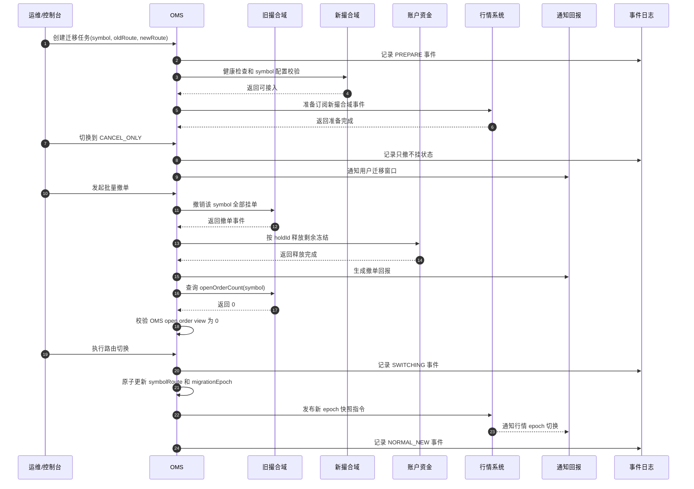
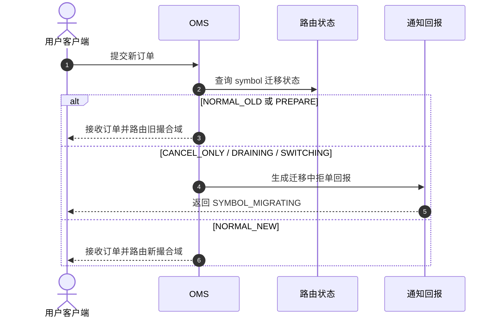
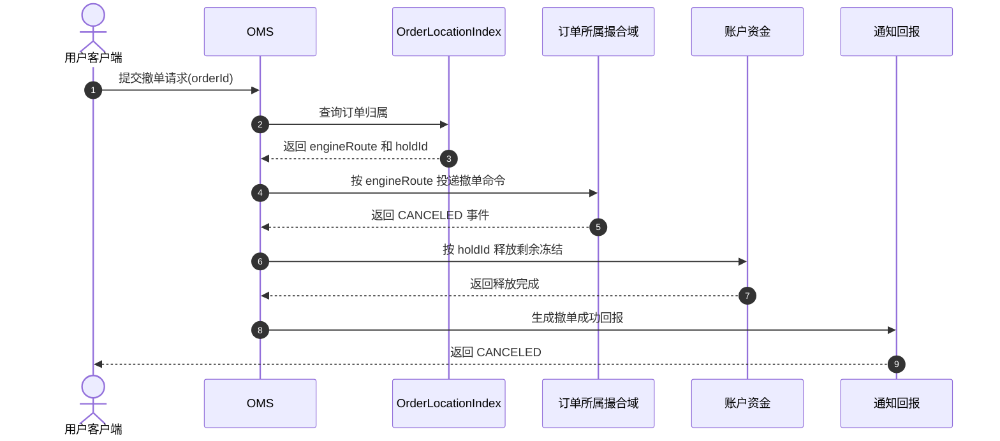

# 平滑迁移交易币对设计方案

## 1. 背景

交易系统后续可能需要把某个交易币对从一个撮合域迁移到另一个撮合域，例如：

```text
旧撮合引擎版本 -> 新撮合引擎版本
旧撮合集群 -> 新撮合集群
旧 symbol 分片 -> 新 symbol 分片
单撮合集群 -> 多撮合分片
```

迁移对象是交易币对，例如：

```text
BTC-USDT
ETH-USDT
SPOT_BTC_USDT
PERP_BTC_USDT
```

领导提出从上游订单管理侧入手是正确方向。生产系统里，币对迁移不应该让撮合引擎自己“抢路由”，而应该由 OMS 作为订单生命周期主控来决定：

```text
新订单发往哪里
撤单发往哪里
改单是否允许
存量挂单如何处理
用户回报如何生成
迁移状态如何审计
```

撮合引擎仍然只负责处理命令、维护订单簿、产生订单事件和成交事件。账户、资金、清算、台账不应该理解复杂迁移策略，只消费确定的订单事件和成交事件。

## 2. 设计目标

本方案目标：

1. 在不停止全站交易的情况下迁移单个或多个交易币对。
2. 避免同一币对同时在两个撮合域接受新订单。
3. 保证撤单、改单能路由到订单原来所在的撮合域。
4. 保证迁移过程中不会重复成交、重复释放冻结、重复发送最终状态回报。
5. 保证行情系统能识别迁移前后的盘口序列边界。
6. 保证迁移过程可审计、可观测、可回滚。

非目标：

1. 第一版不追求完全保留旧订单簿排队优先级。
2. 第一版不做同一 symbol 的双活撮合。
3. 第一版不允许新旧撮合域同时接受同一币对的新订单。

## 3. 核心结论

推荐第一版采用：

```text
OMS 控制路由
+ 币对迁移状态机
+ 只撤不挂
+ 批量撤销旧撮合存量订单
+ 校验旧订单簿清空
+ 原子切换新订单路由
+ 行情发布新 epoch 快照
```

这个方案牺牲了存量挂单排队优先级，但一致性边界最清晰，工程落地风险最低。

如果业务强要求迁移时保留挂单排队优先级，需要走更复杂的订单簿快照迁移方案，详见本文第 13 节。

## 4. 总体架构

```text
Client
  -> Gateway / Session
  -> OMS
       -> SymbolMigrationController
       -> OrderLocationIndex
       -> MatchingCommandOutbox
  -> old Matching Engine
  -> new Matching Engine

Matching Result Event
  -> OMS Order View
  -> Market Data
  -> Clearing
  -> Account / Funds
  -> Notify
```

职责边界：

| 模块 | 迁移中的职责 |
| --- | --- |
| OMS | 迁移控制面；维护币对迁移状态；决定新订单路由；按订单归属路由撤单和改单；生成用户回报 |
| 撮合引擎 | 按接收到的命令维护订单簿；产生订单事件和成交事件；不直接操作资金和账户 |
| 账户/资金 | 根据 OMS 或清算指令冻结、解冻、扣减、入账；按 `holdId` 幂等处理 |
| 清算 | 消费撮合成交事件，计算成交金额、手续费、盈亏、保证金变化 |
| 行情系统 | 按撮合事件生成行情；迁移后发布新的 `epoch` 快照 |
| 事件日志 | 记录迁移状态变更、撮合命令、撮合结果、清算结果，用于审计和恢复 |

核心原则：

```text
路由由 OMS 决定。
成交事实由 Matching 产生。
资金变化由 Account / Funds / Clearing 处理。
审计事实由 Event Log / Ledger 保存。
```

## 5. 关键风险

### 5.1 同一币对双撮合

如果新旧撮合域同时接受同一币对的新订单，会出现：

```text
买单进入新撮合
卖单还在旧撮合
本应成交的订单分散在两个订单簿
价格发现被撕裂
行情和成交事实不一致
```

因此第一版禁止同一 `symbol` 在两个撮合域同时接受新订单。

### 5.2 撤单路由错误

撤单不能只按当前 `symbolRoute` 路由。

错误做法：

```text
CancelOrder(symbol = BTC-USDT) -> 当前 symbolRoute
```

正确做法：

```text
CancelOrder(orderId)
  -> 查 orderId 对应的 engineRoute
  -> 发往该订单原来所在撮合域
```

否则迁移后，用户撤旧撮合域里的订单时，撤单命令可能被错误发送到新撮合域，导致撤单失败或状态不一致。

### 5.3 冻结释放重复

批量撤单、IOC 取消、FOK 失败、PostOnly 拒绝都可能触发释放冻结。

资金释放必须基于：

```text
holdId
orderId
orderEventId
idempotencyKey
```

不能只按账户和资产粗粒度释放。

### 5.4 行情序列拼接错误

迁移后如果行情继续沿用旧的 `bookSeq`，客户端可能把旧订单簿增量和新订单簿增量拼接在一起。

行情必须引入：

```text
symbol
marketDataEpoch
snapshotSeq
bookSeq
```

迁移完成后发布新 `epoch` 的快照，客户端看到 `epoch` 变化后必须丢弃本地旧盘口。

## 6. 币对迁移状态机

推荐状态：

```text
NORMAL_OLD
  -> PREPARE
  -> CANCEL_ONLY
  -> DRAINING
  -> SWITCHING
  -> NORMAL_NEW
```

异常状态：

```text
FAILED
ROLLING_BACK
ROLLBACK_DONE
```

状态含义：

| 状态 | 含义 | 新单 | 撤单 | 改单 |
| --- | --- | --- | --- | --- |
| `NORMAL_OLD` | 正常在旧撮合域交易 | 旧撮合 | 按订单归属 | 按订单归属 |
| `PREPARE` | 新撮合域准备中，尚未影响交易 | 旧撮合 | 按订单归属 | 按订单归属 |
| `CANCEL_ONLY` | 只允许撤单，不允许新增挂单 | 拒绝 | 允许 | 建议拒绝或只允许减量 |
| `DRAINING` | 清理旧撮合域存量订单 | 拒绝 | 允许 | 拒绝 |
| `SWITCHING` | 路由切换临界区 | 拒绝 | 按订单归属 | 拒绝 |
| `NORMAL_NEW` | 正常在新撮合域交易 | 新撮合 | 按订单归属 | 按订单归属 |

状态流转图：



## 7. 迁移配置模型

建议维护 `symbol_migration` 配置表：

```sql
create table symbol_migration (
    id bigint primary key,
    symbol varchar(64) not null,
    old_engine_route varchar(128) not null,
    new_engine_route varchar(128) not null,
    state varchar(32) not null,
    migration_epoch bigint not null,
    route_version bigint not null,
    effective_time timestamp,
    operator varchar(64) not null,
    reason varchar(512),
    created_at timestamp not null,
    updated_at timestamp not null,
    unique (symbol)
);
```

核心字段：

| 字段 | 含义 |
| --- | --- |
| `symbol` | 待迁移交易币对 |
| `old_engine_route` | 旧撮合域路由 |
| `new_engine_route` | 新撮合域路由 |
| `state` | 当前迁移状态 |
| `migration_epoch` | 迁移代际，用于订单、行情、审计分界 |
| `route_version` | 路由配置版本，用于多 OMS 节点一致性校验 |
| `effective_time` | 计划生效时间 |
| `operator` | 操作人 |
| `reason` | 迁移原因 |

## 8. 订单归属索引

OMS 必须维护订单归属：

```text
orderId -> symbol
orderId -> engineRoute
orderId -> migrationEpoch
orderId -> orderState
orderId -> holdId
```

建议在订单主表或订单路由表中增加：

```sql
create table order_location (
    order_id bigint primary key,
    account_id bigint not null,
    client_order_id varchar(64),
    symbol varchar(64) not null,
    engine_route varchar(128) not null,
    migration_epoch bigint not null,
    hold_id varchar(64),
    order_state varchar(32) not null,
    created_at timestamp not null,
    updated_at timestamp not null
);
```

路由规则：

```text
NewOrder:
  根据 symbol_migration.state 和 symbolRoute 决定发往 old / new / reject

CancelOrder:
  根据 orderId / accountId + clientOrderId 查询 order_location
  发往 order_location.engine_route

ReplaceOrder:
  根据原订单 order_location.engine_route 路由
  迁移期间建议只允许减少数量，不允许改价或增加数量
```

## 9. OMS 路由逻辑

### 9.1 新订单路由

伪代码：

```text
placeOrder(request):
  migration = getMigration(request.symbol)

  if migration.state == NORMAL_OLD:
      route = migration.oldEngineRoute

  else if migration.state == PREPARE:
      route = migration.oldEngineRoute

  else if migration.state == NORMAL_NEW:
      route = migration.newEngineRoute

  else:
      reject(SYMBOL_MIGRATING)

  createOrder()
  freezeFunds()
  saveOrderLocation(orderId, route, migration.epoch, holdId)
  writeMatchingCommandOutbox(route, PLACE)
```

### 9.2 撤单路由

伪代码：

```text
cancelOrder(request):
  orderLocation = findOrderLocation(request.orderId)

  if orderLocation == null:
      reject(UNKNOWN_ORDER)

  if orderLocation.orderState is final:
      return currentFinalState()

  writeMatchingCommandOutbox(orderLocation.engineRoute, CANCEL)
```

### 9.3 改单路由

伪代码：

```text
replaceOrder(request):
  orderLocation = findOrderLocation(request.orderId)
  migration = getMigration(orderLocation.symbol)

  if migration.state in (CANCEL_ONLY, DRAINING, SWITCHING):
      if request.onlyReduceQty:
          allowReduceOnlyReplace()
      else:
          reject(SYMBOL_MIGRATING_REPLACE_DISABLED)

  writeMatchingCommandOutbox(orderLocation.engineRoute, REPLACE)
```

生产建议：

```text
迁移期间默认拒绝改单。
如果业务必须支持改单，只允许减少数量。
```

原因是减量通常不改变订单价格优先级；改价或增量可能触发重排，增加迁移期间状态复杂度。

## 10. 标准迁移流程

### 10.1 PREPARE：准备阶段

目标：新撮合域准备好，但不接真实订单。

操作：

1. 启动新撮合集群或新 symbol 分片。
2. 注册 `newEngineRoute`。
3. 同步币对规则：

```text
tickSize
lotSize
minNotional
feeRule
marginRule
tradingStatus
```

4. 确认清算、行情、监控能识别新撮合域。
5. OMS 加载迁移配置，但新订单仍路由旧撮合域。
6. 对新撮合域做健康检查和空订单簿检查。

此时：

```text
NewOrder  -> oldEngineRoute
Cancel    -> orderLocation.engineRoute
Replace   -> orderLocation.engineRoute
MarketData -> oldEngineRoute
```

准入检查：

```text
newEngine healthy
newEngine symbol config loaded
newEngine openOrderCount == 0
marketData subscribed newEngine
clearing subscribed newEngine result stream
OMS routeVersion loaded by all nodes
```

### 10.2 CANCEL_ONLY：只撤不挂

目标：停止增加旧撮合域存量订单。

操作：

1. OMS 将该币对状态切到 `CANCEL_ONLY`。
2. 新订单统一拒绝，返回明确错误码。
3. 撤单继续允许。
4. 改单默认拒绝。
5. 通知用户该币对进入迁移窗口。

新单拒绝码建议：

```text
SYMBOL_MIGRATING_CANCEL_ONLY
```

此时：

```text
NewOrder -> Reject
Cancel   -> orderLocation.engineRoute
Replace  -> Reject
```

### 10.3 DRAINING：清理存量挂单

目标：让旧撮合域该 symbol 没有活跃订单。

推荐采用批量撤单：

```text
OMS -> oldEngine: cancel all open orders by symbol
oldEngine -> OMS: order canceled events
OMS -> Account/Funds: 按 holdId 释放冻结
OMS -> Notify: 推送撤单回报
MarketData: 发布盘口清空增量或新快照
```

批量撤单必须幂等：

```text
cancelBatchId
symbol
oldEngineRoute
migrationEpoch
```

如果重复发起同一个 `cancelBatchId`，系统只能产生一次有效撤单结果。

完成条件：

```text
oldEngine.openOrderCount(symbol) == 0
OMS.openOrderView(symbol, oldEngineRoute) == 0
Account/Funds pendingReleaseCount(symbol) == 0
Notify pendingCancelReportCount(symbol) == 0
```

### 10.4 SWITCHING：路由切换

目标：原子切换新订单路由。

切换前必须校验：

```text
旧撮合该 symbol openOrderCount = 0
OMS 该 symbol open order view = 0
账户冻结释放已完成或有明确补偿任务
旧行情序列已完成收尾
新撮合域健康检查通过
新撮合该 symbol 订单簿为空
清算已经订阅新撮合结果流
行情已经准备发布新 epoch 快照
```

切换动作：

```text
symbolRoute[symbol] = newEngineRoute
migrationEpoch = migrationEpoch + 1
state = NORMAL_NEW
routeVersion = routeVersion + 1
```

多 OMS 节点必须通过版本号保证一致：

```text
只有加载到最新 routeVersion 的 OMS 节点才允许接收该 symbol 新订单。
未加载最新版本的 OMS 节点必须拒绝该 symbol 新订单或从流量摘除。
```

### 10.5 NORMAL_NEW：恢复交易

目标：新撮合域正常接受该 symbol 订单。

恢复后：

```text
NewOrder -> newEngineRoute
Cancel   -> orderLocation.engineRoute
Replace  -> orderLocation.engineRoute
MarketData -> newEngineRoute + new epoch
Clearing -> consume newEngine fill event
Notify -> normal order report
```

行情系统必须发布新快照：

```text
symbol = BTC-USDT
marketDataEpoch = newEpoch
snapshotSeq = 1
bookSeq = 1
```

客户端看到 `marketDataEpoch` 变化后，应丢弃旧盘口并重新构建本地订单簿。

## 11. 迁移时序图

### 11.1 标准迁移主流程



### 11.2 迁移期间新单处理



### 11.3 迁移期间撤单处理



## 12. 回滚方案

### 12.1 PREPARE 阶段回滚

最简单。

```text
新订单仍在旧撮合域
旧撮合域状态未变化
只需要删除或标记迁移任务失败
```

动作：

```text
state -> FAILED
停止新撮合域订阅
保留审计日志
```

### 12.2 CANCEL_ONLY 阶段回滚

可以恢复旧撮合域交易。

动作：

```text
state -> NORMAL_OLD
NewOrder 重新路由 oldEngineRoute
通知用户迁移取消或延期
```

注意：如果迁移期间用户已经主动撤单，这些订单不会自动恢复。

### 12.3 DRAINING 阶段回滚

如果已经批量撤单，不建议自动恢复原挂单。

原因：

```text
撤单已经释放冻结
用户已经收到撤单回报
行情已经发布订单簿变化
自动重挂会改变用户意图和排队公平性
```

可选处理：

```text
state -> NORMAL_OLD
恢复接受新订单
已撤订单保持 CANCELED
```

### 12.4 SWITCHING 阶段回滚

`SWITCHING` 是最危险阶段，应尽量缩短。

如果路由还未正式切到新撮合：

```text
回到 CANCEL_ONLY 或 NORMAL_OLD
```

如果已经切到新撮合且新订单已进入新撮合：

```text
不建议直接回滚到旧撮合
应进入新一轮迁移：
  newEngineRoute 作为 oldRoute
  oldEngineRoute 作为 newRoute
```

避免同一 symbol 在短时间内来回切导致订单归属混乱。

## 13. 可选增强：保留订单簿排队优先级

如果业务要求迁移后保留旧订单簿和时间优先级，需要更复杂的方案：

```text
1. 切到 CANCEL_ONLY，冻结新输入。
2. 等待旧撮合命令队列处理完毕。
3. 旧撮合导出 symbol 订单簿快照。
4. OMS 校验 open order view 和订单簿快照一致。
5. 新撮合加载订单簿快照。
6. 新撮合保留原 orderTime / prioritySeq。
7. 行情发布新 epoch 全量快照。
8. OMS 切换新订单路由。
```

额外要求：

| 要求 | 说明 |
| --- | --- |
| 订单簿快照格式稳定 | 新旧撮合版本都能解释同一快照 |
| 优先级可迁移 | 必须保留价格档、时间优先、订单剩余数量 |
| 快照校验 | OMS、旧撮合、新撮合三方订单数量和剩余数量一致 |
| 行情 epoch | 客户端必须基于新快照重建盘口 |
| 审计说明 | 必须能证明迁移没有改变订单优先级 |

该方案的风险远高于批量撤单方案。建议等基础迁移能力稳定后再做。

## 14. 数据一致性要求

### 14.1 订单一致性

必须保证：

```text
一个 orderId 只有一个 engineRoute
一个 orderId 只有一个最终状态
撤单和改单必须发往订单所属 engineRoute
```

### 14.2 资金一致性

冻结和释放必须基于：

```text
holdId
orderId
orderEventId
```

迁移流程不能引入按账户资产粗粒度释放冻结的逻辑。

### 14.3 清算一致性

清算只消费撮合成交事件：

```text
Matching -> FillEvent -> Clearing
```

OMS 不能伪造成交事件给清算。OMS 只消费订单事件并维护订单视图。

### 14.4 行情一致性

行情必须支持：

```text
marketDataEpoch
snapshotSeq
bookSeq
sourceEngineRoute
```

迁移切换后必须发布新 `epoch` 快照。

### 14.5 配置一致性

多个 OMS 节点必须看到同一份路由版本。

建议：

```text
symbolRoute(symbol, routeVersion)
```

OMS 处理新订单时校验本地 `routeVersion` 是否最新。如果不是最新，拒绝该 symbol 新订单或摘除该节点流量。

## 15. 监控与告警

迁移期间至少需要这些指标：

| 指标 | 说明 |
| --- | --- |
| `migration_state` | 每个 symbol 当前迁移状态 |
| `symbol_route_version` | OMS 本地路由版本 |
| `open_order_count_old` | 旧撮合域该 symbol 活跃订单数 |
| `open_order_count_oms` | OMS 订单视图里的活跃订单数 |
| `pending_cancel_count` | 待撤订单数 |
| `pending_release_count` | 待释放冻结数 |
| `new_order_reject_count` | 迁移期间新单拒绝数 |
| `cancel_success_count` | 撤单成功数 |
| `cancel_failed_count` | 撤单失败数 |
| `market_data_epoch` | 行情当前 epoch |
| `clearing_lag` | 清算消费新旧撮合事件延迟 |

关键告警：

```text
DRAINING 状态超过预期时间
oldEngine openOrderCount 长时间不为 0
OMS openOrderView 和 oldEngine openOrderCount 不一致
pendingReleaseCount 长时间不为 0
多个 OMS 节点 routeVersion 不一致
NORMAL_NEW 后仍有新单进入 oldEngine
行情 epoch 切换失败
```

## 16. 操作清单

迁移前：

```text
确认迁移 symbol
确认 oldEngineRoute 和 newEngineRoute
确认新撮合域健康
确认合约规则同步
确认清算订阅新撮合事件
确认行情支持新 epoch 快照
确认 OMS 多节点路由版本一致
确认回滚预案
通知业务和客服
```

迁移中：

```text
切 PREPARE
切 CANCEL_ONLY
观察新单拒绝和撤单是否正常
发起批量撤单
确认 oldEngine openOrderCount = 0
确认 OMS openOrderView = 0
确认 pendingReleaseCount = 0
切 SWITCHING
切 NORMAL_NEW
发布新行情 epoch 快照
恢复新单
```

迁移后：

```text
确认新单进入 newEngineRoute
确认撤单按订单归属正确路由
确认清算正常消费新撮合成交
确认行情快照和增量正常
确认用户回报正常
确认旧撮合无该 symbol 新命令
归档迁移审计记录
```

## 17. 测试场景

### 17.1 基础路径

```text
NORMAL_OLD 下单成功
PREPARE 下单仍进入旧撮合
CANCEL_ONLY 新单拒绝
CANCEL_ONLY 撤单成功
DRAINING 批量撤单成功
SWITCHING 拒绝新单
NORMAL_NEW 新单进入新撮合
```

### 17.2 撤单路由

```text
旧撮合订单在迁移后撤单
撤单必须路由旧撮合

新撮合订单在迁移完成后撤单
撤单必须路由新撮合
```

### 17.3 幂等

```text
重复提交批量撤单
重复收到撮合 CANCELED 事件
重复请求释放同一个 holdId
重复发送用户撤单回报
```

结果必须只生效一次。

### 17.4 异常恢复

```text
OMS 在 CANCEL_ONLY 后宕机
OMS 在批量撤单中宕机
OMS 在 SWITCHING 前宕机
OMS 某节点未加载最新 routeVersion
旧撮合返回部分撤单失败
账户资金释放超时
行情新 epoch 快照发布失败
```

### 17.5 资金和账务

```text
迁移批量撤单后冻结全部释放
迁移期间成交订单正常清算
迁移期间撤单和成交竞态不重复释放冻结
迁移完成后账户余额、冻结、订单状态一致
```

## 18. 推荐落地阶段

### 阶段 1：只撤不挂迁移

实现：

```text
symbol_migration 状态机
order_location 索引
新单路由控制
撤单按订单归属路由
CANCEL_ONLY / DRAINING / NORMAL_NEW
批量撤单
基础监控和审计
```

这是最推荐的第一版。

### 阶段 2：迁移自动化和可视化

实现：

```text
迁移控制台
自动前置检查
一键进入 CANCEL_ONLY
一键批量撤单
自动校验 openOrderCount
自动切换路由
自动生成迁移报告
```

### 阶段 3：保留订单簿迁移

实现：

```text
订单簿快照导出
订单簿快照导入
优先级保留
三方一致性校验
行情 epoch 重建
审计证明
```

该阶段复杂度高，应在阶段 1 和阶段 2 稳定后再做。

## 19. 最终建议

第一版不要追求“完全无感迁移”。

交易系统迁移最重要的是：

```text
订单不丢
订单不重复成交
资金不重复释放
成交不重复清算
行情不错误拼接
用户最终状态明确
```

因此推荐采用：

```text
OMS 作为迁移控制面
+ 只撤不挂
+ 批量撤单
+ 原子路由切换
+ 新行情 epoch
+ 完整审计和回滚预案
```

这个方案对用户有短暂交易限制，但生产风险可控，适合作为交易币对平滑迁移的基础版本。
