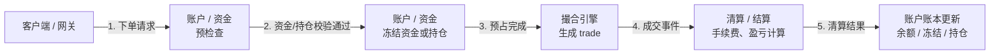
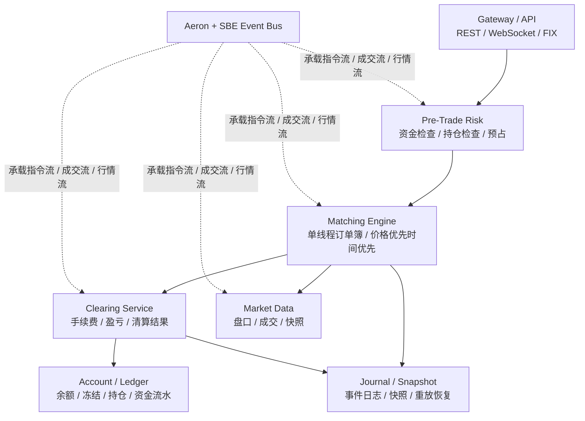

# 交易系统学习图谱

面向交易系统开发面试，重点覆盖账户、资金、清算链路，以及一个可落地的 Java Demo 架构。

---

## 1. 学习主线

- 核心业务域：`账户`、`资金`、`清算`
- Demo 核心服务：`Gateway`、`Risk/Account`、`Matching`、`Clearing`、`Market Data`、`Journal/Snapshot`
- 推荐顺序：先业务，再撮合，再低延迟通信

---

## 2. 账户 / 清算 / 资金流程图

把它理解成一条事件链：下单时先预占，成交后再清算，最后把清算结果落到账户账本。

### 面试里要讲清楚的边界

- `账户`：维护余额、冻结、可用、持仓
- `资金`：维护流水、划转、入金/出金、费用流转
- `清算`：把成交结果转换成资金变化、持仓变化、手续费和盈亏

一句话总结：撮合只负责成交顺序，账户负责资产状态，清算负责把成交结果变成账务结果。

---

## 3. 可落地的 Java Demo 架构

这个架构按“能做出来、能讲明白、能逐步演进”设计，适合先做单机版，再逐步替换成低延迟通信组件。

### 推荐实现顺序

1. 单机单进程：`gateway -> risk/account -> matching -> clearing -> market data`
2. 事件驱动：撮合输出事件，清算和行情异步消费
3. 加日志恢复：补 `journal`、`snapshot`、`replay`
4. 低延迟升级：把内存队列替换为 `Aeron + SBE`

### 每个模块先做什么

| 模块 | 最小功能 |
|------|----------|
| `Gateway` | 接收下单、撤单、查询 |
| `Risk/Account` | 校验可用资金/持仓，冻结与解冻 |
| `Matching Engine` | 限价单、撤单、部分成交、盘口维护 |
| `Clearing Service` | 手续费、盈亏、清算结果生成 |
| `Account/Ledger` | 更新余额、冻结、持仓，记录流水 |
| `Market Data` | 推送盘口、成交、ticker |
| `Journal/Snapshot` | 事件落盘、快照、重放恢复 |

---

## 4. 建议的 Demo 落地范围

### Phase 1：撮合主流程

- 限价单
- 撤单
- 部分成交
- 全部成交
- 盘口维护
- 成交回报

### Phase 2：账户与清算

- 可用 / 冻结
- 资金流水
- 持仓更新
- 手续费
- 盈亏

### Phase 3：恢复与工程化

- Journal
- Snapshot
- 重放恢复
- 幂等
- 对账

---

## 5. 推荐项目

优先筛选“能帮助理解完整交易流程”的仓库，而不只是单独的 order book 实现。

| 项目 | 语言 | 适合学习什么 | 推荐阶段 |
|------|------|--------------|----------|
| [exchange-core/exchange-core](https://github.com/exchange-core/exchange-core) | Java | 撮合 + 风控 + 账户/记账 + 快照回放 | 进阶，最值得精读 |
| [apusingh1967/aeron_sbe_demo](https://github.com/apusingh1967/aeron_sbe_demo) | Java | Aeron/SBE 串起消息链路，偏教学 | 入门 Aeron |
| [aeron-io/aeron-cookbook-code](https://github.com/aeron-io/aeron-cookbook-code) + [aeron-io/simple-binary-encoding](https://github.com/aeron-io/simple-binary-encoding) | Java | Aeron 传输和 SBE 编码基础设施 | 补通信底座 |
| [VladKochetov007/ExchangeSimulation](https://github.com/VladKochetov007/ExchangeSimulation) | Go | 现货 / 保证金 / 永续撮合与结算模拟，业务视角更完整 | 业务补强 |
| [0x5487/matching-engine](https://github.com/0x5487/matching-engine) | Go | 订单类型更丰富，适合学订单簿实现 | 撮合专项 |
| [geseq/orderbook](https://github.com/geseq/orderbook) | Go | 性能导向的 order book 实现 | 数据结构 / 性能专项 |

---

## 6. 推荐学习顺序

| 阶段 | 先看什么 | 目标 |
|------|----------|------|
| 第 1 步 | `ExchangeSimulation` | 先把现货、保证金、永续这几类核心交易流程串起来 |
| 第 2 步 | `exchange-core` | 理解高性能撮合、风控、记账、快照恢复 |
| 第 3 步 | `aeron_sbe_demo` 与 Aeron cookbook | 把低延迟通信和业务主链路接起来 |
| 第 4 步 | 自己实现 Demo | 按单机版 -> 多服务版 -> 重放恢复版迭代 |

---

## 7. 面试回答模板

### 账户、清算、资金分别做什么

账户系统负责维护用户当前资产状态，资金系统负责记录钱的流转和流水，清算系统负责把成交结果转换成余额、持仓、费用和盈亏变化。

### 为什么不在撮合线程里直接更新数据库

撮合优先保证顺序和低延迟，账务落地通过事件流异步处理，再用 `journal`、快照、重放和对账保证最终一致性。

---

## 8. 备注

本图谱的可视化 canvas 版本仍保留在：

- `canvases/trading-system-study-map.canvas.tsx`

文档版放在仓库内，便于长期保存、修改和评审。
