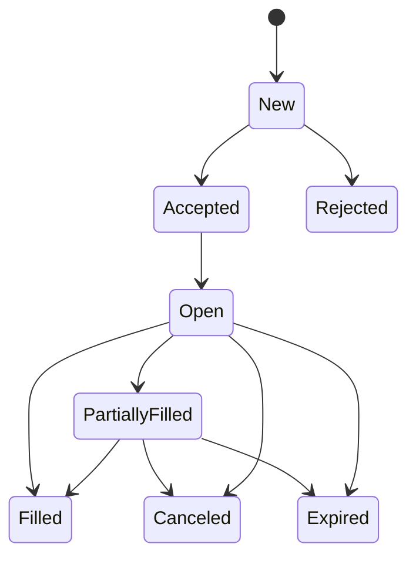
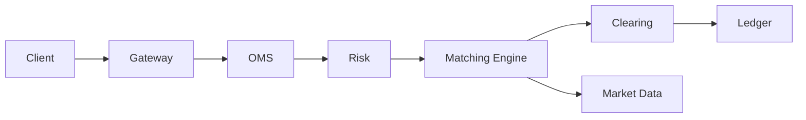
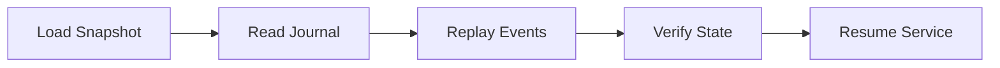
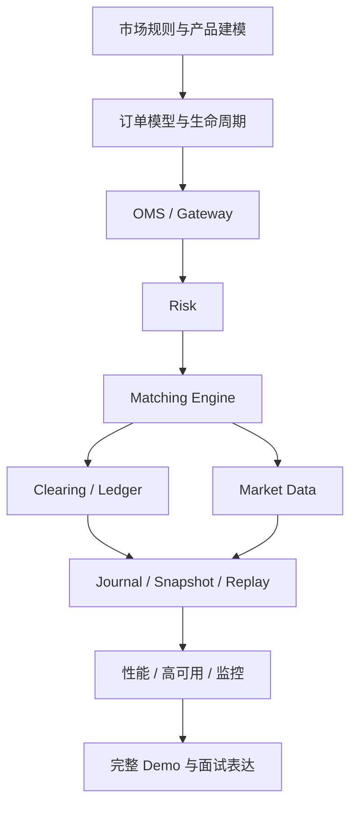

# 交易系统学习图谱 V2

面向交易系统开发进阶学习与面试准备，覆盖从订单进入系统，到撮合、风控、清算、账务、行情、恢复、对账、性能和高可用的完整链路。

这版图谱的目标不是只帮助你“做一个订单簿 Demo”，而是帮助你建立完整的交易系统心智模型：知道系统为什么这样拆、每个模块解决什么问题、真实工程里最容易出错的边界在哪里，以及面试里该如何讲清楚这些设计。

---

## 1. 学习目标与系统全景

学习交易系统，不要只盯着撮合引擎。真正完整的交易系统，至少要同时理解四条主线：

- 业务正确性：订单、撮合、清算、账务是否正确
- 一致性与恢复：宕机后能否恢复，重放后结果是否一致
- 性能与低延迟：吞吐、延迟、尾延迟、背压是否可控
- 风控与运维：风险是否可控，系统是否可观测、可切换、可对账

一句话总结：撮合引擎是核心部件，但不是全部系统。

### 1.1 一个完整交易系统最少包含什么

- `Gateway / API`：接入外部请求
- `OMS`：管理订单生命周期和状态
- `Risk`：下单前检查和限额控制
- `Matching Engine`：撮合成交
- `Clearing`：把成交结果转换成账务结果
- `Ledger / Account`：维护余额、冻结、持仓、流水
- `Market Data`：发布盘口、成交、行情快照
- `Journal / Snapshot / Replay`：记录事件、恢复状态
- `Monitoring / Ops`：监控、告警、限流、切换、对账

### 1.2 学习的核心问题

学习时建议持续追问下面几个问题：

- 一笔订单从进系统到完成，经历了哪些状态变化
- 成交结果如何变成资金和持仓变化
- 为什么撮合线程不能直写数据库
- 宕机后如何恢复，为什么恢复结果要可重现
- 行情、账务、撮合三条链路如何保证最终一致
- 低延迟系统里真正重要的性能指标是什么

### 1.3 先建立正确的系统视角

一个资深交易系统工程师通常不是“只会写订单簿”，而是能同时讲清楚：

- 业务规则如何映射到系统结构
- 哪些地方必须追求严格顺序
- 哪些地方可以异步、最终一致
- 哪些错误可以重试，哪些错误必须补偿
- 哪些状态必须可审计

---

## 2. 市场规则与产品建模

写交易系统前，先把交易规则讲清楚。很多系统复杂度不是来自技术，而是来自业务约束。

### 2.1 先理解你在做哪类交易系统

常见类型包括：

- 现货交易：买入后直接得到资产，卖出后直接减少资产
- 保证金交易：允许借贷和杠杆，涉及借币、利息、强平
- 期货 / 永续合约：涉及保证金、标记价格、资金费率、爆仓、ADL
- 股票 / 基金 / 债券：有交易所规则、交易时段、T+1 或结算周期等约束

不同产品决定了后面的风控、清算、账务模型。

### 2.2 建议明确的基础建模对象

#### Instrument / Symbol

定义一个可交易对象，最少应包含：

- `symbol`：例如 `BTC-USDT`
- `baseAsset` / `quoteAsset`
- `priceTick`：最小价格变动单位
- `qtyStep`：最小数量步长
- `minQty`：最小下单量
- `minNotional`：最小成交额
- `status`：是否允许交易

#### Fee Schedule

- 挂单手续费 `makerFeeRate`
- 吃单手续费 `takerFeeRate`
- VIP 费率
- 活动费率
- 手续费币种

#### Account / Wallet / Position

- `cash balance`
- `frozen balance`
- `available balance`
- `position`
- `margin`
- `equity`

### 2.3 市场规则必须补的约束

如果这部分不定义清楚，后面的撮合和风控都会变乱。

- 价格精度和数量精度
- 最小下单量
- 最小成交额
- 价格保护带 `price band`
- 交易时段
- 是否允许市价单
- 是否允许条件单
- 是否允许自成交
- 是否允许部分成交
- 是否允许改单

### 2.4 这一章学习输出

你应该能回答：

- 一个交易对需要哪些元数据才能支持下单
- 市价单、限价单、IOC、FOK 在规则上有什么差别
- 为什么产品规则决定了系统复杂度

---

## 3. 订单模型与订单生命周期

订单模型是交易系统最重要的基础数据模型之一。很多线上问题，本质上都是订单状态机没设计清楚。

### 3.1 订单最小字段集合

建议订单模型最少包含：

| 字段 | 含义 |
|------|------|
| `orderId` | 系统内部唯一订单号 |
| `clientOrderId` | 客户端幂等键 |
| `userId` | 用户标识 |
| `symbol` | 交易标的 |
| `side` | 买 / 卖 |
| `type` | 限价 / 市价 / 条件单等 |
| `timeInForce` | GTC / IOC / FOK / PostOnly |
| `price` | 委托价格 |
| `quantity` | 原始委托数量 |
| `filledQty` | 已成交数量 |
| `remainingQty` | 剩余数量 |
| `status` | 订单状态 |
| `createdAt` | 创建时间 |
| `updatedAt` | 更新时间 |

### 3.2 建议统一的订单状态机

最少建议覆盖这些状态：

- `New`
- `Accepted`
- `Rejected`
- `Open`
- `PartiallyFilled`
- `Filled`
- `Canceled`
- `Expired`

如果系统支持改单，还需要明确：

- `CancelPending`
- `ReplacePending`
- `Replaced`

### 3.3 一个典型订单生命周期

### 3.4 必须重点理解的边界问题

#### 幂等

同一个客户端因为网络重试，可能发起多次下单请求。系统不能把重复请求当作多笔新订单。

常见做法：

- 客户端提供 `clientOrderId`
- 接入层或 OMS 做去重
- 同一 `clientOrderId + userId` 在业务上只允许生成一笔真实订单

#### 撤单

撤单不是简单删除对象，而是一次状态变化：

- 订单是否存在
- 订单是否已成交完
- 订单是否已在撤单中
- 撤单后冻结资金如何释放
- 部分成交后撤单如何处理剩余量

#### 拒单

拒单要能回答两个问题：

- 为什么拒
- 拒在哪一层

例如：

- 参数校验拒单
- 风控拒单
- 市场规则拒单
- 订单状态不合法拒单

### 3.5 常见订单类型建议补齐

- `Limit`
- `Market`
- `IOC`
- `FOK`
- `PostOnly`
- `Stop`
- `Stop Limit`

你不一定要在第一版 Demo 里都做出来，但必须知道它们在撮合和风控层面的差异。

### 3.6 这一章学习输出

你应该能讲清楚：

- 订单最少需要哪些字段
- 为什么要有 `clientOrderId`
- 部分成交后撤单为什么比普通撤单更麻烦
- 为什么订单状态机设计不好会导致回报混乱

---

## 4. OMS / Gateway / 协议适配

很多初学者会把 `Gateway` 和“订单系统”混为一谈。真实系统里通常需要一个独立的 `OMS`。

### 4.1 模块职责建议拆分

#### Gateway

负责外部接入：

- REST API
- WebSocket API
- FIX 协议
- 鉴权、签名、限流

#### OMS

负责订单生命周期管理：

- 创建订单
- 管理订单状态
- 管理外部请求与内部命令映射
- 幂等去重
- 查询订单状态
- 回报聚合

#### Protocol Adapter

负责把不同协议格式映射为内部统一命令模型。

### 4.2 为什么 OMS 不能省

如果没有 OMS，系统很容易出现以下问题：

- 外部状态与内部状态不一致
- 下单和撤单的回报顺序混乱
- 重复请求无法正确识别
- 多协议接入后逻辑分叉严重
- 查询接口拼不出用户真正关心的状态

### 4.3 一个简化的请求链路

### 4.4 OMS 核心设计点

- 订单状态必须有明确状态机
- 内部命令和外部协议解耦
- 订单查询尽量读 OMS 聚合状态
- 所有异步回报都应带顺序或版本信息

### 4.5 这一章学习输出

你应该能回答：

- Gateway 和 OMS 的边界是什么
- 为什么协议适配不应该侵入撮合引擎
- 为什么查询接口通常不能直接查撮合引擎内存

---

## 5. Pre-Trade Risk 风控体系

很多资料会把风控简化成“检查余额够不够”。这是远远不够的。

### 5.1 风控的目标

风控的本质不是“拦请求”，而是防止系统和用户进入不可接受的风险状态。

### 5.2 常见的下单前风控

- 参数合法性检查
- 价格合法性检查
- 数量合法性检查
- 最小成交额检查
- 可用资金检查
- 可卖持仓检查
- 用户风险限额
- 单笔订单限额
- 单日成交额或订单数限制
- 自成交保护 `Self Trade Prevention`
- 频控和限流

### 5.3 如果涉及杠杆和衍生品

还要补这些概念：

- 初始保证金 `Initial Margin`
- 维持保证金 `Maintenance Margin`
- 杠杆倍数
- 风险等级
- 强平价格
- 减仓
- `ADL`

### 5.4 风控和账户的关系

风控通常不直接做最终账务入账，但会依赖账户状态判断是否可下单。

例如：

- 买单：检查可用资金是否足够，并预冻结
- 卖单：检查可卖持仓是否足够，并预冻结

### 5.5 风控失败时要返回什么

建议统一返回：

- 错误码
- 错误信息
- 拒单层级
- 相关参数

这样便于审计、排障、前端展示和用户申诉处理。

### 5.6 这一章学习输出

你应该能回答：

- 风控为什么不能只做余额检查
- 预冻结和最终入账的区别是什么
- 为什么自成交保护是系统规则而不只是用户体验问题

---

## 6. Matching Engine 与订单簿

撮合引擎的目标是按照确定性的市场规则，把订单转换成成交事件。

### 6.1 撮合引擎最重要的原则

- 顺序性
- 确定性
- 低延迟
- 少阻塞
- 易恢复

### 6.2 最基础的撮合规则

大多数基础系统都以“价格优先、时间优先”为核心规则：

- 价格更优的单子先成交
- 同一价格下，先到先成交

### 6.3 订单簿需要维护什么

- 买盘 `bids`
- 卖盘 `asks`
- 价格档位
- 每档订单队列
- `orderId -> order` 索引
- 最优买一 / 卖一

### 6.4 最少建议支持的功能

第一版 Demo 建议先支持：

- 限价单
- 撤单
- 部分成交
- 全部成交
- 盘口维护
- 成交事件输出

### 6.5 撮合事件通常包括什么

- 订单接收事件
- 订单入簿事件
- 订单撤销事件
- 成交事件 `trade`
- 订单完成事件

### 6.6 为什么撮合线程通常保持单线程

因为单个交易对上的撮合逻辑天然要求顺序一致。单线程有几个优势：

- 更容易保证顺序性
- 不需要复杂锁竞争
- 更容易控制尾延迟
- 更容易做确定性重放

真实系统一般不是“整个系统只有一个线程”，而是“核心撮合路径在单线程上保持严格顺序”。

### 6.7 撮合线程不该做什么

- 不直接访问慢数据库
- 不做复杂远程调用
- 不做重日志格式化
- 不做阻塞式磁盘 IO

### 6.8 这一章学习输出

你应该能回答：

- 为什么价格优先、时间优先容易实现成确定性系统
- 为什么撮合线程里不应该直写数据库
- 为什么单线程撮合不是性能落后，而是工程上的理性选择

---

## 7. Clearing / Ledger / Settlement

这一章非常关键。很多学习图谱会把“账户、资金、清算”写得很浅，但实际系统里最难做对的恰恰是这一部分。

### 7.1 三个概念一定要拆开

#### Clearing

根据成交结果，计算应发生的账务变化。

例如：

- 买入多少资产
- 卖出多少资产
- 扣多少手续费
- 盈亏如何计算

#### Ledger

负责以可审计、可追溯、不可随意篡改的方式记录账务变化。

#### Settlement

负责最终交收或周期性结算。

不同市场下，结算含义不同：

- 现货可以接近实时交收
- 股票可能有结算周期
- 衍生品可能涉及周期性结算和资金费率结算

### 7.2 建议明确的账务对象

- `balance`
- `frozen`
- `available`
- `position`
- `fee`
- `realized pnl`
- `unrealized pnl`
- `equity`

### 7.3 一个买单成交后的典型处理

例如用户用 `USDT` 买入 `BTC`：

1. 下单前检查可用 `USDT`
2. 冻结相应 `USDT`
3. 撮合产生 `trade`
4. 清算计算实际花费、手续费、获得的 `BTC`
5. 释放未使用冻结
6. 更新余额、持仓、流水

### 7.4 为什么建议引入账本思维

如果只是“直接改余额字段”，系统会很快失去可审计性。

建议至少建立这些意识：

- 账务流水尽量 append-only
- 资金变化尽量通过分录表达
- 余额是结果，流水是事实
- 出问题时优先依据流水回放和对账

### 7.5 双分录思想为什么重要

不是所有 Demo 都要完整实现双分录账本，但你至少要理解：

- 一笔账务变化最好能表示为来源和去向
- 资金变化最好可守恒
- 手续费、资产转换、用户间成交，都应能落到可审计分录上

### 7.6 资金冻结与解冻的边界

冻结不是扣款，冻结只是限制可用额度。

常见边界：

- 下单冻结
- 撤单解冻
- 部分成交后释放剩余冻结
- 成交后转为真实扣减

### 7.7 盈亏什么时候计算

不同产品差异很大：

- 现货：更多是资产数量变化
- 保证金：涉及借贷成本和利息
- 永续：涉及未实现盈亏、已实现盈亏、资金费率

所以“清算”不能只写成“手续费和盈亏”，而要说明产品上下文。

### 7.8 这一章学习输出

你应该能讲清楚：

- 清算、账本、结算的区别
- 为什么资金流水比余额字段更重要
- 为什么冻结不等于真实扣款
- 为什么交易系统必须强调可审计

---

## 8. Market Data 行情系统

行情系统不要只写成“推送盘口和成交”。它通常是一条独立链路，并且直接影响前端展示、量化订阅和策略系统。

### 8.1 行情通常包括什么

- 最优买卖价 `L1`
- 深度盘口 `L2`
- 逐笔订单级别明细 `L3`
- 成交明细
- ticker
- 日内统计数据
- 快照
- 增量更新

### 8.2 为什么行情也要强调顺序

如果行情链路乱序，就会出现：

- 前端盘口跳变
- 订阅端无法正确重建 order book
- 策略系统读到错误市场状态

### 8.3 常见设计模式

- 定期推全量快照
- 高频推增量
- 每条消息附带序列号
- 客户端用 `snapshot + delta` 重建状态

### 8.4 行情与撮合的关系

理想情况下，行情应从撮合结果或撮合驱动的状态变化生成，而不是从别处“猜测”。

否则很容易出现：

- 撮合结果正确，行情错
- 行情正确，账务回报晚到
- 各链路看到的世界不同步

### 8.5 这一章学习输出

你应该能回答：

- `L1/L2/L3` 分别是什么
- 为什么行情消息要带序列号
- 客户端为什么经常需要快照加增量重建

---

## 9. Journal / Snapshot / Replay / 对账

如果说撮合决定了系统能不能跑，那恢复和对账决定了系统能不能长期稳定运行。

### 9.1 四个核心概念

#### Journal

记录关键业务事件，通常按顺序落盘，用于恢复和审计。

#### Snapshot

周期性保存关键状态，减少恢复时全量回放的成本。

#### Replay

从快照起点继续按事件顺序重放，恢复系统状态。

#### Reconciliation

对账，检查不同系统间数据是否一致。

### 9.2 为什么不能只靠数据库恢复

因为数据库中的状态往往只是某个时刻的结果，不一定保存了完整事件顺序和中间过程。

而交易系统恢复常常依赖：

- 输入顺序
- 成交顺序
- 账务顺序
- 幂等消费语义

### 9.3 为什么重放必须 deterministic

同样的输入序列，重放后必须得到同样的结果，否则系统就不可信。

确定性重放通常要求：

- 事件顺序固定
- 核心逻辑无外部随机性
- 重放过程不依赖当前时间等非确定输入
- 幂等处理不会重复入账

### 9.4 对账要对什么

常见对账对象包括：

- 撮合成交和账务入账是否一致
- 账务余额和流水汇总是否一致
- 行情快照和订单簿状态是否一致
- 内部账和外部结算账是否一致

### 9.5 常见恢复流程

### 9.6 这一章学习输出

你应该能回答：

- 为什么只靠数据库快照不足以恢复交易系统
- 为什么重放要追求确定性
- 为什么对账是生产系统的基本能力而不是附加功能

---

## 10. 高可用、性能与可观测性

如果目标是资深岗位，这一章不能省。

### 10.1 高性能不只是“吞吐高”

交易系统更关注：

- 平均延迟
- 尾延迟 `p99 / p999`
- 高峰时是否抖动
- 背压是否可控
- 故障时是否退化可控

### 10.2 常见性能设计点

- 核心路径减少对象分配
- 避免频繁 GC
- 使用预分配内存或对象池
- 减少锁竞争
- 减少跨线程切换
- 使用高性能消息传输，如 `Aeron`
- 使用紧凑编码，如 `SBE`

### 10.3 为什么低延迟系统关注尾延迟

因为用户和策略通常并不只关心“平均很快”，而是关心“最差情况下会不会非常慢”。

尾延迟失控往往来自：

- GC 停顿
- 锁竞争
- 突发流量
- 阻塞 IO
- 下游消费变慢导致背压

### 10.4 高可用要考虑什么

- 进程崩溃后如何恢复
- 主备切换如何保证顺序
- 切换期间是否会重复消费
- 切换期间是否会丢消息
- RPO / RTO 目标是什么

### 10.5 可观测性必须覆盖什么

- 订单接入量
- 拒单率
- 成交量
- 风控命中率
- 清算积压
- 行情延迟
- journal 落盘延迟
- replay 耗时
- 关键错误码

### 10.6 这一章学习输出

你应该能回答：

- 为什么交易系统更关注尾延迟
- 为什么单线程撮合不等于低吞吐
- 为什么没有可观测性就很难真正维护生产系统

---

## 11. Demo 分阶段落地路线

建议按“先业务正确，再工程增强，最后性能优化”的顺序实现。

### Phase 1：最小可运行撮合 Demo

目标：把主交易链路跑通。

建议功能：

- 限价单
- 撤单
- 部分成交
- 全部成交
- 基础订单簿
- 成交事件回报

### Phase 2：补订单生命周期和基础 OMS

目标：让系统开始像一个“订单系统”。

建议功能：

- `clientOrderId`
- 订单状态机
- 拒单原因
- 查询订单
- 基础回报聚合

### Phase 3：补风控和账户

目标：让下单之前先做预检查。

建议功能：

- 可用资金检查
- 可卖持仓检查
- 冻结和解冻
- 风控拒单

### Phase 4：补清算和账务

目标：让成交结果真正变成资产变化。

建议功能：

- 成交转账务事件
- 余额更新
- 持仓更新
- 手续费
- 资金流水

### Phase 5：补恢复与对账

目标：让系统具备生产级工程意识。

建议功能：

- Journal
- Snapshot
- Replay
- 幂等消费
- 对账

### Phase 6：补性能与低延迟组件

目标：把系统从功能 Demo 推向性能工程。

建议功能：

- 内存队列优化
- `Aeron + SBE`
- 延迟监控
- 压测和回放测试

### 11.1 每个阶段的验收标准

建议每一阶段都明确“证明做对了”的方式：

- 是否能通过单元测试
- 是否能通过回放测试
- 是否能通过资金守恒校验
- 是否能通过重复请求幂等测试
- 是否能在宕机后恢复

---

## 12. 推荐项目与学习顺序

推荐仓库不是为了“抄实现”，而是为了观察不同项目如何处理交易系统中的不同难点。

下面这批仓库是按 `V2` 图谱的业务覆盖度筛过一轮的，优先挑了 `Go / Java / Kotlin(JVM)` 方向，并确认过仓库链接可打开、不是 `404`。

### 12.1 优先推荐：更接近完整加密货币交易所

| 项目 | 语言 | 项目链接 | 与 V2 图谱匹配点 | 适合学习什么 | 注意点 |
|------|------|----------|------------------|--------------|--------|
| `OPEX core` | Kotlin / Java | [opexdev/core](https://github.com/opexdev/core) | 仓库目录直接包含 `user-management`、`wallet`、`bc-gateway`、`accountant`、`matching-engine`、`matching-gateway`、`eventlog`、`api`、`websocket` | 最接近“账户 + 钱包 + 撮合 + 账务 + 事件日志 + 区块链接入”的完整闭环，适合对照 V2 全景图学习系统拆分 | 偏微服务，组件较多，学习成本高 |
| `GitBitEX` | Java | [gitbitex/gitbitex-new](https://github.com/gitbitex/gitbitex-new) | 开源加密货币交易所，包含内存撮合、分布式 standby、命令回放一致性、Prometheus 指标、Swagger API | 很适合学习 `OMS / Matching / Replay / Monitoring` 这条主链路，工程感较强 | README 明确说明区块链钱包需要自行实现后接入 |
| `OpenCEX` | Python / Vue | [Polygant/OpenCEX](https://github.com/Polygant/OpenCEX) | README 明确包含托管钱包、充提、撮合、Quick Swap、KYC、KYT、2FA | 如果你想补“交易所产品层”和“运营层组件”，它比很多只有撮合内核的仓库完整得多 | 仓库页面明确写了 `This repository is not maintained`，仅适合参考架构和业务范围 |
| `Peatio / OpenDAX 体系` | Ruby | [bitzlato/peatio](https://github.com/bitzlato/peatio) | README 覆盖撮合引擎、多钱包、WebSocket API、Management API、RabbitMQ Event API、KYC/2FA | 很适合补“交易所后台能力”和微服务拆分思路，尤其是钱包、管理后台、事件接口 | 非 Go/Java；更适合作为业务全景参考而不是实现风格参考 |

### 12.2 核心内核补充：Go / Java 方向最值得精读的交易内核

| 项目 | 语言 | 项目链接 | 与 V2 图谱匹配点 | 适合学习什么 | 注意点 |
|------|------|----------|------------------|--------------|--------|
| `exchange-core` | Java | [exchange-core/exchange-core](https://github.com/exchange-core/exchange-core) | README 明确包含 `orders matching engine`、`risk control and accounting module`、`disk journaling and snapshots module`、`trading/admin/reports API` | Java 方向最值得精读的高性能交易核心，适合学习 `撮合 + 风控 + 账务 + journal/snapshot/replay + 性能工程` | 它更像交易核心而不是完整交易所栈；README 里仍把 market data、clearing/settlement、gateway 标成 TODO |
| `Open Outcry` | Go | [tolyo/open-outcry](https://github.com/tolyo/open-outcry) | README 明确支持 `trading and payment accounts`、`market/limit/stop`、`GTC/FOK/IOK/GTD/GTT`、`self-trade prevention`、充值/提现/转账/交易费率 | Go 方向里少见地把“订单规则 + 账户 + 费用 + 交易事务”放在一起考虑，适合补 `订单模型 / 风控规则 / 账务闭环` | 更偏“交易与清算引擎”，不是现成完整交易所；README 里 REST / WebSocket / FIX 仍在 planned features |

### 12.3 如果你只想按一条最顺的路径看

建议按下面顺序看：

1. 先看 [opexdev/core](https://github.com/opexdev/core)
   目标是建立“完整交易所应该拆成哪些域服务”的全景认知。
2. 再看 [gitbitex/gitbitex-new](https://github.com/gitbitex/gitbitex-new)
   目标是理解更贴近 Java 工程实践的 `撮合 + 回放一致性 + 监控`。
3. 再精读 [exchange-core/exchange-core](https://github.com/exchange-core/exchange-core)
   目标是把 `高性能撮合 / 风控 / accounting / journal-snapshot` 这些核心能力吃透。
4. 如果你想补 Go 方向，再看 [tolyo/open-outcry](https://github.com/tolyo/open-outcry)
   目标是学习 Go 里如何把账户、订单规则、交易事务放在一个闭环里实现。
5. 如果你想补“更像真实交易所产品”的外围能力，再参考 [Polygant/OpenCEX](https://github.com/Polygant/OpenCEX) 和 [bitzlato/peatio](https://github.com/bitzlato/peatio)
   目标是补钱包、KYC、管理后台、运营组件，不建议作为主要代码风格样板。

### 12.4 如何把这些项目映射回 V2 图谱

- 学 `订单模型 / 生命周期 / OMS`：优先看 `gitbitex-new`、`Open Outcry`
- 学 `Pre-Trade Risk / 账户 / 账务`：优先看 `exchange-core`、`OPEX core`
- 学 `Clearing / Ledger / Settlement`：优先看 `OPEX core`、`Open Outcry`，再用 `Peatio` 补外围业务
- 学 `Journal / Snapshot / Replay`：优先看 `exchange-core`、`gitbitex-new`
- 学 `完整交易所业务全景`：优先看 `OPEX core`，再用 `OpenCEX`、`Peatio` 补充钱包和运营侧能力

---

## 13. 推荐学习顺序图

---

## 14. 面试回答模板

### 14.1 账户、资金、清算分别做什么

账户系统负责维护用户当前资产状态，比如余额、冻结、可用和持仓；资金或账本系统负责记录资产流转和账务流水；清算系统负责把成交结果转换成余额、持仓、手续费和盈亏变化。

### 14.2 为什么不在撮合线程里直接更新数据库

撮合线程首先要保证顺序和低延迟。如果在撮合线程里直接做重 IO，会把吞吐和尾延迟都拖垮。更合理的方式是让撮合线程只产生成交事件，再由清算和账务链路异步处理，并通过 journal、snapshot、replay 和对账保证最终一致性。

### 14.3 为什么交易系统要强调幂等

因为网络抖动、超时重试、主备切换都会导致同一请求被重复投递。如果没有幂等，系统可能重复下单、重复记账、重复推送回报，最终导致账实不一致。

### 14.4 为什么恢复必须 deterministic

因为交易系统不能接受“同样输入，恢复出不同结果”。确定性重放可以确保事件顺序一致时，恢复出的撮合状态、账务状态和行情状态也一致。

### 14.5 如何保证撮合、账务、行情三条链路一致

核心思路是：

- 撮合输出确定性事件
- 账务和行情都消费这条主事件流
- 每条事件带顺序信息
- 下游消费幂等
- 通过快照、重放和对账校验一致性

---

## 15. 常见误区与边界澄清

### 15.1 常见误区

- 误区一：把交易系统理解成撮合引擎
- 误区二：把账户系统和账本系统混为一谈
- 误区三：只关注成功链路，不关注拒单、撤单、恢复和补偿
- 误区四：只关注平均延迟，不关注尾延迟
- 误区五：只做功能，不做对账和回放验证

### 15.2 边界澄清

#### 账户 vs 账本

- 账户更偏“当前状态”
- 账本更偏“历史事实”

#### 清算 vs 结算

- 清算是算清楚应该发生什么资产变化
- 结算是把这些变化真正交收完成

#### 风控 vs 账务

- 风控负责“能不能做”
- 账务负责“做完后怎么记”

#### Gateway vs OMS

- Gateway 负责接入
- OMS 负责订单状态管理

---

## 16. 学习检查清单

如果你学到一半，不知道自己是否真的掌握了，可以对照这份清单自测。

### 16.1 业务正确性

- 我能讲清楚订单生命周期
- 我能讲清楚撮合、清算、账务的边界
- 我能解释冻结、扣减、解冻的区别
- 我能解释不同订单类型的规则差异

### 16.2 一致性与恢复

- 我知道为什么要 journal 和 snapshot
- 我知道为什么重放要 deterministic
- 我知道如何做幂等消费
- 我知道为什么必须做对账

### 16.3 性能与工程

- 我知道为什么撮合线程偏单线程
- 我知道尾延迟为什么重要
- 我知道 `Aeron` 和 `SBE` 解决什么问题
- 我知道如何监控一条交易主链路

### 16.4 面试表达

- 我能在 3 分钟内讲清楚一笔订单完整链路
- 我能解释为什么撮合线程不直写数据库
- 我能解释如何做恢复和一致性保证
- 我能说明我的 Demo 如果继续演进，下一步会做什么

---

## 17. 一份建议的 8 周学习计划

如果你希望有节奏地推进，可以参考下面的学习节奏。

### 第 1-2 周：业务建模

- 理解现货、保证金、永续差异
- 梳理订单、账户、清算、账本概念
- 画出订单生命周期图

### 第 3-4 周：撮合与 OMS

- 实现简化订单簿
- 支持限价单、撤单、部分成交
- 引入订单状态机和 `clientOrderId`

### 第 5-6 周：风控与账务

- 增加可用 / 冻结检查
- 增加成交转账务分录
- 增加流水和持仓变更

### 第 7 周：恢复与对账

- 增加 journal
- 增加 snapshot
- 增加 replay
- 增加对账校验

### 第 8 周：性能与表达

- 观察性能瓶颈
- 补监控指标
- 整理一份面试讲稿

---

## 18. 总结

交易系统最难的不是“做一个能成交的撮合器”，而是做一个长期稳定、账实一致、可恢复、可审计、能解释清楚的系统。

如果只学撮合，你会做出一个局部正确的组件；如果把订单、风控、清算、账务、恢复、行情、性能串起来，才算真正建立起交易系统工程师的完整视角。

这也是为什么学习路径建议始终遵循下面这个顺序：

- 先理解业务规则
- 再理解订单和撮合
- 再补风控和账务
- 再补恢复和对账
- 最后补低延迟和高可用

一句话收尾：交易系统是“规则系统 + 状态系统 + 事件系统 + 恢复系统”的组合，而不是单独一个撮合引擎。
