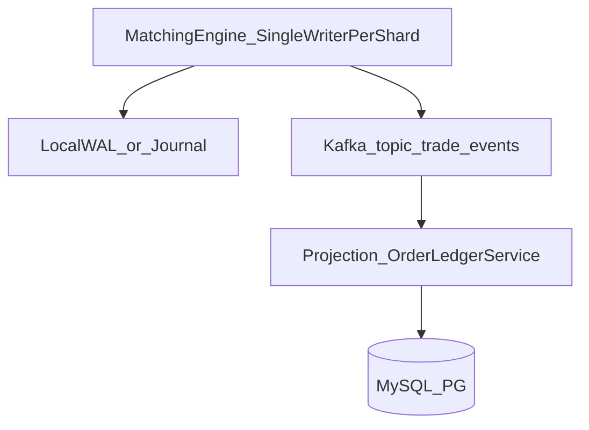
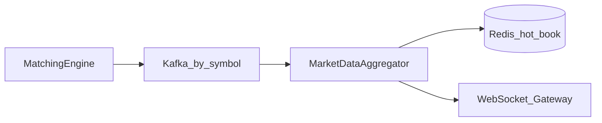
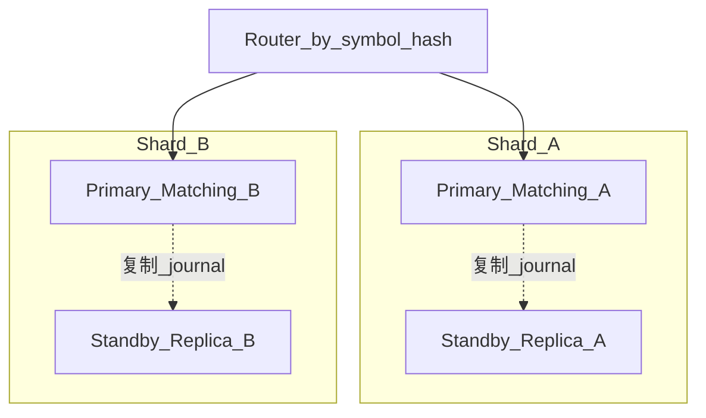
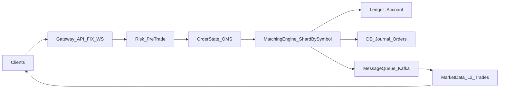

# 交易系统与撮合引擎：学习路线与资料索引

本文档与仓库 [exchange-core](https://github.com/exchange-core/exchange-core) 及 [EXCHANGE_CORE_项目说明.md](./EXCHANGE_CORE_项目说明.md) 配套，供系统学习「撮合内核 + 全链路 + 分布式 + 存储」使用。

---

## 1. 概念澄清：撮合引擎算不算「交易系统」？

**算，但只是交易系统的核心子系统之一。** 业界常说的「交易系统」通常指一整条链：**接入（网关/API）→ 订单与风控 → 撮合（订单簿 + 匹配算法）→ 成交回报与账务 → 持久化与行情发布 →（可选）清算结算与报表**。撮合引擎负责其中**订单簿维护、价格时间优先等匹配规则、生成成交/撤单等确定性结果**；它不单独等于完整交易系统。

本仓库在 README 与 [EXCHANGE_CORE_项目说明.md](./EXCHANGE_CORE_项目说明.md) 里也体现了这种拆分：内核含撮合、两步风控、日志快照等，而 **FIX/REST 网关、完整清算、集群** 等仍在上游 README 的 TODO——这正是「内核 vs 全链路产品」的常见边界。

---

## 2. 对照岗位：只学撮合够不够？缺什么？

| 维度        | 只深耕撮合能覆盖的部分     | 建议补全（否则面试易露短板）                                                                 |
| --------- | --------------- | ------------------------------------------------------------------------------ |
| **语言与工程** | 数据结构、低延迟、单线程确定性 | **Java/Go 生产级**：并发、GC/分配、压测与可观测性                                               |
| **中间件**   | 较少直接考           | **RPC（如 gRPC）**、**消息队列（Kafka/RocketMQ）** 的典型用法与语义（顺序、重试、幂等）                    |
| **数据**    | 订单簿在内存          | **MySQL/PostgreSQL**：订单生命周期表、流水、对账；**Redis**：缓存、会话、限流、行情缓存                     |
| **全链路**   | 撮合逻辑            | **网关**（鉴权、限流、协议）、**风控**（事前额度/限速）、**账户与资金**（冻结、分录、可用/冻结）、**行情**（L2、推送、Kafka 管道） |
| **分布式**   | 常考「按交易对分片」      | **多实例、选主/副本、分片路由、故障切换**；与 **Exactly-once / 至少一次** 在流水落库中的取舍                    |

**结论**：以撮合为**深度突破口**完全可行；想稳拿「高级 / 分布式交易」岗位，需在简历与口述中至少展示：**撮合结果如何落库、如何异步推行情、RPC/MQ 如何解耦、以及分片与高可用的思路**。

---

## 3. 架构师视角：撮合落库、异步行情、RPC/MQ 解耦、分片与高可用

下面是一套**可落地、可面试陈述**的设计骨架（与本仓库「撮合热路径 + journaling」思路一致：内核只保证**确定性状态机 + 顺序事件**；**慢 IO 全部外移**）。

### 3.1 设计目标与边界

- **撮合线程（或每 symbol 单线程）**：禁止同步 MySQL/远程 RPC；只做内存订单簿、风控已冻结前提下的匹配、生成**不可变事件**（成交、撤单、拒单、余额变动指令）。
- **真相源（Source of Truth）**：优先选 **append-only 操作日志 / 撮合事件流**（本地 Chronicle、磁盘 journal，或等价 WAL），数据库是**投影（projection）**，不是「先写库再撮合」。
- **一致性表述**：撮合内核 **强一致 + 单分片顺序**；跨服务落库、行情、通知为 **最终一致**；用 **单调序号 / Kafka offset / 业务幂等键** 收敛重复与乱序。

### 3.2 撮合结果如何落库

**推荐路径：事件 →（可选 MQ）→ 账户/订单投影服务 → 事务写库**

1. **事件内容（最小集）**：`seq`（全局或 per-shard 单调）、`symbolId`、`eventType`（TRADE/CANCEL/REJECT）、`orderId`、`tradeId`、`price`、`qty`、`fee`、`userId`、关联 `clientOrderId` 等；资金侧用 **分录指令**（借/贷、冻结释放）而非直接改余额字段。
2. **本地持久化**：热路径先写 **本地顺序 WAL**（批量 fsync 可配置），崩溃恢复时 **重放日志重建内存态**。
3. **异步落库**：投影消费者从 Kafka（或内嵌 disruptor 下游 handler）按 **partition 内顺序**消费；**幂等**唯一键 `(trade_id)`、`(event_seq, shard_id)` 等。
4. **表草图**：见本仓库 [docs/schemas/orders_trades_ledger_sketch.sql](./schemas/orders_trades_ledger_sketch.sql)。

### 3.3 如何异步推行情

**原则**：**撮合线程不直连 WebSocket**；只向 **MQ** 丢增量事件，由行情服务聚合与推送。

1. **管道**：`trade_events` / `book_delta` topic（按 `symbol` 分区保序）→ **MarketData 服务** → **Redis**（热 BBO、L2）+ **WebSocket 网关**。
2. **快照**：周期全量 L2 checkpoint + 增量 offset，避免新消费者从头重放。

### 3.4 RPC 与 MQ 如何分工解耦

| 维度       | **RPC（如 gRPC）**            | **MQ（如 Kafka / RocketMQ）** |
| -------- | -------------------------- | -------------------------- |
| **典型用途** | 用户**同步路径**：下单、撤单、查单、查余额    | **事实传播**：成交事件、账务投影、行情增量、审计 |
| **耦合**   | 调用方等待；需 **超时、重试、幂等 token** | **发布方不等待消费者**；消费者独立扩容      |
| **顺序**   | 单次请求/响应，不保证全局序             | **按 key 分区**可保证单 symbol 序  |
| **失败语义** | 明确错误码                      | **至少一次**投递 + 消费者幂等         |

**解耦要点**：撮合产出事件 **只进 MQ**，账务与行情 **只订阅 MQ**，不回调撮合 RPC。

### 3.5 分片与高可用（HA）

- **分片**：按 `symbolId` 哈希到 **N 个 shard**；每 shard **单写者**。
- **HA**：每 shard **主备（Active/Passive）**；**复制操作日志**到备；晋升前 **fence 旧主**（租约 / etcd）。

**与本仓库对照**：`MatchingEngineRouter` 按 `symbolId` 哈希到订单簿，已是**分片内核**；集群化时把「每分片」映射为独立进程 + 外置复制与选主即可。

### 3.6 学习本节时建议对照的代码/资料

- 本地：[EXCHANGE_CORE_项目说明.md](./EXCHANGE_CORE_项目说明.md) 中 journaling、`ResultsHandler`、事件链。
- 开源（优先 Java/Go）：[gitbitex/gitbitex-new](https://github.com/gitbitex/gitbitex-new)、[tolyo/open-outcry](https://github.com/tolyo/open-outcry)；扩展：[viabtc/viabtc_exchange_server](https://github.com/viabtc/viabtc_exchange_server)（C）、[fluidex/dingir-exchange](https://github.com/lispczz/dingir-exchange)（Rust）。
- 工程文：[Scaling Clear Street's Trade Capture System](https://www.clearstreet.io/news/blog/scaling-clear-streets-trade-capture-system)

---

## 4. 分阶段学习方案（推荐顺序）

### 阶段 A：撮合与低延迟架构「为什么长这样」

- [The LMAX Architecture（Martin Fowler）](https://martinfowler.com/articles/lmax.html)
- [LMAX Disruptor 设计说明](https://lmax-exchange.github.io/disruptor/disruptor.html)
- [Crypto Exchange Matching Engine Architecture（Codono）](https://codono.com/blog/exchange-matching-engine-architecture)
- [An introduction to matching engines（Databento Blog）](https://databento.com/blog/introduction-to-matching-engines)
- 中文：[The LMAX Architecture（博客园摘译）](https://www.cnblogs.com/JaxYoun/p/15245276.html)

**动手**：阅读本仓库源码与 [EXCHANGE_CORE_项目说明.md](./EXCHANGE_CORE_项目说明.md)，并对照下文 **附录 A：LMAX 与 exchange-core 类对照**。

### 阶段 B：全链路拼图（网关 / 风控 / 账户 / 行情 / 清算）

- [A Complete Guide to Trading System Development](https://www.globaltechlimited.com/news/post-id-50/)
- [How I Built a Capital Markets Trade Lifecycle System（DEV）](https://dev.to/ra9huvansh/how-i-built-a-capital-markets-trade-lifecycle-system-that-mirrors-real-banking-infrastructure-898)
- [Clearing and Settlement in Financial Markets（BME）](https://www.bolsasymercados.es/en/blog/clearingandsettlement.html)
- [Building OMS for Crypto Exchanges（sanj.dev）](https://sanj.dev/post/building-oms-crypto-exchanges)
- [Stop Updating Crypto Exchange Balances Like a Normal CRUD Field（DEV）](https://dev.to/kajol_shah/stop-updating-crypto-exchange-balances-like-a-normal-crud-field-1be2)
- [Architecture Decisions When You're Asked to Build a Crypto Exchange](https://dev.to/kajol_shah/architecture-decisions-when-youre-asked-to-build-a-crypto-exchange-2ilc)

**动手**：结合 [orders_trades_ledger_sketch.sql](./schemas/orders_trades_ledger_sketch.sql) 理解分录模型。

### 阶段 C：分布式改造（分片、高可用、RPC、消息队列）

- [Scaling Clear Street's Trade Capture System](https://www.clearstreet.io/news/blog/scaling-clear-streets-trade-capture-system)
- [Chronicle Queue vs Aeron（sanj.dev）](https://sanj.dev/posts/chronicle-vs-aeron)；[Man Group：Aeron 上的执行系统实践](https://www.man.com/technology/special-fx-execution-system-on-aeron)
- [gRPC 官方文档](https://grpc.io/docs/)

**学习要点**：按 symbol 分片、单分片顺序、幂等落库、主备与 journaling、MQ 顺序与重放。

**动手**：阅读 [gitbitex/gitbitex-new](https://github.com/gitbitex/gitbitex-new) 或 [tolyo/open-outcry](https://github.com/tolyo/open-outcry) 的模块划分；精读一篇 Kafka 工程文（上条 Clear Street 文即可）。

### 阶段 D：存储与缓存（MySQL/PostgreSQL + Redis）

- [open-outcry](https://github.com/tolyo/open-outcry)（PostgreSQL 侧正确性）
- [Redis 官方文档](https://redis.io/docs/)

### 阶段 E：协议与网关（可选加分）

- [FIX Trading Community 介绍](https://www.fixtrading.org/online-specification/introduction)
- [Introduction to FIX（fix.dev）](https://fix.dev/kb/fix-basics)
- [QuickFIX/J Tutorials](https://quickfixj.org/docs/tutorials)
- [FIX Protocol + Spring Boot（Medium）](https://medium.com/@achrafhasbi/fix-protocol-building-a-trading-system-using-java-and-spring-boot-part-1-a76254a5f937)

---

## 5. GitHub 项目推荐（优先 Java / Go）

| 目的                  | 语言   | 项目                                                                                                                                    | 说明                                   |
| ------------------- | ---- | ------------------------------------------------------------------------------------------------------------------------------------- | ------------------------------------ |
| **深挖撮合内核**          | Java | [exchange-core/exchange-core](https://github.com/exchange-core/exchange-core)                                                         | Disruptor、ART 订单簿、风控、journaling；即本仓库 |
| **Java 全站示例**       | Java | [gitbitex/gitbitex-new](https://github.com/gitbitex/gitbitex-new)                                                                     | 内存撮合 + Mongo 等                       |
| **Go 内存撮合 SDK**     | Go   | [0x5487/matching-engine](https://github.com/0x5487/matching-engine)                                                                   | SkipList、事件溯源扩展                      |
| **Go + PostgreSQL** | Go   | [tolyo/open-outcry](https://github.com/tolyo/open-outcry)                                                                             | PL/pgSQL + Go                        |
| **Java 持久化日志 demo** | Java | [Chronicle-Queue](https://github.com/OpenHFT/Chronicle-Queue)、[Chronicle-Queue-Demo](https://github.com/OpenHFT/Chronicle-Queue-Demo) | 日志与回放                                |

**其他语言（扩展）**： [viabtc/viabtc_exchange_server](https://github.com/viabtc/viabtc_exchange_server)（C）、[fluidex/dingir-exchange](https://github.com/lispczz/dingir-exchange)（Rust）。

### 5.1 全链路交易系统项目（Java / Go）

「全链路」指：**网关/API、用户与鉴权、订单与撮合、资产/清算或账务、行情与推送、（可选）钱包充提、管理端与前端** 等可联调跑通。

**说明**：开源全栈多用于学习；勿用于真实资金。

| 类型          | 语言   | 项目                                                                                                        | 概要                                                          |
| ----------- | ---- | --------------------------------------------------------------------------------------------------------- | ----------------------------------------------------------- |
| Java 全栈     | Java | [jammy928/CoinExchange_CryptoExchange_Java](https://github.com/jammy928/CoinExchange_CryptoExchange_Java) | Spring Cloud：撮合、API、行情、OTC、钱包等                              |
| Java 全栈     | Java | [exchange-server/CoinExchange](https://github.com/exchange-server/CoinExchange)                           | 同系全家桶                                                       |
| Java 全站（轻量） | Java | [gitbitex/gitbitex-new](https://github.com/gitbitex/gitbitex-new)                                         | 见上表                                                         |
| Go 微服务全链路   | Go   | [tytsxai/exchange-platform](https://github.com/tytsxai/exchange-platform)                                 | gateway / order / matching / clearing / marketdata / wallet |
| Go（go-zero） | Go   | [ikun2021/gex](https://github.com/ikun2021/gex)、[gex-ui](https://github.com/ikun2021/gex-ui)              | 现货、盘口、K 线、RPC、DTM                                           |

**JVM 补充**： [opexdev/core](https://github.com/opexdev/core)（Kotlin：微服务交易所核心，Docker）

**与「撮合专项」关系**：全链路练模块边界；性能与撮合原理仍建议回到 **exchange-core** / **0x5487/matching-engine**。

---

## 6. 全链路数据流（面试自测用）

---

## 7. 时间分配建议

- **第 1–3 周**：阶段 A + 本仓库源码走读（撮合 + 风控 + journaling）。
- **第 4–6 周**：阶段 B + D + [orders_trades_ledger_sketch.sql](./schemas/orders_trades_ledger_sketch.sql)。
- **第 7–8 周**：阶段 C + GitBitEX 或 open-outcry；「分片 + 主备」一页笔记。
- **持续**：英语读 Fowler、gRPC、Kafka、Redis 官方文档。

---

## 8. 风险与预期

- 开源交易所多数为教学或简化版；学习时关注**模块边界与数据一致性**。
- 外链可能失效；以**官方文档 + LMAX 经典文章**为锚。

---

## 附录 A：LMAX / Disruptor 概念与 exchange-core 源码对照

| LMAX / Disruptor 概念                 | 本仓库中的对应                                                                                                                                                                                            |
| ----------------------------------- | -------------------------------------------------------------------------------------------------------------------------------------------------------------------------------------------------- |
| Business Logic Processor（单线程顺序业务处理） | `RingBuffer` 上的多阶段流水线；单条 `OrderCommand` 顺序经过 `GroupingProcessor` → `RiskEngine` → `MatchingEngineRouter` → `RiskEngine` → `ResultsHandler`（见 [EXCHANGE_CORE_项目说明.md](./EXCHANGE_CORE_项目说明.md) 流程图） |
| Input / Output Disruptor（无锁队列、批处理）  | `ExchangeCore` 组装 Disruptor、各 `EventProcessor` 与 `ExchangeApi` 发布命令                                                                                                                                |
| 内存态 + 事件溯源                          | `UserProfileService`、订单簿内存态；`processors/journaling` 磁盘日志与快照                                                                                                                                        |
| 按业务分片扩展                             | `MatchingEngineRouter` 按 `symbolId` 路由到 `IOrderBook`；多 symbol 多订单簿                                                                                                                                 |
| 风控与账务原子性                            | `RiskEngine` 两步：R1 冻结、R2 成交后释放与结算                                                                                                                                                                  |

**精读入口类**：`ExchangeCore.java`、`ExchangeApi.java`、`GroupingProcessor.java`、`RiskEngine.java`、`MatchingEngineRouter.java`、`IOrderBook` 实现、`processors/journaling/`。

---

## 附录 B：订单 / 成交 / 分录表草图

见 [docs/schemas/orders_trades_ledger_sketch.sql](./schemas/orders_trades_ledger_sketch.sql)。