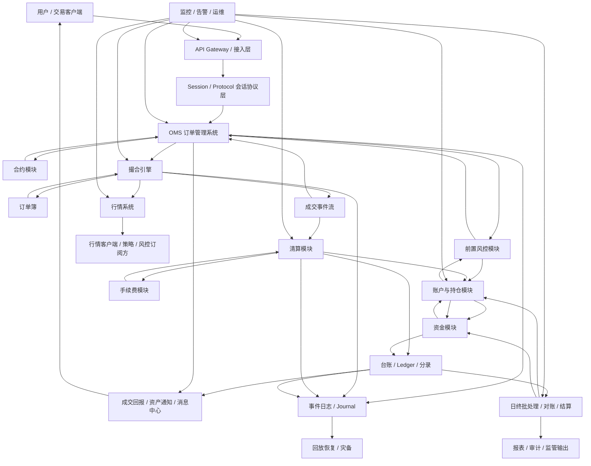
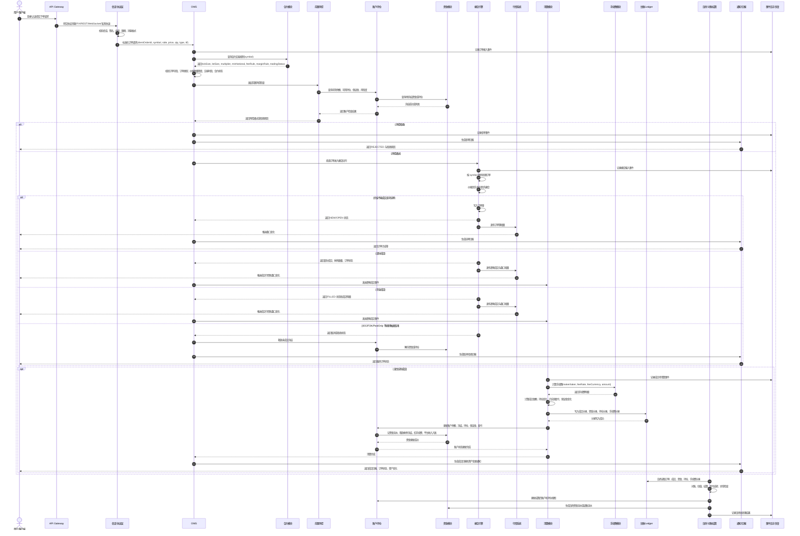

# 完整交易系统业务流程图、时序图与模块说明

本文从完整交易系统视角，串联一条订单从用户提交到成交、行情发布、账务落账、清结算、对账与恢复的完整链路。

相较于“六大模块”文档，本文覆盖范围更大，除了交易、合约、账户、资金、清算、手续费外，还补充：

- 接入层
- 会话与协议层
- OMS
- 前置风控
- 撮合引擎
- 行情系统
- 台账与对账
- 通知与回报
- 监控、审计与恢复
- 仿真、回测与运营后台

---

## 1. 完整交易系统业务流程图



这张图可以按 5 条线理解：

1. `交易请求线`：用户下单，经接入、协议、OMS、风控后进入撮合。
2. `撮合成交线`：撮合引擎维护订单簿，产生成交事件和订单状态变化。
3. `行情分发线`：撮合结果和订单簿变化生成逐笔、盘口、快照和增量行情。
4. `账务清算线`：成交进入清算，计算费用、持仓、资金、盈亏和分录。
5. `运维恢复线`：核心事件写入日志，用于审计、对账、回放和灾备恢复。

---

## 2. 完整交易系统业务时序图



---

## 3. 核心业务阶段说明

### 3.1 接入阶段

接入阶段负责把外部请求安全、稳定、可控地送入交易系统。

主要职责：

- 用户认证
- API Key 校验
- 签名校验
- IP 白名单
- 请求限频
- 协议解析
- 基础参数校验
- 请求追踪 ID 生成
- 灰度、路由和熔断

典型输入：

- 登录请求
- 下单请求
- 撤单请求
- 查单请求
- 查询账户请求
- 订阅行情请求

典型输出：

- 标准化后的业务请求
- 接入拒绝结果
- 会话状态变化
- 请求日志和审计日志

接入层不应该做复杂撮合或账务逻辑。它的重点是保护系统入口，避免非法请求、过量请求和格式错误请求进入核心链路。

### 3.2 会话与协议阶段

会话与协议层负责处理“连接是否可靠、消息是否连续、请求是否重复”等问题。

主要职责：

- 登录与登出
- 心跳检测
- 消息序号
- 重发请求
- 断线恢复
- 请求幂等识别
- 协议字段编码和解码
- 订单协议与行情协议隔离

常见协议形态：

- `REST`：适合普通下单、查询、后台操作。
- `WebSocket`：适合订单回报、资产通知、行情订阅。
- `FIX`：适合机构交易接入，强调会话、序号和标准字段。
- `ITCH` / 私有行情协议：适合高性能行情分发。
- `OUCH` / 私有订单协议：适合高性能订单接入。

会话层的关键是顺序性和可恢复性。如果客户端断线后重连，系统要能判断哪些消息已经处理、哪些消息需要补发。

### 3.3 OMS 订单管理阶段

OMS 是订单管理系统，不只是转发器。

主要职责：

- 创建订单
- 管理订单生命周期
- 管理 `clientOrderId` 与系统订单号
- 处理下单、撤单、改单
- 维护订单状态机
- 对接合约模块获取规则
- 对接风控模块完成下单前检查
- 接收撮合结果
- 生成订单回报
- 将成交事件分发给清算、行情、通知等下游

典型订单状态：

- `NEW`
- `OPEN`
- `PARTIALLY_FILLED`
- `FILLED`
- `CANCELED`
- `REJECTED`
- `EXPIRED`

OMS 的核心要求：

- 同一订单状态不能倒退。
- 每次状态变化都要可追踪。
- 重复请求不能导致重复下单、重复撤单或重复成交回报。
- 订单状态必须和成交数量、剩余数量保持一致。

### 3.4 合约模块

合约模块是交易品种的规则中心。

主要职责：

- 维护交易标的基础信息
- 维护价格步长
- 维护数量步长
- 维护最小下单数量
- 维护最小名义金额
- 维护合约乘数
- 维护手续费规则
- 维护保证金规则
- 维护交易时段
- 维护涨跌停或价格保护规则
- 维护合约上下架、暂停、到期和交割状态

关键字段：

- `symbol`：交易标的代码，例如 `BTC-USDT`、`BTC-USDT-PERP`。
- `baseAsset`：基础资产，例如 `BTC`。
- `quoteAsset`：计价资产，例如 `USDT`。
- `tickSize`：价格最小变动单位。
- `lotSize`：数量最小变动单位。
- `minQty`：最小下单数量。
- `minNotional`：最小名义金额。
- `multiplier`：合约乘数，一张合约代表多少标的或金额。
- `feeRule`：手续费规则。
- `marginRule`：保证金规则。
- `tradingStatus`：是否可交易。

合约模块会影响：

- 下单合法性校验
- 撮合价格精度
- 成交金额计算
- 保证金计算
- 手续费计算
- 盈亏计算
- 风控限制
- 到期和结算逻辑

### 3.5 前置风控阶段

前置风控是在订单进入撮合前完成的风险检查。

主要职责：

- 账户余额检查
- 可用持仓检查
- 保证金检查
- 最大订单数量检查
- 最大订单金额检查
- 价格偏离检查
- 限价保护
- 下单频率限制
- 撤单频率限制
- 限仓检查
- 自成交防护参数检查
- 黑名单、白名单、账户状态检查

风控可以分层：

- 会话级风控：限频、连接数、异常请求。
- 订单级风控：价格、数量、金额、订单类型。
- 账户级风控：余额、持仓、保证金、风险度。
- 市场级风控：涨跌停、熔断、极端行情保护。
- 合规级风控：禁用账户、禁用品种、交易权限。

前置风控的输出通常只有两类：

- `PASS`：允许进入撮合。
- `REJECT`：拒绝订单，并给出明确拒绝原因。

### 3.6 账户与持仓模块

账户模块维护用户当前资产状态。

主要职责：

- 维护余额
- 维护冻结余额
- 维护可用余额
- 维护持仓数量
- 维护可卖数量
- 维护可平数量
- 维护保证金占用
- 维护已实现盈亏
- 维护未实现盈亏
- 维护风险度

常见账户视图：

- 钱包账户
- 现货账户
- 合约账户
- 杠杆账户
- 主账户
- 子账户

账户模块回答的是“现在用户还有多少资产可用”。它不只存余额，还要能解释冻结、持仓、保证金和盈亏。

### 3.7 资金模块

资金模块关注资金变动过程和资金流水。

主要职责：

- 入金
- 出金
- 划转
- 冻结
- 解冻
- 成交扣款
- 卖出入账
- 手续费扣减
- 返佣入账
- 平台收入入账
- 调账

账户模块和资金模块的区别：

- 账户模块维护当前资产状态。
- 资金模块记录资产状态是如何变化出来的。

资金模块必须具备：

- 幂等能力
- 审计能力
- 对账能力
- 追溯能力
- 流水号和业务单号关联能力

生产系统里不能只改余额。每一次余额变化都应该能关联到订单、成交、清算、手续费、出入金或调账原因。

### 3.8 撮合引擎

撮合引擎负责按照交易规则产生成交。

主要职责：

- 维护订单簿
- 按价格优先、时间优先撮合
- 处理限价单
- 处理市价单
- 处理 IOC
- 处理 FOK
- 处理 Post Only
- 处理自成交防护
- 生成成交事件
- 生成订单簿增量
- 返回订单状态变化

撮合引擎重点关注：

- 低延迟
- 顺序性
- 确定性
- 可回放
- 内存数据结构效率
- 单 symbol 或分片内严格有序

撮合引擎通常不直接做复杂账务。它只负责回答：

- 这笔订单是否成交
- 和谁成交
- 成交价格是多少
- 成交数量是多少
- 剩余数量是多少
- 订单最终状态是什么

### 3.9 行情系统

行情系统负责把撮合产生的市场变化分发给外部和内部订阅方。

主要职责：

- 逐笔成交行情
- 最优买卖价行情
- L2 盘口行情
- MBO 逐笔订单行情
- 快照行情
- 增量行情
- K 线生成
- 指数价格
- 标记价格
- 行情重放
- 缺包恢复

行情系统和订单系统的区别：

- 订单系统服务于“我的订单能否成交”。
- 行情系统服务于“市场现在是什么状态”。

行情系统最重要的问题不是只追求快，而是要保证：

- 序号连续
- 快照和增量能对齐
- 缺失能发现
- 乱序能处理
- 客户端能重建本地订单簿

### 3.10 清算模块

清算模块把成交结果转换成资产变化。

主要职责：

- 接收成交事件
- 计算成交金额
- 计算买卖双方资产变化
- 计算持仓变化
- 计算已实现盈亏
- 计算未实现盈亏依赖数据
- 计算保证金变化
- 调用手续费模块
- 生成账户更新指令
- 生成资金更新指令
- 生成台账分录

现货清算通常关注：

- 买方扣计价币
- 买方增加基础资产
- 卖方减少基础资产
- 卖方增加计价币
- 双方扣手续费

合约清算通常还关注：

- 开仓和平仓
- 保证金占用
- 已实现盈亏
- 未实现盈亏
- 标记价格
- 强平风险
- 资金费率

清算模块必须强调幂等。相同的 `tradeId` 不能重复清算。

### 3.11 手续费模块

手续费模块决定成交成本和平台收入。

主要职责：

- 根据成交额计算手续费
- 根据成交量计算手续费
- 支持固定手续费
- 区分 maker 和 taker
- 支持用户等级费率
- 支持 VIP 费率
- 支持平台币抵扣
- 支持返佣
- 支持不同扣费币种
- 支持费率版本追踪
- 支持舍入规则

常见计算方式：

```text
fee = tradeAmount * feeRate
```

或者：

```text
fee = quantity * feeRate
```

手续费不应该在下单时最终扣除，因为订单可能不成交、部分成交、分多笔成交或被撤销。更合理的时机是在逐笔成交清算时扣。

### 3.12 台账、分录与对账模块

台账模块负责保存可审计、可追踪、可对账的账务事实。

主要职责：

- 订单账
- 成交账
- 资金账
- 持仓账
- 手续费账
- 平台收入账
- 分录流水
- 对账批次
- 差异处理

三类关键勾稽关系：

1. 订单账与成交账：订单累计成交数量必须等于相关成交数量汇总。
2. 成交账与资金账：成交金额、手续费、冻结释放必须能对上。
3. 资金账与账户余额：流水累计变化必须能推导出当前余额。

台账不是可有可无的日志，而是后续对账、审计、异常恢复和监管输出的基础。

### 3.13 日终批处理、结算与对账

日终模块负责在交易日结束后完成批量校验、估值、结转和报表。

主要职责：

- 订单对账
- 成交对账
- 资金对账
- 持仓对账
- 手续费对账
- 估值
- 结算价处理
- 盈亏结转
- 保证金重算
- 利息或资金费率结算
- 报表生成
- 异常差异处理

日终处理要解决的问题：

- 白天实时处理是否有遗漏
- 成交、资金、持仓是否一致
- 用户资产是否和流水一致
- 平台收入是否和手续费明细一致
- 外部通道或银行流水是否能对上

### 3.14 通知、回报与查询模块

通知模块负责把交易结果反馈给用户和内部系统。

主要职责：

- 下单回报
- 撤单回报
- 成交回报
- 资产变化通知
- 持仓变化通知
- 风控拒绝通知
- 强平通知
- 结算通知
- 查询订单
- 查询成交
- 查询资金流水
- 查询账户资产

回报系统要特别注意：

- 顺序性
- 不重复
- 可补发
- 可查询
- 与 OMS 状态一致
- 与清算结果一致

用户看到的结果不能只依赖推送。推送可能丢失，所以还必须提供查询和补偿机制。

### 3.15 监控、审计与恢复模块

监控和恢复是完整交易系统的一部分，不是上线后的附加项。

主要职责：

- 系统指标监控
- 业务指标监控
- 延迟监控
- 队列积压监控
- 撮合吞吐监控
- 拒单率监控
- 资金差异监控
- 订单状态异常监控
- 日志审计
- 事件日志落盘
- 快照保存
- 回放恢复
- 灾备切换

关键指标：

- 下单 QPS
- 撮合延迟
- P99 延迟
- 订单拒绝率
- 撤单率
- 成交笔数
- 行情延迟
- 清算积压
- 账户更新失败数
- 对账差异数
- 消息队列堆积

恢复机制通常依赖：

- 事件日志
- 状态快照
- 消息序号
- 幂等消费
- 重放工具
- 主备切换方案

### 3.16 仿真、回测与纸交易模块

仿真和回测不是交易主链路的必需模块，但对策略开发和系统验证很重要。

主要职责：

- 历史行情回放
- 策略回测
- 模拟撮合
- 模拟手续费
- 模拟滑点
- 模拟延迟
- 模拟资金和持仓
- 纸交易环境
- 实盘前验证

回测系统和实盘系统最大的差别：

- 回测知道历史完整结果，实盘只能看到当时的市场状态。
- 回测成交模型通常更乐观，实盘会遇到排队、滑点、拒单、网络延迟和行情缺失。
- 回测可以批量跑，实盘必须严格处理顺序、幂等和风险。

---

## 4. 一笔限价买单的完整业务推演

假设用户提交：

```text
symbol = BTC-USDT-PERP
side = BUY
type = LIMIT
price = 65000.0
quantity = 100
timeInForce = GTC
```

合约规则：

```text
tickSize = 0.1
lotSize = 1
multiplier = 0.001 BTC
takerFeeRate = 0.05%
makerFeeRate = 0.02%
```

系统处理步骤：

1. 接入层校验用户身份、签名、限频。
2. 协议层校验消息格式、序号和幂等键。
3. OMS 创建订单并记录接入事件。
4. OMS 查询合约规则。
5. OMS 校验价格 `65000.0` 是否符合 `tickSize = 0.1`。
6. OMS 校验数量 `100` 是否符合 `lotSize = 1`。
7. 风控模块计算名义金额：

```text
notional = price * quantity * multiplier
         = 65000.0 * 100 * 0.001
         = 6500 USDT
```

8. 账户模块检查可用保证金或可用资金。
9. 资金模块冻结所需资金或保证金。
10. OMS 将订单投递到撮合引擎。
11. 撮合引擎按价格时间优先撮合。
12. 如果成交，生成成交事件。
13. 行情系统发布逐笔成交和盘口变化。
14. 清算模块计算成交金额、持仓变化、保证金变化。
15. 手续费模块按 maker/taker 规则计算费用。
16. 账户模块更新余额、冻结、持仓和盈亏。
17. 资金模块写入资金流水。
18. 台账模块写入成交、资金、持仓、手续费分录。
19. 通知模块向用户推送订单回报和资产变化。
20. 日终模块后续完成对账、估值、结算和报表。

---

## 5. 模块边界速查表

| 模块 | 核心问题 | 关键状态 | 主要输出 |
| --- | --- | --- | --- |
| 接入层 | 请求能否进入系统 | 连接、认证、限频 | 标准化请求、拒绝结果 |
| 会话协议层 | 消息是否可靠连续 | 会话、序号、心跳 | 标准协议事件 |
| OMS | 订单如何流转 | 订单状态、剩余数量 | 订单回报、撮合请求 |
| 合约模块 | 品种怎么交易 | 合约状态、规则版本 | tickSize、lotSize、费率、保证金规则 |
| 前置风控 | 订单能否进入撮合 | 风控结果、冻结状态 | PASS/REJECT |
| 账户持仓 | 用户当前资产是什么 | 余额、冻结、持仓、保证金 | 账户视图 |
| 资金模块 | 钱如何变化 | 资金流水、冻结流水 | 资金变动记录 |
| 撮合引擎 | 订单如何成交 | 订单簿、成交序列 | 成交事件、盘口变化 |
| 行情系统 | 市场状态如何分发 | 快照、增量、序号 | 逐笔、盘口、K 线 |
| 清算模块 | 成交如何变成资产变化 | 清算批次、成交处理状态 | 账户更新、账务指令 |
| 手续费模块 | 成交成本是多少 | 费率版本、扣费币种 | 手续费明细 |
| 台账模块 | 账是否可审计 | 分录、流水、批次 | 订单账、成交账、资金账 |
| 日终结算 | 当日账是否正确 | 结算批次、差异状态 | 结算结果、对账报表 |
| 通知查询 | 用户如何知道结果 | 推送状态、查询视图 | 回报、通知、查询结果 |
| 监控恢复 | 系统如何发现和恢复问题 | 指标、日志、快照 | 告警、审计、回放结果 |

---

## 6. 最小可用交易系统 MVP 建议

如果只是做第一版 MVP，不建议一开始就实现所有生产级能力。可以按下面顺序拆：

### 6.1 第一阶段：最小闭环

必须包含：

- 合约模块
- OMS
- 简化前置风控
- 账户与资金冻结
- 撮合引擎
- 清算模块
- 手续费模块
- 订单回报
- 基础资金流水

能支持：

- 限价单
- 撤单
- 部分成交
- 完全成交
- 资金冻结和释放
- 成交后账户更新

### 6.2 第二阶段：可观测和可恢复

补充：

- 事件日志
- 订单状态回放
- 撮合输入回放
- 资金流水对账
- 基础监控指标
- 异常告警

### 6.3 第三阶段：行情和协议增强

补充：

- 逐笔成交行情
- L2 盘口行情
- 快照和增量
- WebSocket 推送
- 协议序号
- 客户端断线恢复

### 6.4 第四阶段：生产级能力

继续补充：

- 复杂风控
- VIP 手续费
- 保证金和强平
- 日终结算
- 多账户体系
- 对账平台
- 灾备切换
- 运维后台
- 回测和仿真

---

## 7. 一句话总结

完整交易系统不是一个撮合引擎，也不是一个订单接口。

它是一套围绕 `订单生命周期`、`撮合成交`、`行情分发`、`账户资金`、`清算结算`、`对账审计`、`监控恢复` 构建的业务和工程系统。

如果只看交易主链路，可以先掌握：

```text
接入 -> 协议 -> OMS -> 合约规则 -> 前置风控 -> 账户冻结 -> 撮合 -> 行情 -> 清算 -> 手续费 -> 账户资金落账 -> 台账对账 -> 通知回报
```

如果要做生产级系统，还必须继续补：

```text
序号 -> 幂等 -> 快照 -> 增量 -> 日志 -> 回放 -> 对账 -> 监控 -> 灾备
```
